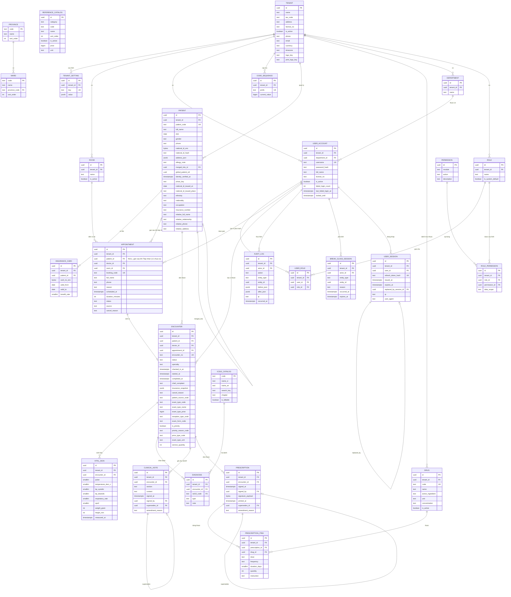

# ERD: NEXAMed v1

**Version**: v1.13 — 18/08/2026 (xem mục 9 để biết lịch sử thay đổi)
**Phạm vi**: chỉ các bảng thuộc v1 (Đặt lịch, Tiếp nhận, Khám bệnh, Kê đơn). Bảng của v2+ (viện phí, kho thuốc, BHYT) **không** tạo ở giai đoạn này.
**Căn cứ**: `docs/product/prd.md` v1.0, `docs/product/plan.md` v1.0, `.claude/docs/data-model.md`

---

## 1. Quy ước đọc sơ đồ

- Mọi bảng nghiệp vụ đều có đủ 8 cột bắt buộc: `id`, `tenant_id`, `created_at`, `updated_at`, `deleted_at`, `version`, `created_by`, `updated_by`. Trong sơ đồ chỉ vẽ `id`, `tenant_id` và các cột đặc thù để dễ đọc.
- Ngoại lệ: `icd10_catalog` (danh mục toàn hệ thống, không có `tenant_id`) và `audit_log` (append-only, không có `updated_at`, `deleted_at`, `version`).
- Khoá ngoại giữa các bảng nghiệp vụ là **composite** `(tenant_id, id)` để không thể trỏ chéo tenant.
- Tiền dùng `bigint` đơn vị đồng; thời gian dùng `timestamptz` lưu UTC.

---

## 2. Sơ đồ tổng thể

---

## 3. Nhóm bảng theo vai trò

### 3.1 Nền tảng và tenant

| Bảng | Vai trò | Ghi chú |
|---|---|---|
| `tenant` | Một phòng khám | Bảng gốc; `tenant_id` của chính nó là `id`. Trang "Thông tin phòng khám" (2026-08-13) thêm `phone`/`email`/`currency`/`timezone`/`logo_key`/`print_logo_key` — xem `docs/DECISIONS.md` #041 |
| `tenant_setting` | Cấu hình theo phòng khám | Giờ làm việc, `slot_duration_minutes`, ngưỡng no-show, ngưỡng sinh hiệu, mẫu in. Unique `(tenant_id, key)` |
| `room` | Phòng khám vật lý | |
| `department` | Khoa/phòng trong tenant | Phục vụ Data Scope `department`; v1 phần lớn phòng khám không dùng nhưng bảng luôn tồn tại |
| `user_account` | Tài khoản người dùng | `password_hash` Argon2id; `license_no` cho bác sĩ; `department_id` tuỳ chọn |
| `role` | Vai trò theo tenant | Seed 5 vai trò mặc định lúc tạo tenant, `clinic_admin` tạo thêm được. Unique `(tenant_id, name)` |
| `permission` | Danh mục hành động toàn hệ thống | Không có `tenant_id`, seed cố định theo code (giống `icd10_catalog`). Unique `(module, action)` |
| `role_permission` | Ma trận phân quyền | `(role_id, permission_id) → data_scope` (`none`/`personal`/`department`/`global`). Unique `(tenant_id, role_id, permission_id)` |
| `user_role` | Gán vai trò cho user | Bảng nối, một người có nhiều vai trò. Unique `(tenant_id, user_id, role_id)` |
| `break_glass_session` | Phiên vượt quyền tạm thời | Append-only, `expires_at` giới hạn thời hạn (mặc định 2 giờ, cấu hình qua `tenant_setting`) |
| `user_session` | Phiên refresh token | Rotation + reuse detection (S1-04); thu hồi = soft delete (`deleted_reason`: `logout`/`rotated`/`expired`/`reuse_detected`/`account_disabled`) |
| `code_sequence` | Cấp mã hiển thị theo tenant | `SELECT ... FOR UPDATE` trong transaction |
| `audit_log` | Nhật ký | Append-only, quyền DB chỉ `INSERT`/`SELECT` |

### 3.2 Bệnh nhân

| Bảng | Vai trò | Ghi chú |
|---|---|---|
| `patient` | Hồ sơ hành chính | `national_id_enc` mã hoá AES-256-GCM; `national_id_hash` để tra trùng; `address_json` lưu địa chỉ (PAT-01) |
| `insurance_card` | Thẻ BHYT | v1 chỉ lưu và hiển thị, không tính chi trả |

`patient.merged_into_id` tự trỏ về `patient` trong cùng tenant, dùng cho luồng gộp hồ sơ trùng (PAT-04). Bản ghi nguồn không xoá, chỉ ngừng cho tạo lượt khám mới.

`patient.global_patient_ref` và `patient.identity_verified_at` luôn `NULL` ở v1. Hai cột này để sẵn cho hồ sơ dùng chung liên tenant ở v3+ (`identity_verified_at` ghi thời điểm xác minh danh tính khi bật master patient index); mọi tra cứu hiện tại đi qua `PatientIdentityPort`.

**Mở rộng hồ sơ hành chính (v1.6, `docs/DECISIONS.md` #034)**: `photo_key` (key lưu trên `StoragePort`, phục vụ qua signed URL có hạn — không lưu URL trực tiếp), `national_id_issued_at`/`national_id_issued_place` (ngày/nơi cấp CCCD), `ethnicity`/`nationality`/`occupation` (text tự do, chưa có danh mục DB chính thức), `insurance_number` (độc lập với `insurance_card`), `relative_full_name`/`relative_relationship`/`relative_phone`/`relative_address` (đúng 1 người thân trên mỗi hồ sơ, không tách bảng). `address_json` thêm khoá `neighborhood` (Khu phố); `district` (Quận/Huyện) vẫn hợp lệ trong dữ liệu cũ nhưng không còn nhập trên UI.

**`address_json.province`/`.ward` (v1.8, `docs/DECISIONS.md` #038, đảo ngược tiếp phần Tỉnh/Xã của #034)**: nay lưu **mã** tham chiếu bảng `province`/`ward` mới (ví dụ `"1"`, `"10105001"`), không lưu tên — cùng cách `ethnicity`/`nationality` đã làm ở #037. Chọn qua Combobox cascading (chọn Tỉnh trước để lọc Xã) ở web thay vì gõ tay.

### 3.3 Lịch hẹn và lượt khám

| Bảng | Vai trò |
|---|---|
| `appointment` | Lịch hẹn; `status`: `SCHEDULED`, `CANCELLED`, `NO_SHOW`, `CONVERTED` |
| `encounter` | Lượt khám; `status`: `SCHEDULED`, `CHECKED_IN`, `IN_CONSULTATION`, `COMPLETED`, `CANCELLED`, `NO_SHOW` |

`encounter.appointment_id` cho phép `NULL` để hỗ trợ walk-in tạo trực tiếp — v1.11 hiện thực đúng thiết kế này: "Tiếp nhận bệnh nhân" (`POST /reception/direct`) tạo thẳng `encounter` với `appointment_id = NULL`, KHÔNG qua `appointment` (khác hướng ban đầu dự tính đi qua `appointment` với `source='walk_in'` — đã đổi theo yêu cầu chủ dự án, xem `docs/DECISIONS.md`). Quan hệ `appointment↔encounter` là một-không-hoặc-một: mỗi lịch hẹn sinh tối đa một lượt khám (ép bằng partial unique index `(tenant_id, appointment_id) WHERE appointment_id IS NOT NULL AND deleted_at IS NULL`, không khai `@unique` ở Prisma schema — cùng lý do `patient.national_id_hash`).

**Đặt lịch "lead capture" (v1.4, `docs/DECISIONS.md` #032)**: `appointment` **không** bắt buộc gắn `patient` lúc đặt — chỉ ghi nhận trực tiếp `full_name`/`phone`/`reason` (lý do khám, tuỳ chọn) trên chính bảng này, kèm `booking_code` (mã đặt lịch hiển thị cho khách, cùng khuôn `patient_code`/`encounter_no`: `<prefix><yyMM><seq6>`, prefix `LH`).

**Tiếp nhận thật (v1.10, Sprint 3, thay thế mô tả cũ "check-in chuyển thẳng SCHEDULED→CONVERTED, chưa có màn hình Tiếp nhận thật")** — HAI luồng tạo `encounter`, dùng CHUNG 1 biểu mẫu web (`ReceptionIntakeForm.tsx`, v1.12), khác route:
- **Check-in từ lịch hẹn có sẵn**: `POST /reception/check-in` đọc `appointment` đang `SCHEDULED`, tạo `encounter` (`status=CHECKED_IN`), gắn `patient_id` đã resolve xong ở web, và chuyển `appointment.status → CONVERTED` — cả ba **atomic trong 1 transaction** (module `reception` chia sẻ `AppointmentRepository`/`EncounterRepository` qua Nest `exports`, xem `docs/DECISIONS.md`). Kích hoạt bằng nút "Tiếp nhận" mở popup ngay trên panel chi tiết Lịch hẹn (bác sĩ/giờ cố định theo lịch hẹn, không sửa ở đây) — KHÔNG có trang hàng đợi riêng để làm việc này.
- **"Tiếp nhận bệnh nhân" (v1.11)**: `POST /reception/direct` — khách đến thẳng phòng khám, không qua đặt lịch trước. Tạo thẳng `encounter` (`appointment_id=NULL`). Trang web riêng "Tiếp nhận bệnh nhân" (menu con dưới "Tiếp nhận và Đặt lịch"), đủ trường ngày giờ/bác sĩ tự chọn.

Cả hai luồng đều lưu `patient_source_code` (mã danh mục `PATIENT_SOURCE`, tuỳ chọn) và snapshot `exam_type_code`/`exam_type_name`/`exam_type_price` (category `EXAM_TYPE`, bắt buộc — copy nguyên giá trị từ `reference_catalog` LÚC TẠO, không JOIN lại khi đọc, cùng tinh thần `insurance_snapshot`), và có thể kèm sinh hiệu (tuỳ chọn, tạo 1 dòng `vital_sign` trong cùng transaction nếu có nhập — v1.12).

Bản ghi từ CẢ HAI luồng cùng xuất hiện trong "Danh sách tiếp nhận" (`GET /reception/list`, lễ tân theo dõi trạng thái THUẦN — không có thao tác nào trên trang này, v1.12) và trang riêng "Hàng đợi khám" (cùng endpoint, thêm `doctorId` — bác sĩ chỉ thấy `CHECKED_IN` của chính mình dù `encounter.read` scope là `global`, lọc tường minh ở query chứ không dựa permission scope; "Bắt đầu khám" thực hiện NGAY TẠI ĐÂY, v1.12).

"Bắt đầu khám" (`CHECKED_IN→IN_CONSULTATION`) và "bỏ về" (`CHECKED_IN→CANCELLED`, bắt buộc lý do — cột `encounter.cancel_reason`) thuộc module `encounter` riêng (`POST /encounters/:id/start|cancel`), áp dụng chung cho encounter tạo từ cả hai luồng.

`encounter.insurance_snapshot` là bản chụp thẻ BHYT tại thời điểm check-in — v1 luôn `{ selfPay: true }` (module `insurance_card`/S2-04 chưa làm). Không join động về `insurance_card` khi in hay tra cứu về sau. `encounter.exam_type_price` chỉ **lưu để hiển thị** — v1 KHÔNG tính toán/xuất hoá đơn (viện phí ngoài phạm vi CLAUDE.md).

**Sinh hiệu bổ sung sau (v1.12)**: `POST /reception/encounters/:id/vital-signs` (REC-02/03, ngưỡng cảnh báo theo tuổi) vẫn tồn tại như hạ tầng riêng — dành cho lúc thiếu sinh hiệu ở bước tiếp nhận, module Khám bệnh (chưa xây) sẽ gọi lại đúng endpoint này để bổ sung/ghi lần đo mới. Không còn giao diện "Sinh hiệu" độc lập trên "Danh sách tiếp nhận" — sinh hiệu chính chuyển hẳn sang nhập cùng lúc tiếp nhận.

**Khung tối thiểu cho đa chuyên khoa (v1.5, `docs/DECISIONS.md` #033)**: `encounter.specialty` (text, mặc định `'general'`) — chuyên khoa thực tế của lượt khám này, KHÔNG phải của tenant (một phòng khám đa khoa có thể có nhiều `specialty` khác nhau trên các `encounter` khác nhau). v1 luôn `'general'`, chưa vai trò nào đọc/ghi giá trị khác — chỉ chuẩn bị chỗ để Sprint 3 không phải retrofit sau. Chưa thêm bảng tầng cha dài hạn (`pregnancy`/`treatment_plan`) hay cột `episode_id` — đó là việc của lúc thật sự làm gói chuyên khoa cụ thể, xem `docs/product/multi-specialty-analysis.md`.

### 3.4 Dữ liệu lâm sàng

| Bảng | Vai trò | Đặc thù |
|---|---|---|
| `vital_sign` | Sinh hiệu | Lưu số nguyên: nhiệt độ theo phần mười độ C (`temperature_deci_c`, 37.5°C → `375`), cân nặng theo gram, chiều cao theo mm |
| `diagnosis` | Chẩn đoán | `type`: `PRIMARY` hoặc `SECONDARY`; bắt buộc có đúng một `PRIMARY` khi hoàn tất lượt khám |
| `clinical_note` | Ghi chú SOAP | `section`: `SUBJECTIVE`, `OBJECTIVE`, `ASSESSMENT`, `PLAN` |
| `prescription` | Đơn thuốc | Ký logic ở v1; `signature_payload` để sẵn cho chữ ký số, luôn `NULL` |
| `prescription_item` | Dòng thuốc | v1 không có cột giá, không trừ kho |

`clinical_note` và `prescription` có `supersedes_id` + `amendment_reason` cho luồng đính chính: bản mới trỏ về bản cũ, bản cũ đặt `deleted_at` + `deleted_reason`.

### 3.5 Danh mục

| Bảng | Phạm vi | Ghi chú |
|---|---|---|
| `icd10_catalog` | Toàn hệ thống | Không có `tenant_id`, read-only lúc chạy, seed từ danh mục Bộ Y tế. `search_key` là tên tiếng Việt đã bỏ dấu và viết thường, phục vụ tìm kiếm không dấu |
| `reference_catalog` | Toàn hệ thống | Dân tộc/Quốc tịch (`docs/DECISIONS.md` #037, đảo ngược #034) + Nguồn khách hàng/Loại khám (Sprint 3, v1.11) + Loại tiếp nhận/Hình thức khám/Lý do ưu tiên/Loại giá dịch vụ (v1.13, `docs/DECISIONS.md` #052) — tái dùng nguyên bảng này thay vì tạo bảng riêng. Không `tenant_id`, **quản lý được qua API** bởi `clinic_admin` (khác `icd10_catalog`/`permission` — read-only lúc chạy) — "xoá" là `is_active=false` (soft), role DB không có quyền `DELETE`. Cột `price`/`unit` (bigint/text, nullable) chỉ có ý nghĩa với category `EXAM_TYPE` — lưu để hiển thị, chưa tính viện phí |
| `province` / `ward` | Toàn hệ thống | Tỉnh/Phường-Xã theo sáp nhập hành chính 2025, mã Bộ Nội vụ (`docs/DECISIONS.md` #038, đảo ngược tiếp phần Tỉnh/Xã của #034). Không `tenant_id`, **read-only lúc chạy** (giống `icd10_catalog`, khác `reference_catalog` — không có endpoint quản lý qua API). `ward.code` (8 chữ số) duy nhất toàn quốc, dùng thẳng làm PK |
| `drug` | Theo tenant | v1 phòng khám tự nhập danh mục thuốc của mình (theo PRD mục 8). Khi có danh mục thuốc quốc gia dùng chung, thêm bảng `drug_catalog` toàn hệ thống và cho `drug.catalog_code` tham chiếu tới |

---

## 4. Ràng buộc ở tầng cơ sở dữ liệu

Những ràng buộc này đặt ở DB, không chỉ ở tầng ứng dụng.

| # | Ràng buộc | Bảng | Lý do |
|---|---|---|---|
| C1 | RLS policy `tenant_id = current_setting('app.current_tenant_id')::uuid` | Mọi bảng có `tenant_id` | Lớp phòng thủ cuối chống rò rỉ giữa tenant |
| C2 | `EXCLUDE USING gist (doctor_id WITH =, tstzrange(scheduled_at, scheduled_at + duration) WITH &&) WHERE (status = 'SCHEDULED' AND deleted_at IS NULL)` | `appointment` | Chống đặt trùng khung giờ khi hai lễ tân thao tác đồng thời |
| C3 | `UNIQUE (tenant_id, national_id_hash) WHERE national_id_hash IS NOT NULL` | `patient` | Chặn trùng CCCD trong cùng phòng khám, vẫn cho phép bệnh nhân không có CCCD |
| C4 | `UNIQUE (tenant_id, patient_code)`, `UNIQUE (tenant_id, encounter_no)`, `UNIQUE (tenant_id, booking_code)` | `patient`, `encounter`, `appointment` | Mã hiển thị duy nhất trong phạm vi tenant |
| C5 | Composite FK `(tenant_id, id)` cho mọi quan hệ nghiệp vụ | Toàn bộ | Không thể trỏ chéo tenant kể cả khi code sai |
| C6 | `CHECK (version >= 1)` và mọi `UPDATE` kèm `WHERE version = ?` | Mọi bảng nghiệp vụ | Optimistic locking |
| C7 | Partial index `WHERE deleted_at IS NULL` | Bảng lâm sàng | Truy vấn mặc định chỉ đọc bản còn hiệu lực |
| C8 | Trigger chặn `UPDATE` khi `signed_at IS NOT NULL` | `clinical_note`, `prescription` | Bản ghi đã ký bất biến, không phụ thuộc vào việc ứng dụng nhớ kiểm tra |
| C9 | Không cấp quyền `DELETE` cho app user trên mọi bảng nghiệp vụ | Toàn bộ | Ép soft delete ở tầng quyền, không chỉ ở code |
| C10 | `CHECK (type IN ('PRIMARY','SECONDARY'))` và unique partial một `PRIMARY` mỗi encounter | `diagnosis` | Bắt buộc đúng một chẩn đoán chính |
| C11 | `UNIQUE (tenant_id, appointment_id) WHERE appointment_id IS NOT NULL AND deleted_at IS NULL` | `encounter` | Mỗi lịch hẹn sinh tối đa một lượt khám, kể cả khi hai request check-in gần như đồng thời (đúng khuôn C2/C3) |

---

## 5. Index cần có từ đầu

| Index | Phục vụ |
|---|---|
| `patient (tenant_id, phone)` | Tìm bệnh nhân theo số điện thoại (PAT-02) |
| GIN trên `patient (tenant_id, search_key)` dùng `pg_trgm` | Tìm theo tên không dấu, mục tiêu dưới 1 giây với 50k bản ghi |
| `encounter (tenant_id, patient_id, checked_in_at DESC)` | Tải tiền sử ở màn hình khám (ENC-01), mục tiêu dưới 2 giây |
| `appointment (tenant_id, doctor_id, scheduled_at)` | Lịch theo bác sĩ theo ngày (APP-01) |
| `appointment (tenant_id, status, scheduled_at) WHERE deleted_at IS NULL` | Job đánh dấu no-show (APP-05) |
| `appointment (tenant_id, phone)` | Tra cứu lịch sử đặt lịch theo SĐT — tự điền tên, cảnh báo spam (v1.4, `docs/DECISIONS.md` #032) |
| GIN trên `icd10_catalog (search_key)` dùng `pg_trgm` | Tìm mã ICD-10 theo tên tiếng Việt (ENC-03) |
| `audit_log (tenant_id, entity_type, entity_id, occurred_at DESC)` | Tra vết sửa đổi hồ sơ (ADM-03) |
| `audit_log (tenant_id, actor_id, occurred_at DESC)` | Tra nhật ký theo người dùng |
| `user_session (tenant_id, user_id, expires_at DESC) WHERE deleted_at IS NULL` | Tra phiên còn hiệu lực của một user (thu hồi hàng loạt) |
| `ward (province_code)` | Cascading Tỉnh → Phường/Xã trong form địa chỉ bệnh nhân (`docs/DECISIONS.md` #038) |

`patient.search_key` là cột dẫn xuất (tên đã bỏ dấu, viết thường), cập nhật bằng trigger hoặc generated column — không tính lại trong câu truy vấn.

---

## 6. Thứ tự tạo bảng theo sprint

Khớp với `docs/product/plan.md`.

| Sprint | Bảng tạo mới |
|---|---|
| S1 (tuần 1-2) | `tenant`, `tenant_setting`, `room`, `user_account`, `code_sequence`, `audit_log` |
| S1 (bổ sung, RBAC — 2026-08-08) | `department`, `role`, `permission`, `role_permission`, `user_role`, `break_glass_session` — thay mô hình vai trò cứng, xem `docs/DECISIONS.md` #013 |
| S1 (bổ sung, Auth — 2026-08-10) | `user_session` (S1-04, rotation + reuse detection); `user_account` thêm `failed_login_count`/`last_failed_login_at`/`locked_until` — xem `docs/DECISIONS.md` #019 |
| S2 (tuần 3-4) | `patient`, `insurance_card`, `appointment` |
| S3 (tuần 5-6) | `icd10_catalog`, `encounter`, `vital_sign`, `diagnosis`, `clinical_note` |
| S4 (tuần 7-8) | `drug`, `prescription`, `prescription_item` |
| S5-S6 | Không thêm bảng mới; chỉ thêm cột `supersedes_id`, `amendment_reason` nếu chưa tạo, và trigger C8 |

Khuyến nghị: tạo đủ 8 cột bắt buộc **ngay từ migration đầu tiên của mỗi bảng**, kể cả khi tính năng dùng tới chúng ở sprint sau. Thêm cột vào bảng đã có dữ liệu thật tốn hơn nhiều.

---

## 7. Bảng của v2+ — không tạo ở v1

Ghi ra đây để không ai vô tình tạo sớm, và để thiết kế v1 không cản đường v2.

| Bảng dự kiến | Phase | Điểm neo vào v1 |
|---|---|---|
| `service`, `service_order` | v2 | `encounter_id` |
| `invoice`, `invoice_line`, `payment` | v2 | `encounter_id` |
| `inventory_batch`, `stock_movement` | v2.1 | `drug_id`, `prescription_item_id` |
| `insurance_claim` | v3 | `encounter_id`, `insurance_card_id` |
| `drug_catalog` (toàn hệ thống) | v2.1 | `drug.catalog_code` |
| `lab_order`, `lab_result` | v3+ | `encounter_id` |

Khi thêm, các bảng này vẫn phải đủ 8 cột bắt buộc và tuân thủ C1-C10.

---

## 8. Điểm chưa chốt ảnh hưởng tới ERD

| # | Vấn đề | Ảnh hưởng | Hạn |
|---|---|---|---|
| E1 | Yêu cầu chữ ký số (Q2 trong PRD) | Nếu bắt buộc, `signature_payload` phải tách thành bảng riêng lưu chứng thư và chuỗi ký, không để cột `bytea` đơn giản | Tuần 2 |
| E2 | Thời hạn lưu trữ (Q1 trong PRD) | Ảnh hưởng chiến lược phân vùng `audit_log` theo thời gian. Nếu lưu trên 10 năm, nên partition theo năm ngay từ đầu | Tuần 2 |
| E3 | Danh mục thuốc quốc gia | Nếu có nguồn dùng chung, `drug` chuyển thành bảng ánh xạ thay vì danh mục độc lập | Tuần 5 |
| E4 | Nhiều chi nhánh của cùng chủ (Q6) | Nếu cần ở v1, phải thêm khái niệm `organization` trên `tenant` và bảng nối người dùng với nhiều tenant | Tuần 4 |

---

## 9. Lịch sử phiên bản

| Version | Ngày | Thay đổi |
|---|---|---|
| v1.0 | 07/08/2026 | Bản đầu tiên, dựng từ PRD v1.0 và PLAN v1.0 |
| v1.1 | 08/08/2026 | Thay mô hình vai trò cứng (`user_role.role` enum) bằng RBAC + Data Scope: thêm `department`, `role`, `permission`, `role_permission`, `break_glass_session`; `user_role` đổi sang trỏ `role_id`. Xem `docs/DECISIONS.md` #013-#016. Scope `branch`/đa chi nhánh (liên quan E4) vẫn hoãn — chỉ giữ 4 mức `none`/`personal`/`department`/`global`. |
| v1.2 | 10/08/2026 | S1-04 (Auth): thêm `user_session` (refresh token, rotation + reuse detection); `user_account` thêm `failed_login_count`/`last_failed_login_at`/`locked_until` (khoá tài khoản tạm). Xem `docs/DECISIONS.md` #019-#020. |
| v1.3 | 11/08/2026 | S2-01 (patient): vá lệch giữa sơ đồ mermaid và mô tả chi tiết ở `.claude/docs/data-model.md` — thêm `address_json` (PRD PAT-01, P0) và `identity_verified_at` (cột chờ sẵn liên-tenant v2+, đi cùng `global_patient_ref`) vào bảng `PATIENT`. Xem `docs/DECISIONS.md` #024. |
| v1.4 | 12/08/2026 | Đổi mô hình đặt lịch sang "lead capture" — `appointment.patient_id` chuyển nullable (gắn sau lúc Tiếp nhận, Sprint 3), thêm `booking_code`/`full_name`/`phone`/`reason` ghi trực tiếp trên `appointment`, không còn bắt buộc tạo/chọn `patient` lúc đặt lịch. Thêm C4 (unique `booking_code`) và index `(tenant_id, phone)`. Xem `docs/DECISIONS.md` #032. |
| v1.5 | 12/08/2026 | Khung tối thiểu chuẩn bị cho đa chuyên khoa (chưa triển khai ở v1) — thêm `encounter.specialty` (mặc định `'general'`) vào đặc tả bảng `encounter` (bảng này còn ở dạng thiết kế, Sprint 3 chưa code). Không thêm bảng/cột nào khác. Xem `docs/DECISIONS.md` #033, `docs/product/multi-specialty-analysis.md`. |
| v1.6 | 12/08/2026 | Mở rộng hồ sơ hành chính `PATIENT` (yêu cầu chủ dự án hiệu chỉnh form PAT-01) — thêm `photo_key`, `national_id_issued_at`/`national_id_issued_place`, `ethnicity`/`nationality`/`occupation` (text tự do), `insurance_number` (độc lập với `insurance_card`), `relative_full_name`/`relative_relationship`/`relative_phone`/`relative_address` (1 người thân/hồ sơ); `address_json` thêm khoá `neighborhood`. Xem `docs/DECISIONS.md` #034. |
| v1.7 | 12/08/2026 | Thêm bảng `reference_catalog` (danh mục dùng chung toàn hệ thống — Dân tộc, Quốc tịch) — đảo ngược `docs/DECISIONS.md` #034 phần `ethnicity`/`nationality` (nay lưu mã `code` tham chiếu bảng này thay vì text tự do; `occupation` không đổi). Khác `icd10_catalog`/`permission`: quản lý được qua API bởi `clinic_admin`, không chỉ seed script. Xem `docs/DECISIONS.md` #037. |
| v1.8 | 12/08/2026 | Thêm bảng `province`/`ward` (danh mục hành chính Tỉnh/Phường-Xã toàn hệ thống, theo sáp nhập hành chính 2025, mã Bộ Nội vụ) — đảo ngược tiếp `docs/DECISIONS.md` #034 phần Tỉnh/Xã của `PATIENT.address_json` (nay lưu mã `code` tham chiếu 2 bảng này thay vì text tự do). Khác `reference_catalog`: read-only lúc chạy (không có endpoint quản lý qua API), giống `icd10_catalog`. Xem `docs/DECISIONS.md` #038. |
| v1.9 | 13/08/2026 | Trang "Thông tin phòng khám" (`/admin/system-config`) — mở rộng `TENANT` thêm `phone`, `email`, `currency` (mặc định `'VND'`), `timezone` (mặc định `'Asia/Ho_Chi_Minh'`), `logo_key`, `print_logo_key`. `currency`/`timezone` chỉ lưu giá trị hiển thị, chưa nối vào logic tính toán/ngày giờ hệ thống. Xem `docs/DECISIONS.md` #041. |
| v1.10 | 13/08/2026 | `encounter`/`vital_sign` từ đặc tả thiết kế (v1.5) chuyển thành đã hiện thực (Sprint 3, phần Tiếp nhận REC-01→03 — không phụ thuộc danh mục ICD-10 nên làm được trước phần Khám bệnh). Thêm `encounter.cancel_reason` (ngoài đặc tả gốc — luồng "bỏ về" cần cột lưu lý do, không soft-delete). Thêm C11 (partial unique chặn double check-in). `appointment.checkin()` không còn tự đổi status suông — nay thật sự tạo `encounter` + gắn `patient_id`, atomic qua module `reception` mới. Endpoint `POST /appointments/:id/checkin` cũ đã gỡ bỏ, thay bằng `POST /reception/check-in`. Xem `docs/DECISIONS.md`. |
| v1.11 | 13/08/2026 | Thiết kế lại "Tiếp nhận" theo góp ý chủ dự án (3 vòng): thêm luồng "Tiếp nhận bệnh nhân" (`POST /reception/direct`) tạo thẳng `encounter` với `appointment_id=NULL`, KHÔNG qua `appointment` (khác hướng ban đầu đi qua `appointment(source='walk_in')`). Thêm `encounter.patient_source_code`/`exam_type_code`/`exam_type_name`/`exam_type_price` (snapshot, cùng tinh thần `insurance_snapshot`). Mở rộng `reference_catalog_category` thêm `PATIENT_SOURCE`/`EXAM_TYPE`, thêm cột `reference_catalog.price` (bigint, chỉ dùng cho `EXAM_TYPE`, chỉ lưu để hiển thị — chưa tính viện phí). "Danh sách tiếp nhận" (lễ tân) tách khỏi "Hàng đợi khám" (bác sĩ, trang riêng) — cùng nguồn dữ liệu `GET /reception/list`, khác tham số lọc. Xem `docs/DECISIONS.md`. |
| v1.13 | 18/08/2026 | Thiết kế lại "Tiếp nhận bệnh nhân" (mockup đã duyệt, `docs/DECISIONS.md` #052) — thêm `reference_catalog.unit` + 4 category mới (`RECEPTION_TYPE`/`EXAM_FORM`/`PRIORITY_REASON`/`PRICE_TYPE`); `encounter` thêm 7 cột: `reception_type_code`/`exam_form_code`/`is_priority`/`priority_reason_code`/`price_type_code`/`exam_type_unit`/`service_quantity` — tất cả nullable/default an toàn, chỉ lưu để hiển thị (Chỉ định dịch vụ khám), KHÔNG tính viện phí. Endpoint mới `GET /patients/by-national-id` (tra trùng CCCD, cùng khuôn `by-phone`). |
| v1.12 | 13/08/2026 | "Danh sách tiếp nhận" về đúng nghĩa THUẦN theo dõi trạng thái (không cột nào đổi, chỉ hành vi/UI web) — dồn "Bắt đầu khám" sang "Hàng đợi khám", bỏ hẳn giao diện "Sinh hiệu" độc lập (chuyển sang nhập cùng lúc tiếp nhận, cả 2 luồng check-in/tiếp nhận-trực-tiếp giờ đều lưu được `patient_source_code`/`exam_type_*`/kèm `vital_sign` tuỳ chọn — trước đó chỉ luồng trực tiếp có). `checkInRequestSchema` mở rộng khớp `registerReceptionRequestSchema` (`packages/shared` tách `intakeVitalSignFieldsSchema` dùng chung). `POST /reception/encounters/:id/vital-signs` (REC-02/03) giữ nguyên làm hạ tầng bổ sung sau. Xem `docs/DECISIONS.md` #044. |
