# ERD: NEXAMed v1

**Version**: v1.57 — 25/09/2026 (xem mục 9 để biết lịch sử thay đổi)
**Phạm vi**: các bảng thuộc v1 (Đặt lịch, Tiếp nhận, Khám bệnh, Kê đơn) cộng các mở rộng phạm vi đã chốt (Thu ngân cơ bản, Sổ quỹ & Thu chi, Ví tạm ứng, Kho Thuốc & Vật tư y tế GĐ1→4, Công nợ nhà cung cấp Phần A+B — xem `CLAUDE.md`). Bảng của v2+ (viện phí đầy đủ, BHYT), Kho Thuốc GĐ5, và Công nợ NCC Phần C→E (đã lên kế hoạch nhưng chưa code) **không** tạo ở giai đoạn này.
**Căn cứ**: `docs/product/prd.md` v1.0, `docs/product/plan.md` v1.0, `.claude/docs/data-model.md`

---

## 1. Quy ước đọc sơ đồ

- Mọi bảng nghiệp vụ đều có đủ 8 cột bắt buộc: `id`, `tenant_id`, `created_at`, `updated_at`, `deleted_at`, `version`, `created_by`, `updated_by`. Trong sơ đồ chỉ vẽ `id`, `tenant_id` và các cột đặc thù để dễ đọc.
- Ngoại lệ: `icd10_catalog` (danh mục toàn hệ thống, không có `tenant_id`) và `audit_log` (append-only, không có `updated_at`, `deleted_at`, `version`).
- Khoá ngoại giữa các bảng nghiệp vụ là **composite** `(tenant_id, id)` để không thể trỏ chéo tenant.
- Tiền dùng `bigint` đơn vị đồng; thời gian dùng `timestamptz` lưu UTC.

---

## 2. Sơ đồ tổng thể

```mermaid
erDiagram
    TENANT ||--o{ TENANT_SETTING : "cau hinh"
    TENANT ||--o{ ROOM : "co"
    TENANT ||--o{ WORK_SHIFT : "co danh muc ca"
    TENANT ||--o{ USER_ACCOUNT : "co"
    TENANT ||--o{ CODE_SEQUENCE : "cap ma"
    TENANT ||--o{ PATIENT : "quan ly"
    TENANT ||--o{ DRUG : "danh muc thuoc"
    TENANT ||--o{ SUPPLIER : "nha cung cap"
    TENANT ||--o{ WAREHOUSE : "co kho"
    DRUG ||--o{ DRUG_UNIT : "quy doi don vi"
    DRUG ||--o{ DRUG_INGREDIENT : "hoat chat & ham luong"
    DEPARTMENT ||--o{ WAREHOUSE : "quan ly (tuy chon)"
    SUPPLIER {
        uuid id PK
        uuid tenant_id FK
        text code UK
        text name
        text tax_code
        text phone
        text address
        text contact_name
        boolean is_active
    }
    WAREHOUSE {
        uuid id PK
        uuid tenant_id FK
        text code UK
        text name
        uuid department_id FK
        boolean is_default
        boolean is_active
    }
    DRUG_UNIT {
        uuid id PK
        uuid tenant_id FK
        uuid drug_id FK
        text unit_code
        int sort_order
        int factor_to_unit_below
        bigint sell_price
    }
    DRUG_INGREDIENT {
        uuid id PK
        uuid tenant_id FK
        uuid drug_id FK
        text active_ingredient_code
        int strength_value
        text strength_unit_code
    }
    TENANT ||--o{ DEPARTMENT : "co"
    TENANT ||--o{ DEPARTMENT_TYPE : "co"
    TENANT ||--o{ ROLE : "co"

    DEPARTMENT_TYPE ||--o{ DEPARTMENT : "phan loai (tuy chon)"
    DEPARTMENT ||--o{ USER_ACCOUNT : "thuoc ve"
    DEPARTMENT ||--o{ ENCOUNTER : "khoa phu trach (hang doi ao)"
    DEPARTMENT_TYPE {
        uuid id PK
        uuid tenant_id FK
        text name
        boolean is_active
    }
    ROLE ||--o{ USER_ROLE : "gan cho"
    ROLE ||--o{ ROLE_PERMISSION : "duoc cau hinh"
    PERMISSION ||--o{ ROLE_PERMISSION : "ap dung"

    USER_ACCOUNT ||--o{ USER_ROLE : "duoc gan"
    USER_ACCOUNT ||--o{ APPOINTMENT : "bac si phu trach"
    USER_ACCOUNT ||--o{ ENCOUNTER : "bac si kham"
    USER_ACCOUNT ||--o{ AUDIT_LOG : "thuc hien"
    USER_ACCOUNT ||--o{ BREAK_GLASS_SESSION : "pha kinh"
    USER_ACCOUNT ||--o{ USER_SESSION : "dang nhap"
    USER_SESSION ||--o| USER_SESSION : "replaced_by"
    USER_ACCOUNT ||--o{ DOCTOR_ROOM_SESSION : "chon phong hom nay"
    ROOM ||--o{ DOCTOR_ROOM_SESSION : "duoc chon"
    DOCTOR_ROOM_SESSION {
        uuid id PK
        uuid tenant_id FK
        uuid doctor_id FK
        uuid room_id FK
        date work_date
    }
    FLOOR ||--o{ ROOM : "co (tuy chon)"
    ROOM ||--o{ EXAM_STATION : "co ban kham/ghe"
    FLOOR {
        uuid id PK
        uuid tenant_id FK
        text name
        int sort_order
        boolean is_active
    }
    EXAM_STATION {
        uuid id PK
        uuid tenant_id FK
        uuid room_id FK
        text name
        int sort_order
        boolean is_active
    }

    PATIENT ||--o{ INSURANCE_CARD : "co the"
    PATIENT |o--o{ APPOINTMENT : "gan sau khi tiep nhan"
    PATIENT ||--o{ ENCOUNTER : "den kham"
    PATIENT ||--o| PATIENT : "merged_into"
    PATIENT ||--o{ PATIENT_ALLERGEN : "di nguyen da biet"
    ALLERGEN ||--o{ PATIENT_ALLERGEN : "duoc gan"
    PATIENT_ALLERGEN {
        uuid id PK
        uuid tenant_id FK
        uuid patient_id FK
        uuid allergen_id FK
    }

    APPOINTMENT ||--o| ENCOUNTER : "sinh ra"
    ROOM ||--o{ APPOINTMENT : "dien ra tai"

    ENCOUNTER ||--o{ VITAL_SIGN : "sinh hieu"
    ENCOUNTER ||--o{ ENCOUNTER_SERVICE_ITEM : "chi dinh dich vu kham"
    ENCOUNTER ||--o{ DIAGNOSIS : "chan doan"
    ENCOUNTER ||--o{ CLINICAL_NOTE : "ghi chu SOAP"
    ENCOUNTER ||--o{ PRESCRIPTION : "don thuoc"

    ICD10_CATALOG ||--o{ DIAGNOSIS : "ma benh"
    REFERENCE_CATALOG {
        uuid id PK
        text category
        text code
        text name
        int sort_order
        boolean is_active
        bigint price
        text unit
        boolean deactivates_account
    }
    PROVINCE ||--o{ WARD : "co"
    PROVINCE {
        text code PK
        text name
        int sort_order
    }
    WARD {
        text code PK
        text name
        text province_code FK
        int sort_order
    }
    PRESCRIPTION ||--o{ PRESCRIPTION_ITEM : "dong thuoc"
    DRUG ||--o{ PRESCRIPTION_ITEM : "thuoc"

    PRESCRIPTION ||--o| PRESCRIPTION : "supersedes"
    CLINICAL_NOTE ||--o| CLINICAL_NOTE : "supersedes"
    DIAGNOSIS ||--o| DIAGNOSIS : "supersedes"

    TENANT {
        uuid id PK
        text name
        text tax_code
        text address
        text license_no
        boolean is_active
        text phone
        text email
        text currency
        text timezone
        text logo_key
        text print_logo_key
        text facility_code
        text professional_in_charge_name
        text website
        jsonb social_links_json
        text bank_account_name
        text bank_account_number
        text bank_name
    }

    USER_ACCOUNT {
        uuid id PK
        uuid tenant_id FK
        uuid department_id FK
        text employee_code
        text username UK
        text password_hash
        text full_name
        text phone
        text personal_email
        text company_email
        text license_no
        text academic_title_code
        text position_code
        text employment_status_code
        text employment_type_code
        boolean can_sign_medical_record
        boolean must_change_password
        boolean is_active
        int failed_login_count
        timestamptz last_failed_login_at
        timestamptz locked_until
    }

    USER_SESSION {
        uuid id PK
        uuid tenant_id FK
        uuid user_id FK
        text refresh_token_hash UK
        timestamptz issued_at
        timestamptz expires_at
        uuid replaced_by_session_id FK
        text ip
        text user_agent
    }

    DEPARTMENT {
        uuid id PK
        uuid tenant_id FK
        uuid department_type_id FK
        text code
        text name
        boolean is_active
        boolean is_default "Hang doi ao (#064) - dung 1 dong/tenant, seed luc tao tenant"
        boolean participates_in_queue "Co hien o GET /departments/options khong (#105) - mac dinh true"
    }

    ROLE {
        uuid id PK
        uuid tenant_id FK
        text name
        boolean is_system_default
    }

    PERMISSION {
        uuid id PK
        text module
        text action
        text description
    }

    ROLE_PERMISSION {
        uuid id PK
        uuid tenant_id FK
        uuid role_id FK
        uuid permission_id FK
        text data_scope
    }

    USER_ROLE {
        uuid id PK
        uuid tenant_id FK
        uuid user_id FK
        uuid role_id FK
    }

    BREAK_GLASS_SESSION {
        uuid id PK
        uuid tenant_id FK
        uuid actor_id FK
        text entity_type
        uuid entity_id
        text reason
        timestamptz occurred_at
        timestamptz expires_at
    }

    PATIENT {
        uuid id PK
        uuid tenant_id FK
        text patient_code UK
        text full_name
        date dob
        text gender
        text phone
        bytea national_id_enc
        text national_id_hash
        jsonb address_json
        text allergy_note
        text personal_history
        text family_history
        uuid merged_into_id FK
        uuid global_patient_ref
        timestamptz identity_verified_at
        text photo_key
        date national_id_issued_at
        text national_id_issued_place
        text ethnicity
        text nationality
        text occupation
        text insurance_number
        text relative_full_name
        text relative_relationship
        text relative_phone
        text relative_address
    }

    INSURANCE_CARD {
        uuid id PK
        uuid tenant_id FK
        uuid patient_id FK
        bytea card_no_enc
        date valid_from
        date valid_to
        smallint benefit_rate
    }

    APPOINTMENT {
        uuid id PK
        uuid tenant_id FK
        uuid patient_id FK "NULL, gan sau khi Tiep nhan (v1 chua co)"
        uuid doctor_id FK
        uuid room_id FK
        text booking_code UK
        text full_name
        text phone
        text reason
        timestamptz scheduled_at
        int duration_minutes
        text status
        text source
        text cancel_reason
        uuid rescheduled_from_id FK "NULL, lich MOI tro ve lich CU khi Doi lich"
    }

    ENCOUNTER {
        uuid id PK
        uuid tenant_id FK
        uuid patient_id FK
        uuid doctor_id FK "NULL, hang doi ao (#064) - chua duoc bac si nao nhan"
        uuid department_id FK "bat buoc, hang doi ao (#064)"
        uuid appointment_id FK
        text encounter_no UK
        text status
        text specialty
        timestamptz checked_in_at
        timestamptz started_at
        timestamptz completed_at
        text chief_complaint
        jsonb insurance_snapshot
        text cancel_reason
        text patient_source_code
        text exam_type_code "DEPRECATED #080, xem ENCOUNTER_SERVICE_ITEM"
        text exam_type_name "DEPRECATED #080"
        bigint exam_type_price "DEPRECATED #080"
        text reception_type_code
        text exam_form_code
        boolean is_priority
        text priority_reason_code
        text price_type_code "DEPRECATED #080"
        text exam_type_unit "DEPRECATED #080"
        int service_quantity "DEPRECATED #080"
    }

    VITAL_SIGN {
        uuid id PK
        uuid tenant_id FK
        uuid encounter_id FK
        smallint pulse
        smallint temperature_deci_c
        smallint bp_systolic
        smallint bp_diastolic
        smallint respiratory_rate
        smallint spo2
        int weight_gram
        int height_mm
        timestamptz measured_at
    }

    ENCOUNTER_SERVICE_ITEM {
        uuid id PK
        uuid tenant_id FK
        uuid encounter_id FK
        text exam_type_code
        text exam_type_name
        text price_type_code
        text unit_code
        bigint exam_type_price
        int quantity
    }

    DIAGNOSIS {
        uuid id PK
        uuid tenant_id FK
        uuid encounter_id FK
        text icd10_code FK
        text type
        text note
        timestamptz signed_at
        uuid signed_by FK
        uuid supersedes_id FK
        text amendment_reason
    }

    CLINICAL_NOTE {
        uuid id PK
        uuid tenant_id FK
        uuid encounter_id FK
        text section
        text content
        timestamptz signed_at
        uuid signed_by FK
        uuid supersedes_id FK
        text amendment_reason
    }

    PRESCRIPTION {
        uuid id PK
        uuid tenant_id FK
        uuid encounter_id FK
        timestamptz signed_at
        uuid signed_by FK
        bytea signature_payload
        timestamptz printed_at
        uuid supersedes_id FK
        text amendment_reason
    }

    PRESCRIPTION_ITEM {
        uuid id PK
        uuid tenant_id FK
        uuid prescription_id FK
        uuid drug_id FK
        text dose
        text frequency
        smallint duration_days
        int quantity
        text instruction
    }

    DRUG {
        uuid id PK
        uuid tenant_id FK
        text code UK
        text name
        text active_ingredient
        text unit
        text concentration
        boolean is_active
        text item_type
        boolean is_batch_managed
        text base_unit_code
        bigint default_sell_price
        boolean unit_pricing_enabled
        text drug_group_code
        text route_code
        text national_code
        text manufacturer
        int min_stock_alert
        int max_stock_alert
    }

    ICD10_CATALOG {
        text code PK
        text name_vi
        text name_en
        text search_key
        text chapter_code
        text chapter_name
        text block_code
        text block_name
        text group_code
        text group_name
        boolean is_billable
        text gender_restriction
        text usage_restriction
        text who_note
    }

    ROOM {
        uuid id PK
        uuid tenant_id FK
        uuid floor_id FK
        text name
        boolean is_active
    }

    WORK_SHIFT {
        uuid id PK
        uuid tenant_id FK
        text name
        text code UK
        text start_time
        text end_time
        text color
        text rest_start_time
        text rest_end_time
        int rest_minutes
        int standard_work_minutes
        int sort_order
        boolean is_active
    }

    TENANT_SETTING {
        uuid id PK
        uuid tenant_id FK
        text key UK
        jsonb value
    }

    CODE_SEQUENCE {
        uuid id PK
        uuid tenant_id FK
        text prefix UK
        bigint current_value
    }

    AUDIT_LOG {
        uuid id PK
        uuid tenant_id FK
        uuid actor_id FK
        text action
        text entity_type
        uuid entity_id
        jsonb before_json
        jsonb after_json
        inet ip
        timestamptz occurred_at
    }
```

---

## 3. Nhóm bảng theo vai trò

### 3.1 Nền tảng và tenant

| Bảng | Vai trò | Ghi chú |
|---|---|---|
| `tenant` | Một phòng khám | Bảng gốc; `tenant_id` của chính nó là `id`. Trang "Thông tin phòng khám" (2026-08-13) thêm `phone`/`email`/`currency`/`timezone`/`logo_key`/`print_logo_key` — xem `docs/DECISIONS.md` #041. Mở rộng tiếp (2026-09-14) `facility_code`/`professional_in_charge_name`/`website`/`social_links_json`/`bank_account_name`/`bank_account_number`/`bank_name` — xem `docs/DECISIONS.md` #140 |
| `tenant_setting` | Cấu hình theo phòng khám | Giờ làm việc, `slot_duration_minutes`, `overdue_wait_warning_minutes` (ngưỡng "chờ lâu" Hàng đợi khám, mặc định 30, #087), ngưỡng no-show, ngưỡng sinh hiệu, mẫu in. Unique `(tenant_id, key)` |
| `room` | Phòng khám vật lý | |
| `work_shift` | Danh mục "Ca làm việc" (v1.36, `docs/DECISIONS.md` #101) | Mẫu ca (tên/giờ/màu/giờ nghỉ/số giờ công chuẩn) do `clinic_admin` tự quản lý qua UI — RIÊNG theo `tenant_id`, KHÔNG dùng chung khuôn `reference_catalog` (toàn hệ thống) vì mỗi phòng khám tự đặt giờ ca. `code` tự sinh, unique `(tenant_id, code)`. Có `@@unique([tenant_id, id])` (thêm ở v1.37) làm đích FK từ `work_shift_assignment` |
| `work_shift_assignment` | "Đăng ký ca làm việc" — Giai đoạn 2 (v1.37, `docs/DECISIONS.md` #102) | MỌI nhân viên tự đăng ký ca (từ `work_shift`) cho 1 ngày cụ thể (`work_date`, nhận từ client — khác `doctor_availability`/`doctor_room_session` luôn ép "hôm nay"). Nhiều dòng/ngày được (Sáng+Chiều), unique `(tenant_id, user_id, work_date, work_shift_id) WHERE deleted_at IS NULL` chặn trùng đúng 1 ca. Tự sửa/xoá tự do TRONG ĐÚNG NGÀY LỊCH VN đã tạo (`created_at`, kiểm ở Service) — khoá lại từ hôm sau, chỉ scope `global` (mặc định `clinic_admin`) sửa/xoá tự do |
| `department_type` | "Loại Khoa/Phòng" (mở rộng ADM-01, 2026-08-20) | Cấp cha tùy chọn của `department`, cùng khuôn `floor`/`room`. Chỉ tổ chức/phân loại, không ảnh hưởng logic nghiệp vụ |
| `department` | Khoa/phòng trong tenant | Phục vụ Data Scope `department`; v1 phần lớn phòng khám không dùng nhưng bảng luôn tồn tại. `code` tự sinh (prefix `KP`), `department_type_id` tuỳ chọn, `is_active` quản lý qua UI (2026-08-20). **`is_default`** (v1.23, `docs/DECISIONS.md` #064) — đúng 1 Khoa "mặc định" ("Khoa chung") mỗi tenant, tự seed lúc tạo tenant (`seedDefaultRolesForTenant`), dùng làm fallback `encounter.department_id` khi bác sĩ chưa gán Khoa hoặc lúc Tiếp nhận chọn thẳng "Khoa chung" — ép đúng 1 dòng/tenant bằng partial unique index (C16) |
| `user_account` | Tài khoản người dùng | `password_hash` Argon2id; `license_no` cho bác sĩ; `department_id` tuỳ chọn. Mở rộng ADM-01 (2026-08-20): hồ sơ nhân sự đầy đủ (`employee_code` tự sinh, SĐT/email cá nhân+công ty, học vị/chức danh/trạng thái+hình thức làm việc — mã tham chiếu `reference_catalog`, `can_sign_medical_record`, `must_change_password`). **Redesign 3-tab (v1.30, 2026-08-27, `docs/DECISIONS.md` #082)**: `personal_email`/`company_email` GỘP thành 1 cột `email` (đổi tên cột, xoá `company_email`); thêm `dob`/`gender` (2 giá trị `male`/`female`); thêm `display_name` (tên hiển thị — bắt buộc lúc tạo mới, tự gợi ý ghép Học vị/Học hàm + Họ tên ở web, dùng khi in đơn thuốc/HSBA); thêm `license_issued_at`/`license_issued_place` (ngày/nơi cấp CCHN, đi cùng `license_no` có sẵn); thêm `signature_key` (ảnh chữ ký PNG, khoá lưu StoragePort — cùng khuôn `patient.photo_key`, chỉ upload được sau khi tài khoản đã tồn tại); thêm `default_room_id` (composite FK tuỳ chọn → `room`, "Phòng khám mặc định" — THUẦN gợi ý hiển thị, không đổi cơ chế "Phòng làm việc hôm nay" `doctor_room_session` #054) |
| `role` | Vai trò theo tenant | Seed 5 vai trò mặc định lúc tạo tenant, `clinic_admin` tạo thêm được. Unique `(tenant_id, name)` |
| `permission` | Danh mục hành động toàn hệ thống | Không có `tenant_id`, seed cố định theo code (giống `icd10_catalog`). Unique `(module, action)` |
| `role_permission` | Ma trận phân quyền | `(role_id, permission_id) → data_scope` (`none`/`personal`/`department`/`global`). Unique `(tenant_id, role_id, permission_id)` |
| `user_role` | Gán vai trò cho user | Bảng nối, một người có nhiều vai trò. Unique `(tenant_id, user_id, role_id)` |
| `break_glass_session` | Phiên vượt quyền tạm thời | Append-only, `expires_at` giới hạn thời hạn (mặc định 2 giờ, cấu hình qua `tenant_setting`) |
| `user_session` | Phiên refresh token | Rotation + reuse detection (S1-04); thu hồi = soft delete (`deleted_reason`: `logout`/`rotated`/`expired`/`reuse_detected`/`account_disabled`) |
| `code_sequence` | Cấp mã hiển thị theo tenant | `SELECT ... FOR UPDATE` trong transaction. Thêm cột `period_key` (v1.41, `docs/DECISIONS.md` #114) — khoá duy nhất `(tenant_id, prefix, period_key)`, `''` mặc định = không reset (tương thích ngược tuyệt đối) |
| `global_code_sequence` | Cấp mã ngắn tuần tự cho danh mục TOÀN HỆ THỐNG (v1.40, `docs/DECISIONS.md` #113) | Không `tenant_id` (đúng bản chất `reference_catalog`/`allergen_group`/`allergen` mà bảng này phục vụ) — khoá theo `prefix`, cùng cơ chế atomic `INSERT ... ON CONFLICT` như `code_sequence` |
| `audit_log` | Nhật ký | Append-only, quyền DB chỉ `INSERT`/`SELECT` |

### 3.2 Bệnh nhân

| Bảng | Vai trò | Ghi chú |
|---|---|---|
| `patient` | Hồ sơ hành chính | `national_id_enc` mã hoá AES-256-GCM; `national_id_hash` để tra trùng; `address_json` lưu địa chỉ (PAT-01) |
| `insurance_card` | Thẻ BHYT | v1 chỉ lưu và hiển thị, không tính chi trả |
| `patient_allergen` | Dị nguyên đã biết | **Mới (Sprint 4, `docs/DECISIONS.md` 2026-08-25)** — bảng NỐI `patient` ↔ `allergen` (danh mục "Dị nguyên" toàn hệ thống, #069), phục vụ PRE-03 chính xác hơn `patient.allergyNote` tự do. Đủ 8 cột bắt buộc (dữ liệu nghiệp vụ chạm bệnh nhân, khác danh mục hệ thống). `allergenId` FK thường (không composite) tới `allergen.id` — cùng khuôn `diagnosis.icd10Code`. `patient.allergyNote` GIỮ NGUYÊN làm ghi chú bổ sung tự do, không đổi/xoá |
| `patient_condition` | Bệnh lý nền + thói quen/lối sống có cấu trúc | **Mới (Sprint 5, 25/08/2026)** — mảng mã ICD-10 (bệnh lý nền VÀ thói quen dùng chung, thói quen mã hoá Chương XXI Z72.x), thay khối chip "Tiền sử bản thân" text tự do cũ. `icd10Code` FK thường tới `icd10_catalog.code`. Đủ 8 cột bắt buộc, partial unique `(tenant_id, patient_id, icd10_code) WHERE deleted_at IS NULL` (C19) |
| `patient_family_history` | Tiền sử gia đình có cấu trúc | **Mới (Sprint 5, 25/08/2026)** — ma trận Quan hệ huyết thống (`relation`, enum `FamilyRelation` 5 giá trị) × Bệnh lý (`icd10Code`, FK thường) × `age_of_onset_years` (nullable). Đủ 8 cột bắt buộc. KHÔNG unique — nhiều người thân cùng quan hệ có thể cùng mắc 1 bệnh, mỗi người 1 dòng riêng. Thay `patient.familyHistory` (text tự do cũ, cột DB giữ nguyên nhưng ngừng đọc/ghi từ UI) |

`patient.merged_into_id` tự trỏ về `patient` trong cùng tenant, dùng cho luồng gộp hồ sơ trùng (PAT-04). Bản ghi nguồn không xoá, chỉ ngừng cho tạo lượt khám mới.

`patient.global_patient_ref` và `patient.identity_verified_at` luôn `NULL` ở v1. Hai cột này để sẵn cho hồ sơ dùng chung liên tenant ở v3+ (`identity_verified_at` ghi thời điểm xác minh danh tính khi bật master patient index); mọi tra cứu hiện tại đi qua `PatientIdentityPort`.

**Mở rộng hồ sơ hành chính (v1.6, `docs/DECISIONS.md` #034)**: `photo_key` (key lưu trên `StoragePort`, phục vụ qua signed URL có hạn — không lưu URL trực tiếp), `national_id_issued_at`/`national_id_issued_place` (ngày/nơi cấp CCCD), `ethnicity`/`nationality`/`occupation` (ban đầu text tự do, chưa có danh mục DB chính thức — cả 3 đều đã đảo ngược sang mã tham chiếu `reference_catalog`, xem #037/#061 bên dưới), `insurance_number` (độc lập với `insurance_card`), `relative_full_name`/`relative_relationship`/`relative_phone`/`relative_address` (đúng 1 người thân trên mỗi hồ sơ, không tách bảng). `address_json` thêm khoá `neighborhood` (Khu phố); `district` (Quận/Huyện) vẫn hợp lệ trong dữ liệu cũ nhưng không còn nhập trên UI.

**`address_json.province`/`.ward` (v1.8, `docs/DECISIONS.md` #038, đảo ngược tiếp phần Tỉnh/Xã của #034)**: nay lưu **mã** tham chiếu bảng `province`/`ward` mới (ví dụ `"1"`, `"10105001"`), không lưu tên — cùng cách `ethnicity`/`nationality` đã làm ở #037. Chọn qua Combobox cascading (chọn Tỉnh trước để lọc Xã) ở web thay vì gõ tay.

**`personal_history`/`family_history` (v1.24, `docs/DECISIONS.md` #068)** — chuyển từ `clinical_note.section` (`PERSONAL_HISTORY`/`FAMILY_HISTORY`, gắn theo từng `encounter_id`) sang đây, đúng khuôn `allergy_note`: dữ liệu chung của bệnh nhân, ít đổi giữa các lần khám, sửa tại chỗ qua `PATCH /patients/:id` (permission `doctor.patient.update=global` đã có sẵn từ #060) thay vì phải nhập lại từ đầu mỗi lượt khám mới — đúng lỗ hổng chủ dự án phát hiện khi dùng thử.

**Tiền sử bản thân/gia đình chuyển sang dữ liệu có cấu trúc (v1.26, Sprint 5, 25/08/2026)** — mockup Artifact duyệt qua 2 vòng chỉnh sửa. `patient.family_history` (text tự do) GIỮ NGUYÊN trong DB nhưng KHÔNG còn đọc/ghi từ UI mới — thay bằng bảng `patient_family_history` (mới, xem model riêng bên dưới). `patient.personal_history` GIỮ NGUYÊN Ý NGHĨA làm ghi chú bổ sung tự do, cạnh chip bệnh lý nền có cấu trúc lưu ở bảng `patient_condition` (mới) — bệnh lý nền VÀ thói quen/lối sống (hút thuốc/rượu bia/lười vận động) đều lưu chung bảng này bằng mã ICD-10 (thói quen dùng Chương XXI Z72.x), không tách cột riêng. `patient.allergy_note` GIỮ NGUYÊN trong DB, KHÔNG còn đọc/ghi từ UI mới (field "Ghi chú dị ứng khác" đã bỏ khỏi giao diện theo yêu cầu). Đồng thời mở quyền `allergen_catalog.create` (tạo mới, KHÔNG sửa/ẩn) cho lễ tân/điều dưỡng/bác sĩ — trước đây chỉ `clinic_admin` (`allergen_catalog.manage`) tạo được, để cho phép thêm dị nguyên mới ngay lúc nhập Tiền sử.

### 3.3 Lịch hẹn và lượt khám

| Bảng | Vai trò |
|---|---|
| `appointment` | Lịch hẹn; `status`: `SCHEDULED`, `CANCELLED`, `NO_SHOW`, `CONVERTED`, `RESCHEDULED` |
| `encounter` | Lượt khám; `status`: `SCHEDULED`, `CHECKED_IN`, `IN_CONSULTATION`, `COMPLETED`, `CANCELLED`, `NO_SHOW`. **"Hàng đợi ảo"** (v1.23, `docs/DECISIONS.md` #064) — `doctor_id` nay **nullable** (`NULL` = lượt khám còn trong hàng chờ chung Khoa, chưa được bác sĩ nào nhận qua "Nhận ca"); thêm `department_id` **bắt buộc** (suy từ Khoa của bác sĩ đã chọn, hoặc client chọn thẳng khi routing "theo Khoa, chưa rõ bác sĩ"). **Huỷ lượt khám + hoàn tiền (v1.33, `docs/DECISIONS.md` #085)**: state machine thêm 2 cạnh `IN_CONSULTATION → CANCELLED` (khách bỏ về giữa chừng) và `IN_CONSULTATION → CHECKED_IN` (nhả `doctor_id` về `NULL`, "Trả về hàng chờ" — ĐƯỜNG LÙI ĐẦU TIÊN của state machine này, không vi phạm quy tắc "không đường lùi từ COMPLETED") |

`encounter.appointment_id` cho phép `NULL` để hỗ trợ walk-in tạo trực tiếp — v1.11 hiện thực đúng thiết kế này: "Tiếp nhận bệnh nhân" (`POST /reception/direct`) tạo thẳng `encounter` với `appointment_id = NULL`, KHÔNG qua `appointment` (khác hướng ban đầu dự tính đi qua `appointment` với `source='walk_in'` — đã đổi theo yêu cầu chủ dự án, xem `docs/DECISIONS.md`). Quan hệ `appointment↔encounter` là một-không-hoặc-một: mỗi lịch hẹn sinh tối đa một lượt khám (ép bằng partial unique index `(tenant_id, appointment_id) WHERE appointment_id IS NOT NULL AND deleted_at IS NULL`, không khai `@unique` ở Prisma schema — cùng lý do `patient.national_id_hash`).

**Đặt lịch "lead capture" (v1.4, `docs/DECISIONS.md` #032)**: `appointment` **không** bắt buộc gắn `patient` lúc đặt — chỉ ghi nhận trực tiếp `full_name`/`phone`/`reason` (lý do khám, tuỳ chọn) trên chính bảng này, kèm `booking_code` (mã đặt lịch hiển thị cho khách, cùng khuôn `patient_code`/`encounter_no`: `<prefix><yyMM><seq6>`, prefix `LH`).

**"Sửa lịch" (tại chỗ) và "Dời lịch" (tạo lịch mới) — 2 thao tác tách biệt, tồn tại song song (v1.14, `docs/DECISIONS.md` #053)**: "Sửa lịch" (`PATCH /appointments/:id`) đổi giờ/bác sĩ/thời lượng TRONG NGÀY, cùng `id`, không đổi `status`. "Dời lịch" (`POST /appointments/:id/reschedule`, thay thế `PATCH .../reschedule` cũ của S2-09) đổi sang NGÀY KHÁC: lịch cũ chuyển `status='RESCHEDULED'` (giữ nguyên làm lịch sử, không sửa/xoá), một `appointment` MỚI được tạo (id/`booking_code` mới, `rescheduled_from_id` trỏ về lịch cũ — self-FK, không unique constraint, cùng khuôn `patient.merged_into_id`), kế thừa `full_name`/`phone`/`reason`/`room_id`/`duration_minutes`/`source` từ lịch cũ.

**Tiếp nhận thật (v1.10, Sprint 3, thay thế mô tả cũ "check-in chuyển thẳng SCHEDULED→CONVERTED, chưa có màn hình Tiếp nhận thật")** — HAI luồng tạo `encounter`, dùng CHUNG 1 biểu mẫu web (`ReceptionIntakeForm.tsx`, v1.12), khác route:
- **Check-in từ lịch hẹn có sẵn**: `POST /reception/check-in` đọc `appointment` đang `SCHEDULED`, tạo `encounter` (`status=CHECKED_IN`), gắn `patient_id` đã resolve xong ở web, và chuyển `appointment.status → CONVERTED` — cả ba **atomic trong 1 transaction** (module `reception` chia sẻ `AppointmentRepository`/`EncounterRepository` qua Nest `exports`, xem `docs/DECISIONS.md`). Kích hoạt bằng nút "Tiếp nhận" mở popup ngay trên panel chi tiết Lịch hẹn (bác sĩ/giờ cố định theo lịch hẹn, không sửa ở đây) — KHÔNG có trang hàng đợi riêng để làm việc này.
- **"Tiếp nhận bệnh nhân" (v1.11)**: `POST /reception/direct` — khách đến thẳng phòng khám, không qua đặt lịch trước. Tạo thẳng `encounter` (`appointment_id=NULL`). Trang web riêng "Tiếp nhận bệnh nhân" (menu con dưới "Tiếp nhận và Đặt lịch"), đủ trường ngày giờ/bác sĩ tự chọn.

Cả hai luồng đều lưu `patient_source_code` (mã danh mục `PATIENT_SOURCE`, tuỳ chọn) và "Chỉ định dịch vụ khám" — **danh sách NHIỀU dịch vụ** (v1.29, `docs/DECISIONS.md` #080, đảo ngược #052 điểm 6), tạo kèm N dòng `encounter_service_item` trong cùng transaction (bắt buộc ít nhất 1 dòng, xem mục 3.4) — và có thể kèm sinh hiệu (tuỳ chọn, tạo 1 dòng `vital_sign` trong cùng transaction nếu có nhập — v1.12).

Bản ghi từ CẢ HAI luồng cùng xuất hiện trong "Danh sách tiếp nhận" (`GET /reception/list`, lễ tân theo dõi trạng thái THUẦN — không có thao tác nào trên trang này, v1.12) và trang riêng "Hàng đợi khám" (cùng endpoint, thêm `doctorId` — bác sĩ chỉ thấy `CHECKED_IN` của chính mình dù `encounter.read` scope là `global`, lọc tường minh ở query chứ không dựa permission scope; "Bắt đầu khám" thực hiện NGAY TẠI ĐÂY, v1.12).

"Bắt đầu khám" (`CHECKED_IN→IN_CONSULTATION`) và "bỏ về" (`CHECKED_IN→CANCELLED`, bắt buộc lý do — cột `encounter.cancel_reason`) thuộc module `encounter` riêng (`POST /encounters/:id/start|cancel`), áp dụng chung cho encounter tạo từ cả hai luồng.

`encounter.insurance_snapshot` là bản chụp thẻ BHYT tại thời điểm check-in — v1 luôn `{ selfPay: true }` (module `insurance_card`/S2-04 chưa làm). Không join động về `insurance_card` khi in hay tra cứu về sau. `encounter_service_item.exam_type_price` chỉ **lưu để hiển thị** — v1 KHÔNG tính toán/xuất hoá đơn (viện phí ngoài phạm vi CLAUDE.md).

**Sinh hiệu bổ sung sau (v1.12)**: `POST /reception/encounters/:id/vital-signs` (REC-02/03, ngưỡng cảnh báo theo tuổi) vẫn tồn tại như hạ tầng riêng — dành cho lúc thiếu sinh hiệu ở bước tiếp nhận, module Khám bệnh (chưa xây) sẽ gọi lại đúng endpoint này để bổ sung/ghi lần đo mới. Không còn giao diện "Sinh hiệu" độc lập trên "Danh sách tiếp nhận" — sinh hiệu chính chuyển hẳn sang nhập cùng lúc tiếp nhận.

**Khung tối thiểu cho đa chuyên khoa (v1.5, `docs/DECISIONS.md` #033)**: `encounter.specialty` (text, mặc định `'general'`) — chuyên khoa thực tế của lượt khám này, KHÔNG phải của tenant (một phòng khám đa khoa có thể có nhiều `specialty` khác nhau trên các `encounter` khác nhau). v1 luôn `'general'`, chưa vai trò nào đọc/ghi giá trị khác — chỉ chuẩn bị chỗ để Sprint 3 không phải retrofit sau. Chưa thêm bảng tầng cha dài hạn (`pregnancy`/`treatment_plan`) hay cột `episode_id` — đó là việc của lúc thật sự làm gói chuyên khoa cụ thể, xem `docs/product/multi-specialty-analysis.md`.

**"Hàng đợi ảo" (v1.23, `docs/DECISIONS.md` #064)** — "Hàng đợi khám" KHÔNG phải bảng/thực thể riêng, chỉ là filter trên chính `encounter`: "Bệnh nhân của tôi" = `WHERE doctor_id = actor`; "Hàng chờ chung Khoa X" = `WHERE department_id = Khoa actor AND doctor_id IS NULL`. `doctor_id` đổi sang **nullable** (`NULL` = ticket đang chờ trong hàng chờ chung, chưa ai nhận); `department_id` **bắt buộc** trên mọi lượt khám, suy từ Khoa của bác sĩ được chọn lúc Tiếp nhận (server tự suy, không tin client gửi) hoặc client chọn thẳng khi routing "theo Khoa, chưa rõ bác sĩ". Mọi tenant luôn có sẵn 1 "Khoa mặc định" (`department.is_default`, C16) nên cột này không bao giờ thiếu giá trị hợp lệ. "Nhận ca" (mở rộng `POST /encounters/:id/start`) — bác sĩ CÙNG Khoa với ticket set `doctor_id = actor` atomic (`WHERE doctor_id IS NULL`, chống trùng kiểu fallback không WebSocket — 2 bác sĩ bấm gần như đồng thời thì người thua nhận `409 ENCOUNTER_ALREADY_CLAIMED` hoặc `404` tuỳ thời điểm đọc/ghi chồng lấn). `room`/`doctor_room_session` (#054) vẫn THUẦN điều phối vật lý, không phải khoá lưu hàng đợi. Nhóm "Hàng chờ chung" tự ẩn hoàn toàn khi tenant chỉ dùng 1 Khoa (đúng khuôn #054/#055).

### 3.4 Dữ liệu lâm sàng

| Bảng | Vai trò | Đặc thù |
|---|---|---|
| `vital_sign` | Sinh hiệu | Lưu số nguyên: nhiệt độ theo phần mười độ C (`temperature_deci_c`, 37.5°C → `375`), cân nặng theo gram, chiều cao theo mm |
| `encounter_service_item` | "Chỉ định dịch vụ khám" | **Mới (v1.29, `docs/DECISIONS.md` #080)** — danh sách NHIỀU dịch vụ/lượt khám, thay 6 cột `exam_type_*`/`price_type_code`/`exam_type_unit`/`service_quantity` DEPRECATED trên `encounter` (giữ nguyên trong DB, ngừng ghi từ Tiếp nhận mới). Mọi field SNAPSHOT lúc thêm — `price_type_code`/`unit_code`/`exam_type_price` cascade thật từ `exam_type_price` (#079, lọc dòng còn hiệu lực hôm nay), NULLABLE khi dịch vụ chưa được cấu hình đơn giá. Không có khái niệm ký/bất biến — sở hữu bởi module `reception` (cùng `vital_sign`), tạo trong CÙNG transaction check-in/tiếp nhận trực tiếp |
| `diagnosis` | Chẩn đoán | `type`: `PRIMARY` hoặc `SECONDARY`; bắt buộc có đúng một `PRIMARY` khi hoàn tất lượt khám. **Ký + đính chính (v1.34, Sprint 5, S5-02/03)** — 4 cột `signed_at`/`signed_by`/`supersedes_id`/`amendment_reason` mới (khác `clinical_note`/`prescription` đã có sẵn từ trước) |
| `clinical_note` | Ghi chú khám (nhóm "Thăm khám") | `section` (6 giá trị — `PERSONAL_HISTORY`/`FAMILY_HISTORY` chuyển sang `patient.personal_history`/`family_history` v1.24, xem #068): `REASON_FOR_VISIT`, `ILLNESS_PROGRESS`, `PRELIMINARY_DIAGNOSIS`, `GENERAL_EXAM`, `REGIONAL_EXAM`, `PLAN`. **Ký + đính chính (v1.34)** — cột đã có sẵn từ Sprint 3 nhưng chỉ tới Sprint 5 mới thật sự dùng (trigger C8 + service) |
| `prescription` | Đơn thuốc | **Đã hiện thực (Sprint 4, S4-01/02, `docs/DECISIONS.md` 2026-08-25)** — `SignableEntity` ĐẦU TIÊN trong dự án thật sự dùng logic ký (`SignaturePort`); ký logic ở v1, `signature_payload` để sẵn cho chữ ký số, luôn `NULL`. **C8 (mục 4) lần đầu là DB trigger THẬT** (chặn UPDATE `signedAt/signedBy/signaturePayload/encounterId/supersedesId/amendmentReason` khi đã ký — CHO PHÉP `printedAt`/soft-delete/version tiếp tục đổi). Đính chính tạo bản mới ĐÃ KÝ NGAY (không qua lại bước nháp). **Từ v1.34 (Sprint 5, S5-02/03), `diagnosis`/`clinical_note` cũng dùng đúng mô hình này** — "Hoàn tất khám" tự động ký cả hai, thay hẳn cơ chế "sửa tại chỗ" cũ (#066). Partial unique `(tenant_id, encounter_id) WHERE deleted_at IS NULL` — đúng 1 đơn đang hiệu lực/lượt khám |
| `prescription_item` | Dòng thuốc | **Đã hiện thực (Sprint 4)** — v1 không có cột giá, không trừ kho. Bulk-replace (xoá mềm + tạo lại) khi đơn CHƯA ký, đúng khuôn `diagnosis` |

`clinical_note` và `prescription` có `supersedes_id` + `amendment_reason` cho luồng đính chính: bản mới trỏ về bản cũ, bản cũ đặt `deleted_at` + `deleted_reason`.

### 3.5 Danh mục

| Bảng | Phạm vi | Ghi chú |
|---|---|---|
| `icd10_catalog` | Toàn hệ thống | Không có `tenant_id`, read-only lúc chạy, seed từ danh mục Bộ Y tế — v1.17 seed ĐỦ Chương I-XXII (15.844 mã, S3-01 mở khoá một phần, `docs/DECISIONS.md` #056). `search_key` là tên tiếng Việt đã bỏ dấu và viết thường (tái dùng `nexamed_unaccent_lower()` của `patient`), phục vụ tìm kiếm không dấu. `chapter_code`/`chapter_name`, `block_code`/`block_name`, `group_code`/`group_name` tách từ 3 cấp phân loại của WHO (thay field `chapter` đơn lẻ ở bản thiết kế trước v1.17). `chapter_code` là số La Mã ("I".."XXII") — thứ tự hiển thị đúng phải sắp ở tầng ứng dụng qua `romanToInt()` (`packages/core`), không sắp được theo thứ tự chuỗi ở DB. `gender_restriction`/`usage_restriction` chỉ hiển thị cảnh báo mềm ở trang tra cứu — chưa có logic chặn (thuộc S3-06/07, chưa xây) |
| `reference_catalog` | Toàn hệ thống | Dân tộc/Quốc tịch (`docs/DECISIONS.md` #037, đảo ngược #034) + Nguồn khách hàng/Loại khám (Sprint 3, v1.11) + Loại tiếp nhận/Hình thức khám/Lý do ưu tiên/Loại giá dịch vụ (v1.13, `docs/DECISIONS.md` #052) + Nghề nghiệp (v1.21, `docs/DECISIONS.md` #061, đảo ngược tiếp phần `occupation` của #034 — không seed cứng, `clinic_admin` tự thêm qua UI) + Học vị/Học hàm, Chức danh, Trạng thái làm việc, Hình thức làm việc (v1.22, mở rộng ADM-01, `docs/DECISIONS.md` #063 — 2 category đầu không seed cứng cùng lý do `OCCUPATION`; 2 category sau seed sẵn giá trị chuẩn) + Đơn vị tính (v1.27, 26/08/2026, mã tự sinh — không seed cứng) + Hình thức thanh toán (`PAYMENT_METHOD`, v1.32, seed sẵn `CASH`/`BANK_TRANSFER`, cột `counts_as_cash` — v1.39) + Loại thu chi (`INCOME_EXPENSE_TYPE`, v1.44, `docs/DECISIONS.md` #121, mã tự sinh tiền tố `TC` — thêm cột `direction`, enum `reference_catalog_direction`, CHỈ có ý nghĩa với category này, 2 giá trị `INCOME`/`EXPENSE` cố định không quản lý qua UI, dùng chung với `cash_voucher.direction` ở mục 3.6) — tái dùng nguyên bảng này thay vì tạo bảng riêng. Không `tenant_id`, **quản lý được qua API** bởi `clinic_admin` (khác `icd10_catalog`/`permission` — read-only lúc chạy) — "xoá" là `is_active=false` (soft), role DB không có quyền `DELETE`. Cột `price`/`unit` (bigint/text, nullable) chỉ có ý nghĩa với category `EXAM_TYPE` — lưu để hiển thị, chưa tính viện phí. Cột `deactivates_account` (boolean, mặc định `false`, v1.22) chỉ có ý nghĩa với category `EMPLOYMENT_STATUS` — mục "Nghỉ việc" đặt `true` để `user_account.employment_status_code` trỏ tới nó tự động vô hiệu hoá tài khoản, tách khỏi `code` (vốn sửa được qua UI) để không phụ thuộc vào việc admin không đổi tên mã. Cột `description` (text, nullable, v1.27) chỉ có ý nghĩa với category `UNIT` |
| `province` / `ward` | Toàn hệ thống | Tỉnh/Phường-Xã theo sáp nhập hành chính 2025, mã Bộ Nội vụ (`docs/DECISIONS.md` #038, đảo ngược tiếp phần Tỉnh/Xã của #034). Không `tenant_id`, **read-only lúc chạy** (giống `icd10_catalog`, khác `reference_catalog` — không có endpoint quản lý qua API). `ward.code` (8 chữ số) duy nhất toàn quốc, dùng thẳng làm PK |
| `drug` | Theo tenant | **Đã hiện thực (Sprint 4, S4-03; mở rộng GĐ1 Kho Thuốc v1.48, `docs/DECISIONS.md` #146/#148)** — v1 phòng khám tự nhập danh mục Thuốc & Vật tư y tế của mình. Cột gốc S4-03 giữ nguyên làm dữ liệu legacy; GĐ1 thêm 10 cột (`item_type`, `is_batch_managed`, `base_unit_code`, `default_sell_price`, `drug_group_code`/`route_code`, `national_code`, `manufacturer`, `min_stock_alert`/`max_stock_alert`) — xem mục 3.7. Đảo ngược quyết định "dược/kho ngoài v1" của Sprint 4 |
| `exam_type_price` | Theo tenant | **Mới (v1.28, `docs/DECISIONS.md` #079, 2026-08-26)** — "Đơn giá dịch vụ": nhiều dòng đơn giá cho một mục `reference_catalog` category `EXAM_TYPE`, khác Loại giá dịch vụ (`price_type_code`) và/hoặc khoảng ngày hiệu lực. TÁCH THEO TENANT (khác `reference_catalog` cha — toàn hệ thống) vì giá dịch vụ khác nhau thật giữa các phòng khám dù cùng tên dịch vụ. `exam_type_code`/`price_type_code`/`unit_code` lưu thẳng mã, không FK composite thật (cùng cách mọi cột khác tham chiếu `reference_catalog`). Sửa/xoá tự do (không phải `SignableEntity`, không giữ lịch sử giá) — quản lý bằng bulk-replace (đúng khuôn `diagnosis`). C20 chặn chồng lấn ngày hiệu lực cùng (dịch vụ, Loại giá dịch vụ) ở tầng DB |

### 3.6 Thu ngân (Sprint 5/6, BIL-01→04)

**Đã hiện thực (v1.31, `docs/DECISIONS.md` #084)** — module `billing`, phạm vi "mức 1" đã chốt ở #072: 1 phiếu thu/lượt khám, in phiếu, đánh dấu đã thu/chưa thu + phương thức, tổng kết cuối ngày. KHÔNG có bảng giá đa đối tượng/công nợ/trả góp/BHYT/báo cáo doanh thu.

| Bảng | Vai trò | Đặc thù |
|---|---|---|
| `invoice` | Phiếu thu | Đúng 1/lượt khám (C21). Tự động tạo trong CÙNG transaction check-in/tiếp nhận trực tiếp, ngay sau khi có `encounter_service_item` — chỉ tạo nếu tổng (dòng có giá) `> 0` (không có gì để thu thì không tạo). `status` (4 giá trị từ v1.33, xem dưới), `total_amount` snapshot lúc tạo (GROSS, trước chiết khấu — xem `discount_type`/`discount_value`/`discount_reason`, v1.46). `pending_payment_method`/`pending_cash_received_amount` — "Lưu tạm" (F8), KHÔNG phải trạng thái nghiệp vụ, xoá sạch khi đánh dấu Đã thu. KHÔNG dùng `SignableEntity`/trigger C8 — khoá sửa chỉ ở tầng service |
| `invoice_line` | Dòng dịch vụ đã tính tiền | Snapshot 1-1 từ `encounter_service_item` có giá (`docs/DECISIONS.md` #080 — SUM nhiều dòng, bỏ qua dòng chưa cấu hình giá). `source_service_item_id` biết nguồn gốc dòng. `discount_type`/`discount_value` (v1.46) — chiết khấu "Từng dịch vụ", xem dưới |
| `payment` | Lịch sử thu/hoàn tiền | v1 tối đa 1 dòng HIỆU LỰC mỗi CHIỀU (`type`)/invoice — tách bảng riêng để không đổi schema nếu v2 cần nhiều đợt thanh toán. "Đánh dấu chưa thu" (bấm nhầm) = soft-delete dòng `PAYMENT` (`deleted_reason` bắt buộc) + `invoice.status` quay lại `UNPAID`. **"Hoàn tiền" (v1.33, #085) là dòng MỚI, SỐNG, `type='REFUND'`** — đối ứng dòng `PAYMENT` gốc (KHÔNG soft-delete gì), giữ đủ vết 2 chiều |

**`payment.method`/`invoice.pending_payment_method` (v1.32, `docs/DECISIONS.md` #084)** — TEXT, mã tham chiếu `reference_catalog` category `PAYMENT_METHOD` mới (KHÔNG FK cứng, đúng khuôn `exam_type_code`/`price_type_code`/`unit_code`), không còn Postgres enum `payment_method` cố định như thiết kế ban đầu — `clinic_admin` quản lý (thêm/sửa/ẩn) hình thức thanh toán qua "Danh mục dùng chung". Seed sẵn 2 mã mặc định `CASH`/`BANK_TRANSFER` (migration `20260827121000_seed_payment_method_catalog`).

`encounter` thêm `allows_deferred_payment` (boolean, mặc định `false`) — ý nghĩa thật checkbox "Thanh toán sau" đã ghi nhận ở #080: gate "Bắt đầu khám"/"Nhận ca" khi còn phiếu thu `UNPAID` (chỉ có hiệu lực khi `tenant_setting.deferred_payment_enabled=true`, cấu hình cấp phòng khám tại `/admin/system-config` → pill "Cấu hình thanh toán").

**Huỷ lượt khám + hoàn tiền (v1.33, `docs/DECISIONS.md` #085)** — 3 tình huống vận hành thật: khách bỏ về chưa đóng tiền, khách đã đóng tiền rồi huỷ (cần hoàn), khách rút khỏi hàng đợi khi bác sĩ đã nhận ca.

- `invoice_status` (enum) mở 2 → 4 giá trị: `UNPAID ──thu tiền──> PAID ──hoàn tiền──> REFUNDED`, và `UNPAID ──huỷ lượt khám──> CANCELLED`. Huỷ lượt khám khi phiếu đã `PAID` **GIỮ NGUYÊN `PAID`** (không tự nhảy `REFUNDED`) — hoàn tiền là thao tác riêng, quyền riêng, để lễ tân (không có quyền hoàn tiền) vẫn huỷ được ca ngay khi admin vắng mặt. Cặp (`PAID`, lượt khám đã huỷ) là nguồn suy ra cảnh báo "Cần hoàn tiền" (`needsRefund`, không lưu cột riêng).
- `payment` thêm `type` (enum `payment_type`: `PAYMENT`/`REFUND`, mặc định `PAYMENT`) và `reason` (text, bắt buộc ở tầng service khi `type=REFUND`, dùng in phiếu chi).
- Ba khái niệm dễ nhầm, tách bạch: "Đánh dấu chưa thu" (sửa thao tác BẤM NHẦM, xoá vết đã thu) ≠ "Huỷ lượt khám" (khách bỏ về, đóng `invoice` nếu chưa thu) ≠ "Hoàn tiền" (tiền đã vào két, nay trả ra thật, ghi thêm chứ không xoá).
- v1 chỉ hoàn **TOÀN PHẦN** (không nhận số tiền từ client, luôn đúng bằng `invoice.total_amount` đã thu) — mở hoàn một phần sau này không cần đổi schema (`payment.amount` đã lưu số thật).

**Chiết khấu (v1.46, `docs/DECISIONS.md` #137)** — thu ngân áp chiết khấu %/tiền ngay ở "Chi tiết thanh toán", 2 cách LOẠI TRỪ LẪN NHAU (1 phiếu chỉ dùng một cách):
- "Toàn hoá đơn": `invoice.discount_type`/`discount_value` (nullable, enum `invoice_discount_type` — `PERCENT`/`AMOUNT`).
- "Từng dịch vụ": `invoice_line.discount_type`/`discount_value` (cùng enum) — cho phép chiết khấu một phần dịch vụ trong đơn, dòng không muốn chiết khấu để `NULL`.
- `invoice.discount_reason` (text, nullable) — lý do BẮT BUỘC ở tầng service mỗi lần áp/sửa/xoá, dùng CHUNG cho cả 2 cách (không tách theo dòng).
- **KHÔNG lưu số tiền chiết khấu đã tính** (`discount_amount`/`due_amount`) — tính bằng hàm thuần `computeInvoiceDiscount()` (`@nexamed/core`) mỗi lần đọc từ `total_amount`/`line_total` + 2 cột trên, đúng tinh thần "không lưu derived field" (như `needsRefund`). `dueAmount = totalAmount - discountAmount` là số tiền THẬT phải thu/đã thu/đã hoàn — dùng ở MỌI nơi tính tiền thật (`markPaid`, trừ ví, tổng kết cuối ngày, danh sách Thu ngân), `total_amount` giữ nguyên nghĩa gross cũ.
- Chỉ sửa được khi `invoice.status='UNPAID'` — đã "Thu tiền" phải "Đánh dấu chưa thu" trước, không hỗ trợ tính lại chênh lệch trên phiếu đã `PAID` (ngoài phạm vi "Thu ngân cơ bản" v1). Migration `20260909110000_invoice_discount` — chỉ 5 cột nullable, không backfill, không đổi hành vi phiếu cũ.
- Quyền mới `invoice.refund` — TÁCH khỏi `invoice.update`, mặc định **CHỈ `clinic_admin`** (lễ tân không có).

**"Chốt ca" (đối soát tiền mặt/két, ngoài kế hoạch BIL-05, `docs/DECISIONS.md` #112, 03/09/2026)** — v1 chỉ **1 két dùng chung toàn tenant**, chỉ 1 ca `OPEN` tại một thời điểm.

| Bảng | Vai trò | Đặc thù |
|---|---|---|
| `cashier_shift` | 1 phiên làm việc của két tiền mặt (mở/đóng/đối soát) | Partial unique `(tenant_id) WHERE status='OPEN'` (C2-style, chặn quá 1 ca mở cùng lúc — đường mở rộng nhiều két/chi nhánh sau này chỉ cần đổi thành `UNIQUE(tenant_id, branch_id) WHERE status='OPEN'`). `shift_label` ("Ca sáng"/"Ca chiều"/"Ca tối") là SNAPSHOT tính lúc mở ca (`deriveShiftLabel`), KHÔNG phải FK tới `work_shift` (danh mục ca làm việc nhân viên #101 — khác bản chất hoàn toàn dù tên gần giống). `opening_float_expected` kế thừa từ `keep_for_next_amount` của ca `CLOSED`/`APPROVED` gần nhất (bất kỳ ai, toàn tenant). `status`: `OPEN → CLOSED → APPROVED`. `cash_in_amount`/`cash_out_amount`/`non_cash_breakdown_json`/`expected_cash_amount` snapshot lúc chốt (tính từ `payment` trong khoảng `[opened_at, closed_at)`, lọc theo THỜI GIAN không theo `created_by`). `edited_by`/`edited_at` có giá trị ⇒ badge "Đã chỉnh sửa" |

`reference_catalog` thêm cột `counts_as_cash` (boolean, mặc định `false`) — CHỈ có ý nghĩa với category `PAYMENT_METHOD`, tách khỏi so khớp cứng `code='CASH'` (cùng lý do `deactivates_account`/#063). Backfill `true` cho dòng `CASH` có sẵn.

`tenant_setting` thêm `cashier_shift_blind_close_enabled` (boolean, mặc định `true`) — "Chế độ Mù" ẩn số tiền mặt dự kiến ở bước 1 wizard Chốt ca tới khi đã đếm xong, đọc/ghi qua `GET/PATCH /clinic-settings` có sẵn.

`tenant_setting` thêm `cashier_shift_required_enabled` (boolean, mặc định `true`, `docs/DECISIONS.md` #116, 04/09/2026) — tắt thì bỏ hẳn gate "Thu tiền đòi ca đang mở" (`InvoiceDetailPage.handlePay()`). **Không còn quyết định banner/nút "Mở ca"/"Chốt ca" ở `/billing` có hiện hay không** — đảo hướng ở #117 (04/09/2026), tách khỏi mối quan tâm hiện/ẩn UI vì gây xung đột với "Đa thu ngân" (bật đa thu ngân + tắt công tắc này thì trước đó không ai bấm được nút mở ca nào cả). Chiếu tối thiểu `GET /clinic-settings/cashier-shift-required-enabled`.

`tenant_setting` thêm `cashier_shift_multi_cashier_enabled` (boolean, mặc định `false`, `docs/DECISIONS.md` #117, 04/09/2026) — "Đa thu ngân": mỗi thu ngân mở ca RIÊNG, chạy song song. TẮT (mặc định): hành vi y hệt trước #117 — 1 két dùng chung toàn tenant, tổng kết ca tính theo khoảng thời gian. BẬT: partial unique index ở bảng `cashier_shift` áp dụng THEO TỪNG `cashier_id` thay vì toàn `tenant_id` (an toàn đua tranh khi mở ca chuyển sang khoá tay `pg_advisory_xact_lock` ở tầng ứng dụng, lần đầu dùng kỹ thuật này trong dự án); `payment` thêm cột `cashier_shift_id` (nullable, gắn lúc thu/hoàn tiền qua port `CASHIER_SHIFT_READER_PORT`, `billing` ⇄ `cashier-shift` phụ thuộc 2 chiều thật, dùng `forwardRef()` ở cả 2 `@Module()`); tổng kết ca đổi sang lọc theo `cashier_shift_id` (FK) thay vì khoảng thời gian, "vốn đầu ca" kế thừa từ ca CLOSED gần nhất CỦA CHÍNH người mở ca (không phải toàn tenant nữa).

3 permission mới `cashier_shift.create/read/manage` — `create`/`read` (`personal`, receptionist + clinic_admin tự thao tác két của ca mình), `read=global`/`manage=global` (chỉ `clinic_admin`, màn "Danh sách phiếu chốt ca" + duyệt/xử lý chênh lệch/mở khoá sửa).

**"Thu chi tại quầy" — Sổ quỹ & Thu chi Giai đoạn 1 (v1.44, `docs/DECISIONS.md` #121/#122, 05/09/2026)** — mở rộng phạm vi v1 tiếp theo (xem `CLAUDE.md`), giải quyết lỗ hổng: chỉ ghi nhận được tiền đi qua lượt khám (`invoice`), không có chỗ ghi thu/chi khác (tiền điện, tiền nước...).

| Bảng | Vai trò | Đặc thù |
|---|---|---|
| `cash_account` | Quỹ (tiền mặt/ngân hàng) theo tenant | `type` enum `cash_account_type` khai sẵn 3 giá trị `CASH`/`BANK`/`DRAWER` ngay từ GĐ1 (`DRAWER` — két riêng thu ngân — chưa dùng, chỉ để GĐ2 bật "Thủ quỹ riêng" không phải `ALTER TYPE`). `opening_balance`/`opening_balance_at` (số dư đầu kỳ), `is_default` (đúng 1 quỹ mặc định/`type`, partial unique). Mã tự sinh ngắn tuần tự tiền tố `QU` (`code_sequence`, tenant-scoped, đúng khuôn `work_shift` prefix `CA`). Seed 1 quỹ `CASH` "Quỹ tiền mặt" `is_default=true` lúc tạo tenant |
| `cash_voucher` | Phiếu thu/Phiếu chi ngoài dịch vụ khám | MỘT bảng cho cả 2 chiều, phân biệt bằng `direction` (dùng lại enum `reference_catalog_direction` đã có từ danh mục "Loại thu chi" — cùng khái niệm Thu/Chi, một nguồn sự thật). `income_expense_type_code` (mã `INCOME_EXPENSE_TYPE`, không FK cứng — đúng khuôn `payment.method`), `cash_account_id` (composite FK), `payment_method_code` (mã `PAYMENT_METHOD` — `counts_as_cash` của nó quyết định phiếu có vào tiền mặt của ca hay không, giống hệt `payment`). `amount` CHECK `>0`, chiều tiền nằm ở `direction` (không dùng số âm). `status` enum `cash_voucher_status` (`POSTED`/`PENDING_APPROVAL`/`REJECTED`) — huỷ phiếu = soft-delete, KHÔNG thêm giá trị `VOIDED`. `cashier_shift_id` (composite FK, nullable, gắn ca lúc lập phiếu). `voucher_no` qua `BusinessCodeService`, 2 loại mã mới `CASH_RECEIPT` (`PTQ`)/`CASH_PAYMENT` (`PCQ`) |

`payment` thêm cột `cash_account_id` (nullable, composite FK) — `InvoiceService` set khi thu/hoàn tiền (tra quỹ `is_default` theo `counts_as_cash` của method; `null` cho method không phải tiền mặt). Đây là điểm mấu chốt để GĐ2 không phải backfill: mọi dòng tiền từ GĐ1 trở đi đều biết mình nằm ở quỹ nào.

`cashier_shift` thêm 2 cột `other_cash_in_amount`/`other_cash_out_amount` (nullable, snapshot lúc chốt ca — tách bạch "thu khám" với "thu/chi khác" lúc in phiếu). `computeCashierShiftTotals()` (`packages/core`) gộp thêm nguồn `cash_voucher` (field `source` mới, thuần additive — không đổi công thức `expectedCashAmount` cũ). Chỉ phiếu `status='POSTED'` được tính vào tổng kết ca.

`tenant_setting` thêm `cash_voucher_approval_enabled` (boolean, mặc định `false`) — bật thì phiếu CHI mới tạo ở `PENDING_APPROVAL` (phiếu THU luôn `POSTED` ngay).

6 permission mới: `cash_account.read`/`.manage`, `cash_voucher.create`/`.read`/`.update` (`personal` cho receptionist — chỉ phiếu tự lập, ca chưa chốt)/`.approve` (chỉ `clinic_admin`).

Xem mục 3.5 — danh mục "Loại thu chi" (`INCOME_EXPENSE_TYPE`) đã tạo sẵn từ #121 đúng cho mục đích này.

**"Sổ quỹ & Thu chi" Giai đoạn 2 — Sổ quỹ + Báo cáo dòng tiền + Chuyển quỹ + Thủ quỹ riêng (v1.45, `docs/DECISIONS.md` #124, 07/09/2026)** — chốt qua `EnterPlanMode` (`jiggly-meandering-leaf.md`).

`cash_voucher` thêm 3 cột: `counter_account_id` (UUID, nullable, composite FK → `cash_account`) — có giá trị = phiếu **Chuyển quỹ** (di chuyển tiền giữa 2 quỹ NỘI BỘ, không phải Thu/Chi thật; `cash_account_id` là quỹ NGUỒN bị trừ, `counter_account_id` là quỹ ĐÍCH được cộng, server luôn ép `direction='EXPENSE'`, KHÔNG qua duyệt dù bật `cashVoucherApprovalEnabled`). `income_expense_type_code` đổi NOT NULL → NULLABLE (chỉ bắt buộc cho phiếu Thu/Chi thường) — C25 (mục 4) ép đúng 1 trong 2 hình dạng. `is_auto_generated` (boolean, mặc định `false`) — phiếu Chuyển quỹ tự sinh lúc Chốt ca (Thủ quỹ riêng) khác phiếu lập tay.

`cash_account` thêm `owner_user_id` (UUID, nullable, composite FK → `user_account`) — CHỈ có ý nghĩa với `type='DRAWER'`: chủ sở hữu két riêng, tự cấp (find-or-create) lúc mở ca khi bật "Thủ quỹ riêng".

`cashier_shift` thêm `drawer_account_id` (UUID, nullable, composite FK → `cash_account`) — SNAPSHOT quỹ `DRAWER` gắn với CHÍNH ca này lúc mở (chỉ có giá trị khi Thủ quỹ riêng đang bật). Lúc Chốt ca, nếu ca có két riêng: tự sinh 1 `cash_voucher` Chuyển quỹ (`isAutoGenerated=true`, `cashAccountId=két riêng`, `counterAccountId=quỹ CASH mặc định`, `amount=submittedAmount`) — CỐ Ý gắn `cashier_shift_id=NULL` (không gắn vào chính ca đang chốt), tránh "Tính toán lại" tự nạp lại phiếu này và cộng dồn `cashOutAmount` mỗi lần tính lại (tự tham chiếu — bug thật phát hiện + sửa lúc viết test, xem `docs/DECISIONS.md` #124).

`tenant_setting` thêm `cashier_drawer_separate_enabled` (boolean, mặc định `false`) — BẮT BUỘC bật cùng `cashier_shift_multi_cashier_enabled` (validate ở Service, lỗi `CASHIER_DRAWER_SEPARATE_REQUIRES_MULTI_CASHIER` nếu bật sai thứ tự — mô hình 1 két dùng chung/1 ca duy nhất không có khái niệm "két CỦA TỪNG người" để tách).

Permission mới `cash_voucher.report` (Sổ quỹ tổng hợp + Báo cáo dòng tiền) — CHỈ `clinic_admin=global`, tách khỏi `cash_voucher.read` (receptionist cũng có — dùng cho "Phiếu thu/chi" + "Sổ quỹ" tra cứu vận hành hằng ngày).

"Chuyển quỹ" LẬP TAY chỉ cho ai có `cash_account.manage` (KHÔNG phải `cash_voucher.create` — chặn cứng ở Service, tránh mở lỗ hổng để lễ tân tự ý điều chuyển tiền giữa 2 quỹ bất kỳ kể cả rút khỏi két riêng của người khác). Phiếu tự sinh lúc Chốt ca KHÔNG qua kiểm tra quyền này (gọi thẳng repository, không qua Service).

**Báo cáo dòng tiền** — `totalIncome`/`totalExpense` TOÀN PHÒNG KHÁM loại trừ mọi phiếu Chuyển quỹ (không phải doanh thu/chi phí thật — **KHÔNG** phải "báo cáo doanh thu theo kỳ" bị loại khỏi phạm vi v1, xem `CLAUDE.md`); nhóm theo quỹ (`byAccount`) thì CÓ tính cả 2 chiều Chuyển quỹ (đứng từ góc 1 quỹ, tiền thật sự ra/vào). Xuất Excel qua `exceljs` (backend-only, đúng nguyên tắc hiệu năng #073).

### 3.7 Kho Thuốc & Vật tư y tế — Giai đoạn 1 (`docs/DECISIONS.md` #146/#148)

**Đã hiện thực (v1.48, 15/09/2026)** — đảo ngược quyết định "dược/kho ngoài v1" của Sprint 4 (2026-08-25). Lộ trình 5 giai đoạn đã chốt qua `EnterPlanMode`: **GĐ1 Danh mục nền (xong)** → **GĐ2 Nhập kho & tồn theo lô (`inventory_batch`/`stock_balance`/`stock_ledger`/`stock_receipt` — xong, v1.52, xem mục 3.8)** → **GĐ3 Xuất kho theo đơn + FEFO + tiền thuốc (xong, duy nhất chạm bảng `invoice` đang chạy thật, đã verify tại pilot)** → **GĐ4 Kiểm kê/Điều chuyển kho/Mở rộng Nhập-Xuất kho/Báo cáo Nhập-Xuất-Tồn (xong hoàn toàn 23/09/2026, `docs/DECISIONS.md` #170...#179, xem mục 3.9/3.10)** → GĐ5 Trải nghiệm kê đơn (tìm không dấu, macro, điều hướng bàn phím) — **chưa bắt đầu**. Nguyên tắc xuyên suốt: mở rộng `drug` sẵn có (không tạo bảng `items` mới); chuỗi quy đổi đơn vị N bậc; thẻ kho append-only (`stock_ledger`, GĐ2) là nguồn sự thật; "đơn thuốc là y lệnh — chỉ Phiếu xuất kho mới sinh tiền/trừ kho" (1 đơn ↔ N phiếu xuất, GĐ3).

| Bảng | Vai trò | Đặc thù |
|---|---|---|
| `drug_unit` | Chuỗi quy đổi đơn vị N bậc | `unit_code` (tham chiếu category `UNIT`), `sort_order`, `factor_to_unit_below` (int — hệ số quy đổi sang đơn vị liền kề bậc dưới, vd Hộp→Vỉ→Viên). Partial unique `(tenant_id, drug_id, sort_order) WHERE deleted_at IS NULL` |
| `drug_ingredient` | Hoạt chất & hàm lượng | Sửa lỗ hổng "thuốc phối hợp nhiều hoạt chất bị bỏ sót cảnh báo trùng" ở tầng DỮ LIỆU (PRE-02 CHƯA rewire thuật toán sang bảng này — cố ý hoãn, đụng luồng kê đơn đang chạy thật tại pilot, xem #148). `active_ingredient_code` (tham chiếu category `ACTIVE_INGREDIENT` mới), `strength_value` (int, hàm lượng ×1000 — cấm decimal cho số liệu y tế, đúng tiền lệ `vital_sign`), `strength_unit_code`. Partial unique `(tenant_id, drug_id, active_ingredient_code) WHERE deleted_at IS NULL` |
| `supplier` | Nhà cung cấp | `code` (tự sinh ngắn tuần tự, tiền tố `NCC` — KHÔNG qua `BusinessCodeService`/khuôn tháng-năm, đây là danh mục tĩnh), `name`, `tax_code`/`phone`/`address`/`contact_name`, `is_active`. Unique `(tenant_id, code)` |
| `warehouse` | Kho | `code` (tự sinh, tiền tố `KH`), `name`, `department_id` (composite FK, nullable — Khoa/Phòng quản lý, thuần mô tả), `is_default` (đúng 1 kho mặc định/tenant). Tự seed "Kho chính" lúc tạo tenant mới, backfill cho tenant cũ lúc API khởi động (`ensureDefaultWarehouse()`, đúng khuôn `ensureDefaultCashAccount`) |

3 category `reference_catalog` mới: `ACTIVE_INGREDIENT` (Hoạt chất), `DRUG_GROUP` (Nhóm thuốc), `DRUG_ROUTE` (Đường dùng) — không seed cứng, `clinic_admin` tự thêm qua UI. Đơn vị (`drug.base_unit_code`/`drug_unit.unit_code`/`drug_ingredient.strength_unit_code`) TÁI DÙNG category `UNIT` có sẵn, không tạo category đơn vị riêng.

Quyền: `supplier`/`warehouse` dùng lại `drug.read`/`drug.manage` (không permission mới) — trang "Danh mục Thuốc & Vật tư" (`/admin/catalog-pharmacy`, đổi tên từ "Danh mục thuốc" S4-03) gom cả 3 (Thuốc & Vật tư/Nhà cung cấp/Kho) cùng 1 trang, cùng gate `drug.manage`. 3 pill danh mục (Hoạt chất/Nhóm thuốc/Đường dùng) cũng đặt ở đúng trang này (tái dùng `ReferenceCatalogPane.tsx`, dời từ "Danh mục dùng chung" sang theo yêu cầu chủ dự án — cùng nhóm nội dung Kho Thuốc).

`apps/web` KHÔNG mở phụ thuộc `packages/core` cho riêng chỗ hiển thị chuỗi quy đổi đơn vị (`DrugCatalogPane.tsx` viết lại 1 bản nhỏ cục bộ thay vì import `computeUnitConversion()` có sẵn ở `packages/core/src/inventory/compute-unit-conversion.ts`) — cân nhắc rủi ro/lợi ích cho 1 chỗ dùng duy nhất, tránh mở tiền lệ `apps/web → packages/core` lần đầu tiên trong dự án.

Chunk khởi động web đo được **500.01 kB — vượt trần 500 kB đúng 10 byte** sau thay đổi này (nguyên nhân chỉ từ đổi nhãn text ở `Sidebar.tsx`, không phải code GĐ1 thật — 4 trang mới đều nằm gọn trong chunk lazy riêng). Chưa tách chunk xử lý, ghi vào `docs/CURRENT.md` mục "Đang chờ".

**Giá bán theo từng đơn vị cụ thể (v1.49, chủ dự án yêu cầu trực tiếp, `docs/DECISIONS.md` #150)** — mở rộng tiếp GĐ1. Trước đây giá mỗi bậc quy đổi LUÔN suy ra từ `drug.default_sell_price` (đơn vị nhỏ nhất) theo tỷ lệ `factor_to_unit_below`. Nay thêm công tắc THEO TỪNG MẶT HÀNG: `drug.unit_pricing_enabled` (boolean, mặc định `false` — giữ nguyên hành vi cũ). Bật thì `drug_unit.sell_price` (bigint, nullable — chỉ có ý nghĩa khi công tắc bật) lưu giá RIÊNG của đúng bậc đó, KHÔNG suy ra theo tỷ lệ nữa (vd 1 Viên lẻ có thể đắt hơn/rẻ hơn tỷ lệ quy đổi từ 1 Vỉ). Bắt buộc nhập đủ giá MỌI bậc (kể cả `default_sell_price` của đơn vị nhỏ nhất) khi bật — validate ở `packages/shared/src/drug.ts` (`checkUnitPricingRequired`, `superRefine` dùng chung create/update), không phải CHECK constraint DB. Không bảng mới, không permission mới.

**Rà soát theo tài liệu quy chuẩn kho thuốc/VTYT (v1.50, `docs/DECISIONS.md` #151)** — chủ dự án gửi tài liệu tham khảo, đối chiếu field-by-field trước khi code. VTYT giữ nguyên hoãn; Thuốc bổ sung đầy đủ.

Enum mới `drug_control_type` (`NORMAL`/`TOXIC`/`NARCOTIC`/`PSYCHOTROPIC`/`PRECURSOR`, theo Thông tư 20/2017/TT-BYT) — CỐ ĐỊNH theo pháp luật, KHÔNG dùng `reference_catalog` (khác hồ sơ `DRUG_GROUP`/`DRUG_ROUTE` là danh mục mở). `drug` thêm 10 cột (tất cả CHỈ có ý nghĩa với `item_type='MEDICINE'`, ẩn hoàn toàn cho SUPPLY ở UI, TRỪ `manufacturer_code` áp dụng cả 2 loại):

| Cột | Kiểu | Bắt buộc? | Ghi chú |
|---|---|---|---|
| `control_type` | `drug_control_type` | Có default `NORMAL` | Phân loại kiểm soát đặc biệt |
| `is_prescription_only` | `boolean` | Có default `true` | Rx/OTC |
| `manufacturer_code` | `text` | **Bắt buộc (cả 2 loại)** | Mã tham chiếu category `MANUFACTURER` mới — thay `manufacturer` (text, S4-03, giữ nguyên làm legacy, backfill 1 lần qua migration) |
| `registration_number` | `text` | **Bắt buộc (MEDICINE)** | Số đăng ký lưu hành / GPNK |
| `dosage_form` | `text` | **Bắt buộc (MEDICINE)** | Mã tham chiếu category `DOSAGE_FORM` mới |
| `country_of_origin` | `text` | **Bắt buộc (MEDICINE)** | Mã tham chiếu category `COUNTRY_OF_ORIGIN` mới |
| `default_dosage` | `text` | Tùy chọn | Liều dùng mặc định (text tự do) |
| `usage_instruction` | `text` | Tùy chọn | Cách dùng (text tự do) |
| `contraindications` | `text` | Tùy chọn | Chống chỉ định/Cảnh báo (text tự do) |
| `storage_conditions` | `text` | Tùy chọn | Mã tham chiếu category `STORAGE_CONDITION` mới |
| `storage_location` | `text` | Tùy chọn | Mã tham chiếu category `STORAGE_LOCATION` mới |
| `barcode` | `text` | Tùy chọn | Text tự do |

5 category `reference_catalog` mới: `DOSAGE_FORM`, `STORAGE_CONDITION`, `MANUFACTURER`, `COUNTRY_OF_ORIGIN`, `STORAGE_LOCATION` — không seed cứng, mã tự sinh, có pill quản lý riêng trong "Danh mục Thuốc và Vật Tư". **"Thêm nhanh" ngay tại ô chọn** (chủ dự án yêu cầu trực tiếp): `Combobox` dùng chung (`apps/web/src/shared/ui/Combobox.tsx`) mở rộng 2 prop tùy chọn `allowCreate`/`onCreateOption` (mặc định tắt, không đổi hành vi ~25+ nơi dùng cũ) — gõ không khớp hiện dòng "+ Thêm mới", chọn tạo ngay + tự chọn.

**Backfill `manufacturer`** (migration riêng khỏi migration thêm enum — Postgres không cho dùng giá trị enum mới trong cùng transaction): với mỗi giá trị `trim(manufacturer)` PHÂN BIỆT của TOÀN HỆ THỐNG (`reference_catalog` không có `tenant_id`, phát hiện lại khi tra model — là bảng chia sẻ toàn hệ thống, không theo tenant), tạo 1 dòng danh mục `MANUFACTURER` rồi trỏ `manufacturer_code`. Khác hoa/thường sinh 2 dòng riêng (chấp nhận, `clinic_admin` tự gộp qua UI).

Rà soát lại "trường nào bắt buộc" theo yêu cầu trực tiếp: `defaultSellPrice`/`manufacturerCode` bắt buộc cho CẢ 2 loại (trước đó `manufacturer`/`defaultSellPrice` cũng đã bắt buộc từ #151 đợt 1); `drugGroupCode`/`routeCode`/`ingredients[]`/`registrationNumber`/`dosageForm`/`countryOfOrigin` bắt buộc CHỈ khi MEDICINE (`checkMedicineRequiredFields`, `superRefine` mở rộng) — CHỈ bắt buộc ở `createDrugRequestSchema`, `updateDrugRequestSchema` giữ `nullable().optional()`.

Migration: `20260916100000_drug_control_type` (enum + 2 cột) → `20260916120000_drug_extra_fields` (8 cột text) → `20260916130000_drug_catalog_categories_enum` (5 giá trị enum `reference_catalog_category` + 2 cột `manufacturer_code`/`storage_location`) → `20260916140000_drug_manufacturer_catalog_backfill` (INSERT+UPDATE dữ liệu).

**Seed master data `DRUG_GROUP`/`DRUG_ROUTE`/`DOSAGE_FORM` (v1.51, `docs/DECISIONS.md` #152)** — chủ dự án cung cấp 3 file chuẩn hoá theo Bộ Y tế/BHYT, yêu cầu nạp ĐẦY ĐỦ mọi cột thay vì chỉ `code`/`name`. `reference_catalog` thêm 2 cột `byt_code` (mã liên thông BHYT, Quyết định 130/QĐ-BYT — chuẩn bị tích hợp sau này, chưa dùng ở đâu) và `full_name` (tên đầy đủ chuẩn ngành) — CHỈ có ý nghĩa với 3 category này, `name` vẫn giữ "tên ngắn UI" gọn cho Combobox. Cột `description` có sẵn (trước chỉ UNIT/ACADEMIC_TITLE/STAFF_POSITION/PAYMENT_METHOD/INCOME_EXPENSE_TYPE dùng) mở rộng ý nghĩa sang DRUG_ROUTE/DOSAGE_FORM (cột "Mô tả/Ví dụ" của file gốc — riêng DRUG_GROUP không có cột này trong nguồn, để `null`). Migration `20260916150000_reference_catalog_byt_code` → `20260916160000_reference_catalog_full_name`. Seed idempotent theo `(category, code)` — 28 Nhóm tác dụng dược lý (N01-N27, N99) + 18 Đường dùng (U01-U17, U99) + 16 Dạng bào chế (F01-F15, F99), nguồn `docs/data/nhom-tac-dung-duoc-ly.md`/`duong-dung-thuoc.md`/`dang-bao-che.md`. Không permission mới, không đổi UI quản lý (chưa có ô hiển thị riêng cho `bytCode`/`fullName`).

### 3.8 Kho Thuốc & Vật tư y tế — Giai đoạn 2 (Nhập kho & tồn theo lô, `docs/DECISIONS.md` #159)

**Đã hiện thực (v1.52, 17/09/2026)** — mockup Artifact + kế hoạch kỹ thuật (`EnterPlanMode`, `precious-humming-goblet.md`) duyệt ở phiên trước, code + test ngay đầu phiên này sau khi chủ dự án xác nhận "Duyệt, làm đi". Tiếp nối GĐ1 (mục 3.7) — GĐ2 CHỈ xây chức năng thật cho `receiptType` PURCHASE/OPENING_BALANCE, 3 giá trị còn lại (TRANSFER_IN/RETURN_FROM_USE/COUNT_SURPLUS) khai sẵn cho GĐ3/4.

| Bảng | Vai trò | Đặc thù |
|---|---|---|
| `stock_receipt` | Header "Phiếu nhập kho" | `receipt_no` (tự sinh qua `BusinessCodeService`, `codeType='STOCK_RECEIPT'`, prefix `PNK`). `status` (`DRAFT` → `POSTED`/`REJECTED`, huỷ = soft-delete từ `POSTED`). `supplier_id` nullable — CHECK bắt buộc có khi `receiptType='PURCHASE'`, bắt buộc NULL các loại khác. `rejection_reason` CHECK khớp `status='REJECTED'`. Sửa được khi còn `DRAFT` (bulk-replace dòng hàng); huỷ phiếu `POSTED` không xoá/sửa `stock_ledger` gốc, chỉ ghi dòng đảo chiều mới |
| `stock_receipt_line` | Dòng hàng trong phiếu | Lưu ĐÚNG đơn vị/giá trên hoá đơn NCC (không ép quy đổi tay) — chỉ có ý nghĩa lúc `DRAFT`/vừa `POSTED`, KHÔNG phải nguồn sự thật tồn kho. Bắt buộc `batch_no` nếu `drug.isBatchManaged` (kiểm ở Service, không CHECK DB vì cần tra `drug`) |
| `inventory_batch` | Định danh lô | Chỉ tạo dòng cho `drug.isBatchManaged=true`. Nhập lại đúng `batch_no`+`drug_id`+`warehouse_id` → reuse (partial unique). `unit_cost` = giá vốn ĐÍCH DANH của lô, tự cập nhật bình quân gia quyền NẾU nhập bổ sung cùng lô (KHÔNG trộn với lô khác) |
| `stock_ledger` | Thẻ kho, append-only — NGUỒN SỰ THẬT | Đủ 8 cột bắt buộc (cùng khuôn `payment`, khác khuôn tối giản `audit_log`). `quantity_change` có dấu, đơn vị CƠ SỞ — GĐ2 luôn dương (chỉ nhập), để sẵn ghi âm cho GĐ3 (xuất). `batch_id` nullable (NULL khi hàng không quản lý theo lô). `source_receipt_id` trỏ `stock_receipt` sinh ra dòng này |
| `stock_balance` | Cache số dư luỹ kế, cập nhật ĐỒNG BỘ | UPSERT trong CÙNG transaction ghi `stock_ledger` (không tính lại mỗi lần đọc như Sổ quỹ — tồn kho cần đọc liên tục cho FEFO/cảnh báo GĐ3/4). `average_unit_cost` CHỈ có ý nghĩa khi `batch_id IS NULL` (bình quân gia quyền toàn kho); có `batch_id` thì giá vốn lấy từ `inventory_batch.unit_cost` |

`drug` thêm 2 cột: `last_purchase_unit_cost`/`last_purchase_at` (cache giá nhập gần nhất theo đơn vị CƠ SỞ, chỉ cập nhật khi Duyệt phiếu `PURCHASE` — không tính `OPENING_BALANCE`).

**Phương pháp giá vốn** (đúng chuẩn VAS 02): `isBatchManaged=true` → giá đích danh theo lô (`inventory_batch.unit_cost`, khớp FEFO khi GĐ3 xây); `isBatchManaged=false` → bình quân gia quyền liên hoàn (`stock_balance.average_unit_cost`, tính lại ngay sau mỗi lần Duyệt, round-half-up). Cả hai hàm thuần đặt ở `packages/core/src/inventory/` (`computeUnitConversion()` có sẵn từ GĐ1, `computeWeightedAverageCost()` mới).

**Huỷ phiếu đã Duyệt** đảo NGƯỢC đúng các dòng `stock_ledger` mà chính phiếu đó sinh ra (`sourceReceiptId=id`), KHÔNG tính lại từ `stock_receipt_line`/chuỗi quy đổi hiện tại (tránh lệch nếu đơn vị quy đổi của thuốc đã đổi sau khi phiếu được duyệt) — chặn nếu tồn hiện có không đủ trừ ngược (đã bị dùng bớt, chỉ xảy ra thật từ GĐ3 trở đi).

Permission mới `stock_receipt.create/read/approve` — `clinic_admin` đủ cả 3 (phòng khám nhỏ tự vừa lập vừa duyệt); `doctor`/`nurse` chỉ `read` (chuẩn bị GĐ5 kê đơn thấy tồn); `receptionist` không có. Không đổi permission `drug.*` (vận hành kho khác sửa danh mục thuốc).

**Lưu ý đồng bộ tài liệu (nợ tài liệu từ trước, chưa dọn hết)**: GĐ3 (Xuất kho theo đơn + FEFO + tiền thuốc, `stock_issue`/`stock_issue_line`, docs/DECISIONS.md #163/#164) và GĐ4 phần "Kiểm kê" (`stock_count`/`stock_count_line`, #170) đã hiện thực THẬT (đang chạy tại pilot) nhưng chưa từng được ghi đầy đủ vào mục 3 này. Cũng thiếu tương tự: GĐ4 "Phiếu xuất kho mở rộng" (`stock_issue` thêm cột `approved_by`/`approved_at`/`rejection_reason`/`department_id`, enum `stock_issue_status` thêm `DRAFT`/`REJECTED`, migration `20260923100000_stock_issue_status_draft_rejected`/`20260923110000_stock_issue_receipt_gd4_extend`) và "Phiếu nhập kho mở rộng" (`stock_receipt` thêm `discount_type`/`discount_value`/`discount_reason`, `stock_receipt_line` thêm `discount_type`/`discount_value`, dùng lại enum `invoice_discount_type` có sẵn — không tạo enum mới, docs/DECISIONS.md #179). Xem `docs/DECISIONS.md` #163/#164/#170/#179 để nắm đúng schema các phần này trong lúc chờ bổ sung đầy đủ vào mục 3.

### 3.9 Kho Thuốc & Vật tư y tế — Giai đoạn 4, phần "Điều chuyển kho" (`docs/DECISIONS.md` #170)

**Đã hiện thực (v1.53, 22/09/2026)** — mockup Artifact duyệt trong phiên (câu hỏi treo duy nhất "khi kho nhận bấm nhận hàng thì có tạo phiếu nhập cho kho đó không" đã trả lời trước khi code: CÓ, tự sinh `stock_receipt` `TRANSFER_IN` — xem bảng dưới). 1 LUỒNG DUY NHẤT tự sinh CẶP chứng từ liên kết, tách 2 bước: **Duyệt** (`DRAFT→IN_TRANSIT`, xuất kho NGUỒN NGAY, tự sinh `stock_issue` `TRANSFER_OUT`) → **Xác nhận nhận hàng** (`IN_TRANSIT→COMPLETED`, nhập kho ĐÍCH đúng SL THỰC NHẬN — có thể thấp hơn số đã xuất, KHÔNG được cao hơn — tự sinh `stock_receipt` `TRANSFER_IN`). KHÔNG hỗ trợ Huỷ sau khi đã `IN_TRANSIT`. Xác nhận nhận hàng là MỘT LẦN DUY NHẤT.

| Bảng | Vai trò | Đặc thù |
|---|---|---|
| `stock_transfer` | Header "Phiếu điều chuyển kho" | `transfer_no` (tự sinh qua `BusinessCodeService`, `codeType='STOCK_TRANSFER'`, prefix `PDC`). `status` (`DRAFT`→`IN_TRANSIT`→`COMPLETED`, nhánh phụ `DRAFT`→`REJECTED`). `from_warehouse_id`/`to_warehouse_id` — CHECK khác nhau (C32). `shipped_by`/`shipped_at`/`received_by`/`received_at` ghi lúc Duyệt/Xác nhận. `rejection_reason` CHECK khớp `status='REJECTED'` |
| `stock_transfer_line` | Dòng hàng điều chuyển | `batch_id` = lô ĐÃ tồn tại TẠI KHO NGUỒN (không có khái niệm "lô mới" như Kiểm kê). `unit_cost` SNAPSHOT tại thời điểm Duyệt xuất (đơn vị CƠ SỞ) — dùng lại đúng số này khi tạo `stock_receipt` `TRANSFER_IN` tại kho đích, không đọc lại giá vốn kho nguồn (có thể đã đổi giữa lúc xuất và lúc nhận). `quantity_received`/`variance_note` NULL tới khi Xác nhận nhận hàng — CHECK chặn cứng `quantity_received <= quantity_shipped` (C33) và bắt buộc `variance_note` khi thiếu (C34) |

`stock_receipt`/`stock_issue` thêm cột `transfer_id` (nullable, trỏ ngược về `stock_transfer` khi phiếu ĐƯỢC TỰ SINH từ bước Duyệt xuất/Xác nhận nhận hàng — cùng bản chất `count_id` đã có từ Kiểm kê, chỉ để "xem chứng từ gốc" sau này, KHÔNG dùng để tính lại gì).

**Tại kho đích lần đầu nhận hàng, lô/tồn chưa từng tồn tại là bình thường** — find-or-create đúng cơ chế `StockReceiptService.approve()` đã dùng cho phiếu nhập mua thông thường (kế thừa `batchNo`/`expiryDate`/`unitCost` từ lô gốc bên kho nguồn, không tính lại bình quân gia quyền).

**Phân quyền theo Khoa/Phòng** (kiến trúc mục 0 kế hoạch kỹ thuật #170, dùng CHUNG 1 quyền `stock_transfer.approve` cho cả 2 bước — kiểm ĐÚNG kho của bước đó): Tạo/Sửa/Từ chối/Duyệt xuất kiểm theo Khoa quản lý kho NGUỒN; Xác nhận nhận hàng kiểm theo Khoa quản lý kho ĐÍCH; XEM (GET) nới hơn — actor thuộc Khoa quản lý kho NGUỒN **hoặc** kho ĐÍCH đều xem được.

Permission mới `stock_transfer.create/read/approve` — `clinic_admin` đủ cả 3; `doctor`/`nurse` chỉ `read`; `receptionist` không có (cùng mẫu `stock_receipt`/`stock_count`).

### 3.10 Công nợ nhà cung cấp — Phần A "Nền sổ công nợ" + Phần B "Thanh toán" + Phần C "Trả hàng NCC" (`docs/DECISIONS.md` #180/#182/#183/#184/#185)

**Đã hiện thực (v1.57, 25/09/2026)** — mở rộng tiếp của Kho Thuốc GĐ2/GĐ3 (mục 3.8), theo dõi công nợ phòng khám ↔ NCC phát sinh từ Phiếu nhập kho `receiptType='PURCHASE'` đã Duyệt. Migration `20260924100000_supplier_debt_phase_a` + `20260924110000_supplier_debt_phase_c` (viết tay, đã áp thật lên Postgres dev) — Phần B **không thêm bảng/cột nào** (tái dùng nguyên schema Phần A), Phần C thêm 3 cột (không bảng mới, xem bảng dưới). Lộ trình 5 phần đã chốt: **Phần A — Nền sổ công nợ (xong)** → **Phần B — Thanh toán trên TỔNG nợ (xong)** → **Phần C — Trả hàng NCC (code+test xong, CHƯA verify Playwright)** → Phần D — Luồng xử lý sai sót: Huỷ/Điều chỉnh/Đề nghị huỷ (chưa xây, bảng `supplier_debt_adjustment` **CHƯA tạo**) → Phần E — Đối chiếu & chốt công nợ theo kỳ (chưa có mockup).

| Bảng | Vai trò | Cột đáng chú ý |
|---|---|---|
| `supplier_debt_account` | 1 dòng/NCC, số dư SNAPSHOT | `supplier_id` (composite FK → `supplier`, `@@unique([tenantId, supplierId])` — đúng 1 tài khoản/NCC). `balance` (`bigint`, dương = phòng khám còn nợ NCC, âm = NCC đang nợ lại — cho phép âm, Q8 kế hoạch kỹ thuật) |
| `supplier_debt_entry` | Sổ công nợ, append-only — NGUỒN SỰ THẬT | Đủ 8 cột bắt buộc (cùng khuôn `stock_ledger`/`wallet_transaction`). `entry_type` enum `SupplierDebtEntryType` (8 giá trị: `OPENING_BALANCE`/`PURCHASE`/`PAYMENT`/`RETURN`/`REFUND_RECEIVED`/`ADJUSTMENT_INCREASE`/`ADJUSTMENT_DECREASE`/`REVERSAL` — Phần A/B/C có đường ghi thật cho 5 giá trị đầu (Phần C mở khoá `RETURN`/`REFUND_RECEIVED`), `ADJUSTMENT_*` khai sẵn cho Phần D). `amount_change` có dấu (`bigint`), `balance_after` snapshot SAU dòng này (tính theo thứ tự GHI SỔ, không theo `occurred_at` — đúng nguyên tắc Sổ quỹ #125). `stock_receipt_id`/`stock_issue_id`/`cash_voucher_id` (composite FK, nullable — trỏ đúng 1 nguồn phát sinh; `RETURN` bắt buộc `stock_issue_id`, `stock_receipt_id` chỉ có khi chọn "Phiếu nhập gốc"). `reversal_of_id` (tự tham chiếu, nullable, UNIQUE partial — 1 bút toán chỉ đảo được 1 lần, dùng cho Huỷ chứng từ ở Phần D) |

**Phần C (v1.57)** — gắn NCC + tiền vào `stock_issue.issueType='RETURN_TO_SUPPLIER'` (GĐ4 #170 chỉ khai enum, chưa gắn gì): `stock_issue` thêm `supplier_id`/`source_receipt_id` (nullable, CHỈ ý nghĩa với loại phiếu này — C35/C36); `stock_issue_line` thêm `return_unit_price` (nullable `bigint`, ĐƠN VỊ CƠ SỞ — cột riêng, không tái dùng `sell_price`). Giá mặc định khi bỏ trống ở form: có "Phiếu nhập gốc" → giá SAU chiết khấu dòng của đúng dòng khớp (`drugId`+`batchNo`) trong phiếu đó, quy đổi ra đơn vị cơ sở qua `computeUnitConversion()`; không có → giá vốn lô/bình quân gia quyền (LƯU Ý: giá vốn lô là giá TRƯỚC chiết khấu phiếu nhập, #179). Duyệt ghi `RETURN` (−giá trị trả, trừ đúng "Phiếu nhập gốc" trước nếu có chọn — target FIFO của `allocateSupplierDebt()`). "Thu tiền NCC hoàn lại" (`POST /supplier-debt/:supplierId/refund`, CHỈ khi `balance<0`) tạo `cash_voucher` INCOME (`SUPPLIER_REFUND`, LUÔN `POSTED` ngay — chỉ EXPENSE mới xét `cashVoucherApprovalEnabled`) → `applyVoucherEntry()` (đã tổng quát PAYMENT/REFUND_RECEIVED từ Phần A, không sửa gì thêm) ghi `REFUND_RECEIVED`.

**Phân bổ FIFO tính LÚC ĐỌC** bằng hàm thuần `allocateSupplierDebt()` (`packages/core/src/supplier-debt/`) — KHÔNG lưu bảng phân bổ riêng, đúng khuôn "tính lại từ sổ append-only" thay vì lưu kết quả trung gian.

`stock_receipt` thêm 4 cột "Trả ngay" (chỉ có ý nghĩa với `receiptType='PURCHASE'`): `prepaid_amount` (bigint, mặc định 0), `prepaid_payment_method_code` (text, nullable — mã `PAYMENT_METHOD`), `prepaid_cash_account_id` (UUID, nullable, composite FK → `cash_account`), `prepaid_voucher_id` (UUID, nullable, composite FK → `cash_voucher` — CHỈ có giá trị SAU khi phiếu đã Duyệt kèm `prepaidAmount > 0`, phiếu chi sinh LÚC DUYỆT, không phải lúc khai Nháp). `cash_voucher` thêm 1 cột `supplier_id` (UUID, nullable, composite FK → `supplier`) — lọc "Phiếu thanh toán NCC" khỏi phiếu thu/chi thường, dùng chung cho cả "Trả ngay" (Phần A) lẫn "Thanh toán công nợ" đứng riêng (Phần B, `SupplierDebtService.recordPayment()` — cùng khuôn tạo voucher như `recordPurchaseApproval()`, khác ở chỗ tự mở transaction riêng, không tham gia transaction Duyệt phiếu nhập).

**Hook xuyên module trong CÙNG transaction** (không qua port, đúng tiền lệ `reception`/`encounter`/`appointment` #042): `StockReceiptService.approve()` → `SupplierDebtService.recordPurchaseApproval()` (ghi `PURCHASE` đúng `netAmount` sau chiết khấu + tạo `cash_voucher` "Trả ngay" nếu có); `CashVoucherService.create()`/`approve()`/`voidVoucher()` → `recordVoucherPosted()`/`reverseVoucherPayment()` khi voucher có `supplierId` (Phần B thêm hook ở `create()` — trước chỉ có ở `approve()`/`voidVoucher()`, thiếu đường ghi cho voucher `POSTED` NGAY không cần duyệt). `SupplierDebtModule` phụ thuộc `DrugModule`/`CashierShiftModule`/`CashBookModule` qua `forwardRef()` (chuỗi require dài `Encounter→Billing→CashierShift→CashBook→SupplierDebt→Drug→Inventory` — bắt buộc bọc `forwardRef()` ở cả `inventory.module.ts` lẫn `supplier-debt.module.ts`, không được gỡ).

**Hook Phần C**: `StockIssueService.approveManual()` (issueType='RETURN_TO_SUPPLIER') → `SupplierDebtService.recordReturnApproval()` TRONG CÙNG transaction, cùng khuôn `recordPurchaseApproval()`. `StockIssueModule` (module `inventory`) đã sẵn `imports: [forwardRef(() => SupplierDebtModule)]` từ Phần A (dùng chung cho `StockReceiptService`) — **không cần wiring DI mới**, `StockIssueService` chỉ thêm constructor injection `SupplierDebtService`/`SupplierRepository`/`StockReceiptRepository` (cùng module, không `forwardRef`).

5 permission mới `supplier_debt.read/pay/adjust/approve/unlock` — CHỈ `clinic_admin=global` lúc ra mắt (Q4 #182), vai trò khác chưa được cấp gì. Phần B tái dùng nguyên `supplier_debt.pay` (lập Thanh toán công nợ)/`.read` (2 endpoint mới `POST :supplierId/payment`/`GET payments`), không permission mới. **Phần C cũng không permission mới** — dùng lại `stock_issue.create`/`.approve` (đã có từ GĐ4) cho phiếu xuất trả, `supplier_debt.pay` cho "Thu tiền NCC hoàn lại".

Trang web `/suppliers/:id` (chi tiết NCC — header + `StatCardRow` 3 số liệu + banner "chờ duyệt" + **4 tab** "Phiếu nhập"/**"Phiếu trả hàng" (Phần C, mới)**/"Sổ công nợ"/"Thanh toán" + dialog "Khai nợ đầu kỳ" + nút/dialog "Thanh toán công nợ" + **nút/dialog "Thu tiền NCC hoàn lại" (Phần C, mới, chỉ hiện khi `balance<0`)**), `StockReceiptFormPage.tsx` thêm khối "Thanh toán" (`BoxedSection`, đúng mockup màn 5 `https://claude.ai/artifact/WvZtCgwbdEKAb9LcCzyCfh`) cạnh khối "Chiết khấu" có sẵn. `StockIssueFormPage.tsx` (Phần C) thêm field "Nhà cung cấp"/"Phiếu nhập gốc" (chỉ hiện khi `issueType='RETURN_TO_SUPPLIER'`) + cột "Đơn giá trả"/"Thành tiền" + dòng tổng "Giá trị trừ công nợ" trong bảng dòng hàng — để trống "Đơn giá trả" thì backend tự tính (xem mục giá mặc định ở trên). `SupplierPane.tsx` thêm cột "Tổng mua"/"Còn nợ" + nút "Xem". **Phần B thêm 2 trang mới**: `/suppliers/debts` ("Công nợ nhà cung cấp" — bảng tổng hợp mọi NCC) và `/suppliers/payments` ("Phiếu thanh toán NCC" — lịch sử, lọc NCC/ngày/trạng thái) + badge số NCC chờ duyệt trên mục sidebar tương ứng (`shared/layout/Sidebar.tsx#NavItem` thêm prop `badge?: number` dùng chung).

---

## 4. Ràng buộc ở tầng cơ sở dữ liệu

Những ràng buộc này đặt ở DB, không chỉ ở tầng ứng dụng.

| # | Ràng buộc | Bảng | Lý do |
|---|---|---|---|
| C1 | RLS policy `tenant_id = current_setting('app.current_tenant_id')::uuid` | Mọi bảng có `tenant_id` | Lớp phòng thủ cuối chống rò rỉ giữa tenant |
| C2 | `EXCLUDE USING gist (doctor_id WITH =, tstzrange(scheduled_at, scheduled_at + duration) WITH &&) WHERE (status = 'SCHEDULED' AND deleted_at IS NULL)` | `appointment` | Chống đặt trùng khung giờ khi hai lễ tân thao tác đồng thời |
| C3 | `UNIQUE (tenant_id, national_id_hash) WHERE national_id_hash IS NOT NULL` | `patient` | Chặn trùng CCCD trong cùng phòng khám, vẫn cho phép bệnh nhân không có CCCD |
| C4 | `UNIQUE (tenant_id, patient_code)`, `UNIQUE (tenant_id, encounter_no)`, `UNIQUE (tenant_id, booking_code)` | `patient`, `encounter`, `appointment` | Mã hiển thị duy nhất trong phạm vi tenant |
| C5 | Composite FK `(tenant_id, id)` cho mọi quan hệ nghiệp vụ | Toàn bộ | Không thể trỏ chéo tenant kể cả khi code sai |
| C6 | `CHECK (version >= 1)` và mọi `UPDATE` kèm `WHERE version = ?` | Mọi bảng nghiệp vụ | Optimistic locking |
| C7 | Partial index `WHERE deleted_at IS NULL` | Bảng lâm sàng | Truy vấn mặc định chỉ đọc bản còn hiệu lực |
| C8 | Trigger chặn `UPDATE` khi `signed_at IS NOT NULL` | `clinical_note`, `prescription`, `diagnosis` | Bản ghi đã ký bất biến, không phụ thuộc vào việc ứng dụng nhớ kiểm tra. **`prescription` là bảng đầu tiên có trigger THẬT** (Sprint 4). **`clinical_note`/`diagnosis` có trigger thật từ Sprint 5 (v1.34, S5-02/03)** — `clinical_note` có sẵn cột từ Sprint 3 nhưng chưa từng có trigger tới lúc này; `diagnosis` không có cột nào tới Sprint 5 (thêm mới trong cùng migration). Trigger chỉ chặn sửa nội dung + `signed_at/signed_by/(signature_payload)/encounter_id/supersedes_id/amendment_reason` — CHO PHÉP `printed_at` (chỉ `prescription`)/soft-delete/`version` tiếp tục đổi trên bản đã ký |
| C9 | Không cấp quyền `DELETE` cho app user trên mọi bảng nghiệp vụ | Toàn bộ | Ép soft delete ở tầng quyền, không chỉ ở code |
| C10 | `CHECK (type IN ('PRIMARY','SECONDARY'))` và unique partial một `PRIMARY` mỗi encounter | `diagnosis` | Bắt buộc đúng một chẩn đoán chính |
| C11 | `UNIQUE (tenant_id, appointment_id) WHERE appointment_id IS NOT NULL AND deleted_at IS NULL` | `encounter` | Mỗi lịch hẹn sinh tối đa một lượt khám, kể cả khi hai request check-in gần như đồng thời (đúng khuôn C2/C3) |
| C12 | `UNIQUE (tenant_id, work_date, doctor_id) WHERE deleted_at IS NULL` | `doctor_room_session` | Mỗi bác sĩ chỉ có 1 phòng làm việc hiệu lực/ngày lịch VN; cũng là arbiter cho `INSERT ... ON CONFLICT DO UPDATE` khi đổi phòng giữa ngày |
| C13 | Composite FK `(tenant_id, floor_id)` nullable | `room.floor_id` | "Tầng" tùy chọn — phòng không gán tầng vẫn hợp lệ, khác mọi composite FK bắt buộc khác |
| C14 | `UNIQUE (tenant_id, name) WHERE deleted_at IS NULL` | `role` | ADM-07 — tạo lại đúng tên vai trò tuỳ biến đã từng bị ẩn (soft-delete) không vi phạm unique, cùng khuôn `user_role`/C3 |
| C15 | Composite FK `(tenant_id, department_type_id)` nullable | `department.department_type_id` | Mở rộng ADM-01 (v1.22) — "Loại Khoa/Phòng" tùy chọn, cùng khuôn C13 (`room.floor_id`) |
| C16 | `UNIQUE (tenant_id) WHERE is_default = true` | `department` | "Hàng đợi ảo" (v1.23, `docs/DECISIONS.md` #064) — đúng 1 Khoa mặc định ("Khoa chung")/tenant, dùng làm fallback `encounter.department_id` |
| C17 | `UNIQUE (tenant_id, encounter_id) WHERE deleted_at IS NULL` | `prescription` | Sprint 4 — đúng 1 đơn ĐANG HIỆU LỰC (nháp hoặc đã ký, chưa bị đính chính/xoá) mỗi lượt khám, cùng khuôn C11/C16 |
| C18 | `UNIQUE (tenant_id, patient_id, allergen_id) WHERE deleted_at IS NULL` | `patient_allergen` | Sprint 4 — gỡ rồi gán lại đúng dị nguyên đã từng gỡ không vi phạm unique, cùng khuôn C3/C14 |
| C19 | `UNIQUE (tenant_id, patient_id, icd10_code) WHERE deleted_at IS NULL` | `patient_condition` | Sprint 5 — gỡ rồi gán lại đúng bệnh lý nền đã từng gỡ không vi phạm unique, cùng khuôn C18 |
| C20 | `EXCLUDE USING gist (tenant_id WITH =, exam_type_code WITH =, price_type_code WITH =, daterange(effective_from, COALESCE(effective_to,'infinity'),'[]') WITH &&) WHERE (deleted_at IS NULL)` | `exam_type_price` | "Đơn giá dịch vụ" (v1.28, `docs/DECISIONS.md` #079) — chặn 2 dòng đơn giá cùng dịch vụ + cùng Loại giá dịch vụ có khoảng ngày hiệu lực chồng lấn, kể cả ghi đồng thời, cùng tinh thần C2 |
| C22 | `UNIQUE (tenant_id, work_date, doctor_id) WHERE deleted_at IS NULL` | `doctor_availability` | "Tạm nghỉ / Đóng ca" (v1.35) — mỗi bác sĩ chỉ có 1 trạng thái hiệu lực/ngày lịch VN, cùng khuôn C12 (`doctor_room_session`) kể cả arbiter `ON CONFLICT` |
| C21 | `UNIQUE (tenant_id, encounter_id)` | `invoice` | Thu ngân cơ bản (v1.31, `docs/DECISIONS.md` #084) — đúng 1 phiếu thu/lượt khám (BIL-01) |
| C23 | `UNIQUE (tenant_id, user_id, work_date, work_shift_id) WHERE deleted_at IS NULL` | `work_shift_assignment` | "Đăng ký ca làm việc" Giai đoạn 2 (v1.37, `docs/DECISIONS.md` #102) — chặn đăng ký trùng ĐÚNG 1 ca/ngày, vẫn cho nhiều ca KHÁC nhau cùng ngày (Sáng+Chiều). Cũng là arbiter cho `createMany({skipDuplicates:true})` khi bulk-apply/sao chép |
| C24 | `UNIQUE (tenant_id) WHERE status='OPEN' AND deleted_at IS NULL` | `cashier_shift` | "Chốt ca" (v1.39, `docs/DECISIONS.md` #112) — v1 chỉ 1 két dùng chung toàn tenant, chặn có quá 1 ca `OPEN` cùng lúc kể cả mở đồng thời (double bảo vệ cùng `CashierShiftAlreadyOpenError` ở Service) |
| C25 | `CHECK ((counter_account_id IS NULL AND income_expense_type_code IS NOT NULL) OR (counter_account_id IS NOT NULL AND income_expense_type_code IS NULL AND cash_account_id <> counter_account_id))` | `cash_voucher` | Sổ quỹ & Thu chi GĐ2 (v1.45) — đúng 1 trong 2 hình dạng: phiếu Thu/Chi thường (bắt buộc Loại thu chi) HOẶC phiếu Chuyển quỹ (bắt buộc quỹ đích, không Loại thu chi, không tự chuyển cho chính mình) |
| C26 | `UNIQUE (tenant_id) WHERE is_default AND deleted_at IS NULL` | `warehouse` | Kho Thuốc & Vật tư y tế GĐ1 (v1.48, `docs/DECISIONS.md` #148) — đúng 1 kho mặc định/tenant, cùng khuôn C16 (`department.is_default`) |
| C27 | `UNIQUE (tenant_id, drug_id, sort_order) WHERE deleted_at IS NULL` | `drug_unit` | GĐ1 — mỗi bậc trong chuỗi quy đổi đơn vị chỉ có đúng 1 dòng hiệu lực, cùng khuôn C3/C14 |
| C28 | `UNIQUE (tenant_id, drug_id, active_ingredient_code) WHERE deleted_at IS NULL` | `drug_ingredient` | GĐ1 — gỡ rồi gán lại đúng hoạt chất đã từng gỡ không vi phạm unique, cùng khuôn C18/C19 |
| C29 | `CHECK ((receipt_type='PURCHASE' AND supplier_id IS NOT NULL) OR (receipt_type<>'PURCHASE' AND supplier_id IS NULL))` | `stock_receipt` | Kho Thuốc GĐ2 (v1.52, `docs/DECISIONS.md` #159) — phiếu nhập nhà cung cấp bắt buộc có NCC, loại phiếu khác (Đầu kỳ...) không có |
| C30 | `UNIQUE (tenant_id, drug_id, warehouse_id, batch_no) WHERE deleted_at IS NULL` | `inventory_batch` | GĐ2 — nhập lại đúng số lô cho cùng thuốc+kho → reuse dòng cũ, không tạo trùng, cùng khuôn C27/C28 |
| C31 | `UNIQUE (tenant_id, drug_id, warehouse_id, batch_id) WHERE batch_id IS NOT NULL` + `UNIQUE (tenant_id, drug_id, warehouse_id) WHERE batch_id IS NULL` | `stock_balance` | GĐ2 — đúng 1 dòng số dư/thuốc+kho+lô (hoặc /thuốc+kho khi không quản lý theo lô), 2 index riêng vì `batch_id NULL` không tự loại trùng qua UNIQUE thường, cùng vấn đề C3/C14 |
| C32 | `CHECK (from_warehouse_id <> to_warehouse_id)` | `stock_transfer` | Kho Thuốc GĐ4, "Điều chuyển kho" (v1.53, `docs/DECISIONS.md` #170) — không tự chuyển cho chính kho đó |
| C33 | `CHECK (quantity_received IS NULL OR quantity_received <= quantity_shipped)` | `stock_transfer_line` | GĐ4 "Điều chuyển kho" — chặn CỨNG nhận nhiều hơn đã xuất (kế hoạch #170 mục 8), phòng vệ tầng DB cộng thêm tầng Service |
| C34 | `CHECK (quantity_received IS NULL OR quantity_received = quantity_shipped OR variance_note IS NOT NULL)` | `stock_transfer_line` | GĐ4 "Điều chuyển kho" — bắt buộc ghi lý do khi nhận ÍT hơn số đã xuất |
| C35 | `CHECK (issue_type = 'RETURN_TO_SUPPLIER' OR supplier_id IS NULL)` | `stock_issue` | Công nợ nhà cung cấp Phần C (v1.57, `docs/DECISIONS.md` #185) — `supplier_id` CHỈ có ý nghĩa với phiếu xuất trả NCC, cùng khuôn lỏng C-tương-tự của `department_id`/`INTERNAL_ALLOCATION` (bắt buộc NOT NULL chiều thuận ép ở Zod/Service, không CHECK DB) |
| C36 | `CHECK (issue_type = 'RETURN_TO_SUPPLIER' OR source_receipt_id IS NULL)` | `stock_issue` | Phần C — "Phiếu nhập gốc" (tuỳ chọn, Q3 kế hoạch kỹ thuật) cũng CHỈ có ý nghĩa với phiếu xuất trả NCC |

---

## 5. Index cần có từ đầu

| Index | Phục vụ |
|---|---|
| `patient (tenant_id, phone)` | Tìm bệnh nhân theo số điện thoại (PAT-02) |
| GIN trên `patient (tenant_id, search_key)` dùng `pg_trgm` | Tìm theo tên không dấu, mục tiêu dưới 1 giây với 50k bản ghi |
| `encounter (tenant_id, patient_id, checked_in_at DESC)` | Tải tiền sử ở màn hình khám (ENC-01), mục tiêu dưới 2 giây |
| `appointment (tenant_id, doctor_id, scheduled_at)` | Lịch theo bác sĩ theo ngày (APP-01) |
| `appointment (tenant_id, status, scheduled_at) WHERE deleted_at IS NULL` | Job đánh dấu no-show (APP-05) |
| `appointment (tenant_id, phone)` | Tra cứu lịch sử đặt lịch theo SĐT — tự điền tên, cảnh báo spam (v1.4, `docs/DECISIONS.md` #032) |
| GIN trên `icd10_catalog (search_key)` dùng `pg_trgm` | Tìm mã ICD-10 theo tên tiếng Việt (ENC-03) |
| `audit_log (tenant_id, entity_type, entity_id, occurred_at DESC)` | Tra vết sửa đổi hồ sơ (ADM-03) — **đã tạo thật** (S5-05, migration `20260829100000_audit_log_encounter_indexes`) |
| `audit_log (tenant_id, actor_id, occurred_at DESC)` | Tra nhật ký theo người dùng — **đã tạo thật** (cùng migration trên) |
| `encounter (tenant_id, patient_id)` | Tra lượt khám thuộc 1 bệnh nhân — **đã tạo thật** (S5-05, cùng migration trên) — subset đơn giản của dòng `checked_in_at DESC` phía trên, dòng đó vẫn CHƯA tạo |
| `user_session (tenant_id, user_id, expires_at DESC) WHERE deleted_at IS NULL` | Tra phiên còn hiệu lực của một user (thu hồi hàng loạt) |
| `ward (province_code)` | Cascading Tỉnh → Phường/Xã trong form địa chỉ bệnh nhân (`docs/DECISIONS.md` #038) |
| `encounter_service_item (tenant_id, encounter_id)` | Tra danh sách "Chỉ định dịch vụ khám" theo lượt khám (`docs/DECISIONS.md` #080) |
| `invoice_line (tenant_id, invoice_id)` | Tra danh sách dòng theo phiếu thu — xem chi tiết/in phiếu (v1.31) |
| `payment (tenant_id, invoice_id)` | Tra lịch sử thu theo phiếu thu — revert/audit (v1.31) |
| `cashier_shift (tenant_id, opened_at)` | "Danh sách phiếu chốt ca" — tra theo ngày/khoảng ngày (v1.39, `docs/DECISIONS.md` #112) |
| `cash_voucher (tenant_id, occurred_at)`, `(tenant_id, cashier_shift_id)`, `(tenant_id, cash_account_id, occurred_at)` | Sổ quỹ + Báo cáo dòng tiền GĐ2 — tra theo khoảng ngày/theo ca/theo quỹ (v1.44, `docs/DECISIONS.md` #121) |

`patient.search_key` là cột dẫn xuất (tên đã bỏ dấu, viết thường), cập nhật bằng trigger hoặc generated column — không tính lại trong câu truy vấn.

---

## 6. Thứ tự tạo bảng theo sprint

Khớp với `docs/product/plan.md`.

| Sprint | Bảng tạo mới |
|---|---|
| S1 (tuần 1-2) | `tenant`, `tenant_setting`, `room`, `user_account`, `code_sequence`, `audit_log` |
| S1 (bổ sung, RBAC — 2026-08-08) | `department`, `role`, `permission`, `role_permission`, `user_role`, `break_glass_session` — thay mô hình vai trò cứng, xem `docs/DECISIONS.md` #013 |
| S1 (bổ sung, Auth — 2026-08-10) | `user_session` (S1-04, rotation + reuse detection); `user_account` thêm `failed_login_count`/`last_failed_login_at`/`locked_until` — xem `docs/DECISIONS.md` #019 |
| S2 (tuần 3-4) | `patient`, `insurance_card`, `appointment` |
| S3 (tuần 5-6) | `icd10_catalog`, `encounter`, `vital_sign`, `diagnosis`, `clinical_note` |
| S4 (tuần 7-8) | `drug`, `prescription`, `prescription_item`, `patient_allergen` (mới, ngoài đặc tả gốc — liên kết `allergen_catalog` #069 với `patient`, `docs/DECISIONS.md` 2026-08-25) |
| S5-S6 | `patient_condition`, `patient_family_history` (Tiền sử có cấu trúc, 25/08/2026); `invoice`, `invoice_line`, `payment` — **ĐÃ HIỆN THỰC (v1.31, 27/08/2026, `docs/DECISIONS.md` #084)**, xem mục 3.6; `diagnosis` thêm cột `signed_at`/`signed_by`/`supersedes_id`/`amendment_reason` + trigger C8 (`clinical_note` chỉ cần thêm trigger, cột đã có sẵn từ S3) — **ĐÃ HIỆN THỰC (v1.34, S5-02/03, `docs/DECISIONS.md`)** |
| Ngoài kế hoạch, sau S4 (2026-08-26) | `encounter_service_item` — "Chỉ định dịch vụ khám" đổi từ 1 dịch vụ/lượt khám sang danh sách nhiều dịch vụ + cascade giá thật theo `exam_type_price` (`docs/DECISIONS.md` #080) |
| Ngoài kế hoạch, sau S5-S6 (2026-09-03) | `cashier_shift` (BIL-05, "Chốt ca" — đối soát tiền mặt/két, `docs/DECISIONS.md` #112), xem mục 3.6 |
| Ngoài kế hoạch, sau S5-S6 (2026-09-05) | `cash_account`, `cash_voucher` (Sổ quỹ & Thu chi GĐ1 — "Thu chi tại quầy", `docs/DECISIONS.md` #121/#122), xem mục 3.6 |
| Ngoài kế hoạch, sau S5-S6 (2026-09-15) | `drug_unit`, `drug_ingredient`, `supplier`, `warehouse` (Kho Thuốc & Vật tư y tế GĐ1, mở rộng `drug` sẵn có — `docs/DECISIONS.md` #146/#148), xem mục 3.7 |
| Ngoài kế hoạch, sau S5-S6 (2026-09-24) | `supplier_debt_account`, `supplier_debt_entry` (Công nợ nhà cung cấp Phần A, mở rộng tiếp Kho Thuốc GĐ2/GĐ3 — `docs/DECISIONS.md` #180/#182/#183), xem mục 3.10 |

Khuyến nghị: tạo đủ 8 cột bắt buộc **ngay từ migration đầu tiên của mỗi bảng**, kể cả khi tính năng dùng tới chúng ở sprint sau. Thêm cột vào bảng đã có dữ liệu thật tốn hơn nhiều.

---

## 7. Bảng của v2+ — không tạo ở v1

Ghi ra đây để không ai vô tình tạo sớm, và để thiết kế v1 không cản đường v2.

| Bảng dự kiến | Phase | Điểm neo vào v1 |
|---|---|---|
| `service`, `service_order` | v2 | `encounter_id` |
| ~~`inventory_batch`, `stock_balance`, `stock_ledger`, `stock_receipt`, `stock_receipt_line`~~ | ~~Kho Thuốc GĐ2~~ **ĐÃ CODE XONG (v1.52, #159, xem mục 3.8)** | `drug_id`, `warehouse_id` |
| ~~`stock_issue` (Phiếu xuất kho)~~ | ~~Kho Thuốc GĐ3~~ **ĐÃ CODE XONG (#164/#165, đang chạy tại pilot)**; mở rộng thêm GĐ4 "Phiếu xuất kho mở rộng" (#170/#179) | `drug_id`, `prescription_item_id`, `invoice_id` |
| ~~`stock_count`, `stock_count_line`, `stock_transfer`, `stock_transfer_line`~~ | ~~Kho Thuốc GĐ4~~ **ĐÃ CODE XONG (#170/#173/#179, xem mục 3.9/3.10 + ghi chú nợ tài liệu ở mục 3.8)** | `drug_id`, `warehouse_id` |
| `insurance_claim` | v3 | `encounter_id`, `insurance_card_id` |
| `lab_order`, `lab_result` | v3+ | `encounter_id` |

Khi thêm, các bảng này vẫn phải đủ 8 cột bắt buộc và tuân thủ C1-C10.

---

## 8. Điểm chưa chốt ảnh hưởng tới ERD

| # | Vấn đề | Ảnh hưởng | Hạn |
|---|---|---|---|
| E1 | Yêu cầu chữ ký số (Q2 trong PRD) | Nếu bắt buộc, `signature_payload` phải tách thành bảng riêng lưu chứng thư và chuỗi ký, không để cột `bytea` đơn giản | Tuần 2 |
| E2 | Thời hạn lưu trữ (Q1 trong PRD) | Ảnh hưởng chiến lược phân vùng `audit_log` theo thời gian. Nếu lưu trên 10 năm, nên partition theo năm ngay từ đầu | Tuần 2 |
| E3 | Danh mục thuốc quốc gia | **Đã giải quyết một phần (v1.47/#147, v1.48/#146)** — không chuyển `drug` thành bảng ánh xạ; thay vào đó thêm `drug.national_code` (chuẩn bị đối chiếu) + port rỗng `EPrescriptionGatewayPort`. Còn chặn bởi chữ ký số CA thật (`SignaturePort` vẫn no-op) và đăng ký mã liên thông thủ công với đơn vị vận hành cổng — đúng hạng mục "BHYT + chữ ký số" xếp v3 | Đã xử lý |
| E4 | Nhiều chi nhánh của cùng chủ (Q6) | Nếu cần ở v1, phải thêm khái niệm `organization` trên `tenant` và bảng nối người dùng với nhiều tenant | Tuần 4 |

---

## 9. Lịch sử phiên bản

| Version | Ngày | Thay đổi |
|---|---|---|
| v1.0 | 07/08/2026 | Bản đầu tiên, dựng từ PRD v1.0 và PLAN v1.0 |
| v1.1 | 08/08/2026 | Thay mô hình vai trò cứng (`user_role.role` enum) bằng RBAC + Data Scope: thêm `department`, `role`, `permission`, `role_permission`, `break_glass_session`; `user_role` đổi sang trỏ `role_id`. Xem `docs/DECISIONS.md` #013-#016. Scope `branch`/đa chi nhánh (liên quan E4) vẫn hoãn — chỉ giữ 4 mức `none`/`personal`/`department`/`global`. |
| v1.2 | 10/08/2026 | S1-04 (Auth): thêm `user_session` (refresh token, rotation + reuse detection); `user_account` thêm `failed_login_count`/`last_failed_login_at`/`locked_until` (khoá tài khoản tạm). Xem `docs/DECISIONS.md` #019-#020. |
| v1.3 | 11/08/2026 | S2-01 (patient): vá lệch giữa sơ đồ mermaid và mô tả chi tiết ở `.claude/docs/data-model.md` — thêm `address_json` (PRD PAT-01, P0) và `identity_verified_at` (cột chờ sẵn liên-tenant v2+, đi cùng `global_patient_ref`) vào bảng `PATIENT`. Xem `docs/DECISIONS.md` #024. |
| v1.4 | 12/08/2026 | Đổi mô hình đặt lịch sang "lead capture" — `appointment.patient_id` chuyển nullable (gắn sau lúc Tiếp nhận, Sprint 3), thêm `booking_code`/`full_name`/`phone`/`reason` ghi trực tiếp trên `appointment`, không còn bắt buộc tạo/chọn `patient` lúc đặt lịch. Thêm C4 (unique `booking_code`) và index `(tenant_id, phone)`. Xem `docs/DECISIONS.md` #032. |
| v1.5 | 12/08/2026 | Khung tối thiểu chuẩn bị cho đa chuyên khoa (chưa triển khai ở v1) — thêm `encounter.specialty` (mặc định `'general'`) vào đặc tả bảng `encounter` (bảng này còn ở dạng thiết kế, Sprint 3 chưa code). Không thêm bảng/cột nào khác. Xem `docs/DECISIONS.md` #033, `docs/product/multi-specialty-analysis.md`. |
| v1.6 | 12/08/2026 | Mở rộng hồ sơ hành chính `PATIENT` (yêu cầu chủ dự án hiệu chỉnh form PAT-01) — thêm `photo_key`, `national_id_issued_at`/`national_id_issued_place`, `ethnicity`/`nationality`/`occupation` (text tự do), `insurance_number` (độc lập với `insurance_card`), `relative_full_name`/`relative_relationship`/`relative_phone`/`relative_address` (1 người thân/hồ sơ); `address_json` thêm khoá `neighborhood`. Xem `docs/DECISIONS.md` #034. |
| v1.7 | 12/08/2026 | Thêm bảng `reference_catalog` (danh mục dùng chung toàn hệ thống — Dân tộc, Quốc tịch) — đảo ngược `docs/DECISIONS.md` #034 phần `ethnicity`/`nationality` (nay lưu mã `code` tham chiếu bảng này thay vì text tự do; `occupation` không đổi). Khác `icd10_catalog`/`permission`: quản lý được qua API bởi `clinic_admin`, không chỉ seed script. Xem `docs/DECISIONS.md` #037. |
| v1.8 | 12/08/2026 | Thêm bảng `province`/`ward` (danh mục hành chính Tỉnh/Phường-Xã toàn hệ thống, theo sáp nhập hành chính 2025, mã Bộ Nội vụ) — đảo ngược tiếp `docs/DECISIONS.md` #034 phần Tỉnh/Xã của `PATIENT.address_json` (nay lưu mã `code` tham chiếu 2 bảng này thay vì text tự do). Khác `reference_catalog`: read-only lúc chạy (không có endpoint quản lý qua API), giống `icd10_catalog`. Xem `docs/DECISIONS.md` #038. |
| v1.9 | 13/08/2026 | Trang "Thông tin phòng khám" (`/admin/system-config`) — mở rộng `TENANT` thêm `phone`, `email`, `currency` (mặc định `'VND'`), `timezone` (mặc định `'Asia/Ho_Chi_Minh'`), `logo_key`, `print_logo_key`. `currency`/`timezone` chỉ lưu giá trị hiển thị, chưa nối vào logic tính toán/ngày giờ hệ thống. Xem `docs/DECISIONS.md` #041. |
| v1.10 | 13/08/2026 | `encounter`/`vital_sign` từ đặc tả thiết kế (v1.5) chuyển thành đã hiện thực (Sprint 3, phần Tiếp nhận REC-01→03 — không phụ thuộc danh mục ICD-10 nên làm được trước phần Khám bệnh). Thêm `encounter.cancel_reason` (ngoài đặc tả gốc — luồng "bỏ về" cần cột lưu lý do, không soft-delete). Thêm C11 (partial unique chặn double check-in). `appointment.checkin()` không còn tự đổi status suông — nay thật sự tạo `encounter` + gắn `patient_id`, atomic qua module `reception` mới. Endpoint `POST /appointments/:id/checkin` cũ đã gỡ bỏ, thay bằng `POST /reception/check-in`. Xem `docs/DECISIONS.md`. |
| v1.11 | 13/08/2026 | Thiết kế lại "Tiếp nhận" theo góp ý chủ dự án (3 vòng): thêm luồng "Tiếp nhận bệnh nhân" (`POST /reception/direct`) tạo thẳng `encounter` với `appointment_id=NULL`, KHÔNG qua `appointment` (khác hướng ban đầu đi qua `appointment(source='walk_in')`). Thêm `encounter.patient_source_code`/`exam_type_code`/`exam_type_name`/`exam_type_price` (snapshot, cùng tinh thần `insurance_snapshot`). Mở rộng `reference_catalog_category` thêm `PATIENT_SOURCE`/`EXAM_TYPE`, thêm cột `reference_catalog.price` (bigint, chỉ dùng cho `EXAM_TYPE`, chỉ lưu để hiển thị — chưa tính viện phí). "Danh sách tiếp nhận" (lễ tân) tách khỏi "Hàng đợi khám" (bác sĩ, trang riêng) — cùng nguồn dữ liệu `GET /reception/list`, khác tham số lọc. Xem `docs/DECISIONS.md`. |
| v1.13 | 18/08/2026 | Thiết kế lại "Tiếp nhận bệnh nhân" (mockup đã duyệt, `docs/DECISIONS.md` #052) — thêm `reference_catalog.unit` + 4 category mới (`RECEPTION_TYPE`/`EXAM_FORM`/`PRIORITY_REASON`/`PRICE_TYPE`); `encounter` thêm 7 cột: `reception_type_code`/`exam_form_code`/`is_priority`/`priority_reason_code`/`price_type_code`/`exam_type_unit`/`service_quantity` — tất cả nullable/default an toàn, chỉ lưu để hiển thị (Chỉ định dịch vụ khám), KHÔNG tính viện phí. Endpoint mới `GET /patients/by-national-id` (tra trùng CCCD, cùng khuôn `by-phone`). |
| v1.12 | 13/08/2026 | "Danh sách tiếp nhận" về đúng nghĩa THUẦN theo dõi trạng thái (không cột nào đổi, chỉ hành vi/UI web) — dồn "Bắt đầu khám" sang "Hàng đợi khám", bỏ hẳn giao diện "Sinh hiệu" độc lập (chuyển sang nhập cùng lúc tiếp nhận, cả 2 luồng check-in/tiếp nhận-trực-tiếp giờ đều lưu được `patient_source_code`/`exam_type_*`/kèm `vital_sign` tuỳ chọn — trước đó chỉ luồng trực tiếp có). `checkInRequestSchema` mở rộng khớp `registerReceptionRequestSchema` (`packages/shared` tách `intakeVitalSignFieldsSchema` dùng chung). `POST /reception/encounters/:id/vital-signs` (REC-02/03) giữ nguyên làm hạ tầng bổ sung sau. Xem `docs/DECISIONS.md` #044. |
| v1.14 | 18/08/2026 | Tách "Sửa lịch" (`PATCH /appointments/:id`, tại chỗ, trong ngày) khỏi "Dời lịch" (`POST /appointments/:id/reschedule`, thay hẳn `PATCH .../reschedule` cũ S2-09 — tạo `appointment` MỚI cho ngày khác, lịch cũ chuyển `status='RESCHEDULED'`) — 2 thao tác tồn tại song song theo yêu cầu chủ dự án. Thêm giá trị enum `RESCHEDULED` và cột `appointment.rescheduled_from_id` (self-FK, không unique — cùng khuôn `patient.merged_into_id`). Xem `docs/DECISIONS.md` #053. |
| v1.15 | 19/08/2026 | Thêm bảng `doctor_room_session` ("phòng làm việc hôm nay" — mô hình định tuyến theo phòng tham khảo từ chủ dự án, thiết kế để chạy được ở cả quy mô 1-3 bác sĩ lẫn nhiều phòng). Thêm C12. Chỉ điều phối/hiển thị UI (`GET /appointments/doctors` thêm `currentRoomName`) — KHÔNG đổi `data_scope`/cách lọc hàng đợi khám (vẫn `doctor_id`). Tự động ẩn mọi UI liên quan khi tenant có ≤1 phòng active. Xem `docs/DECISIONS.md` #054. |
| v1.16 | 19/08/2026 | "Tầng phòng" — mở rộng `room` thành cấp bậc: thêm bảng `floor` (Tầng, tùy chọn — `room.floor_id` nullable, C13) và bảng `exam_station` (Bàn khám/Ghế, cấp con bắt buộc thuộc 1 `room`). Cả hai THUẦN mô tả/tổ chức không gian — đơn vị điều phối thật (`doctor_room_session`, `appointment.room_id`) vẫn dừng ở cấp `room`, không đổi. Quản lý qua UI tích hợp chung 1 màn hình (không tách pill/mục riêng từng cấp). Xem `docs/DECISIONS.md` #055. |
| v1.17 | 19/08/2026 | Module `icd10_catalog` hiện thực (S3-01, mở khoá một phần — seed ĐỦ Chương I-XXII, 15.844 mã) — schema mở rộng đầy đủ thay field `chapter` đơn lẻ: thêm `chapter_code`/`chapter_name`/`block_code`/`block_name`/`group_code`/`group_name`/`gender_restriction`/`usage_restriction`/`who_note`. Cùng khuôn `province`/`ward` (không `tenant_id`/`id`/`version`, REVOKE INSERT/UPDATE khỏi `nexamed_app`). Ký hiệu chéo `†` (dagger)/`*` (asterisk) — hệ thống WHO — tách khỏi `code` lúc parse dữ liệu — không phải một phần mã ICD-10 thật. Xem `docs/DECISIONS.md` #056. |
| v1.18 | 20/08/2026 | ADM-07 (vai trò tuỳ biến + ma trận phân quyền) hiện thực — `role.name` UNIQUE(tenant_id, name) đổi từ thường sang PARTIAL (`WHERE deleted_at IS NULL`, migration `20260820090000_role_management`, thêm C14) để tạo lại đúng tên vai trò đã ẩn không vi phạm. Không thêm bảng/cột mới. Ripple đi kèm (không đổi ERD): `user_account` tạo/gán vai trò qua `roleIds` (id thật) thay vì `roleNames` cố định trong enum 5 vai trò — xem `docs/DECISIONS.md` #057. |
| v1.19 | 20/08/2026 | `diagnosis`/`clinical_note` (S3-05→07, phần backend) từ đặc tả thiết kế chuyển thành đã hiện thực — migration `20260820120000_clinical_diagnosis_note`. Đúng khuôn đã đặc tả từ trước (mục 3.4, C10) — không đổi cột/kiểu dữ liệu nào so với thiết kế gốc. `signed_at`/`signed_by`/`supersedes_id`/`amendment_reason` trên `clinical_note` để sẵn theo `SignableEntity`, luôn NULL (ký hồ sơ/đính chính là Sprint 5, S5-02/03, chưa viết logic). 4 endpoint mới trên `apps/api/src/modules/encounter/` (`GET .../consultation`, `PUT .../diagnoses`, `PUT .../clinical-note`, `POST .../complete`) — không thêm permission mới. Phần web (S3-06/07) tạm dừng theo yêu cầu chủ dự án, tiếp tục ở phiên sau — xem `docs/DECISIONS.md` #059. |
| v1.20 | 20/08/2026 | S3-06/07 (web) hoàn thành + `clinical_note.section` đổi từ 4 mục SOAP sang 8 mục nhóm Tiền sử/Thăm khám (yêu cầu chủ dự án, migration `20260820150000_clinical_note_sections_v2` — xoá sạch dữ liệu demo/dev cũ trước khi đổi enum, không có tenant production). Thêm `doctor.patient.update = global` vào ma trận RBAC (bác sĩ cập nhật "Tiền sử dị ứng" ghi thẳng `patient.allergy_note`). `reception.recordVitalSigns()` nới điều kiện trạng thái từ chỉ `CHECKED_IN` sang cả `CHECKED_IN`/`IN_CONSULTATION` (bác sĩ bổ sung/đo lại sinh hiệu ngay trong màn khám) — không đổi bảng `vital_sign`. Ngưỡng cảnh báo nhiệt độ (`packages/core`) đổi trần 39.0°C→38.5°C. Xem `docs/DECISIONS.md` (entry sau #059). |
| v1.21 | 20/08/2026 | Thêm category `OCCUPATION` (Nghề nghiệp) vào enum `reference_catalog_category` (migration `20260820160000_reference_catalog_occupation`, chỉ `ALTER TYPE ... ADD VALUE`) — đảo ngược tiếp phần `occupation` của `docs/DECISIONS.md` #034 (trước đây cố ý để text tự do). Không seed cứng (khác Dân tộc/Quốc tịch, thiếu nguồn dữ liệu chính thức) — `clinic_admin` tự thêm qua UI, đúng khuôn `PATIENT_SOURCE`/`EXAM_TYPE`. `patient.occupation` không đổi cột/kiểu dữ liệu, chỉ đổi ý nghĩa giá trị lưu (mã tham chiếu `reference_catalog` thay vì text tự do), cùng khuôn `ethnicity`/`nationality` đã làm ở #037. Xem `docs/DECISIONS.md` #061. |
| v1.22 | 20/08/2026 | Mở rộng ADM-01 — "Danh mục quản lý tài khoản" đầy đủ hồ sơ nhân sự (chủ dự án yêu cầu trực tiếp, `docs/DECISIONS.md` #063). `user_account` thêm 10 cột: `employee_code` (tự sinh, prefix `NV`), `phone`, `personal_email`, `company_email`, `academic_title_code`/`position_code`/`employment_status_code`/`employment_type_code` (4 mã tham chiếu `reference_catalog`, không FK cứng — cùng khuôn `patient.ethnicity`/`occupation`), `can_sign_medical_record` (boolean, chỉ lưu metadata — chữ ký số chưa triển khai ở v1), `must_change_password` (boolean, chặn thật lần đăng nhập đầu). `reference_catalog` thêm 4 category mới (`ACADEMIC_TITLE`/`STAFF_POSITION`/`EMPLOYMENT_STATUS`/`EMPLOYMENT_TYPE`) + cột `deactivates_account` (boolean, chỉ có ý nghĩa với `EMPLOYMENT_STATUS` — tách khỏi `code` để không phụ thuộc admin đổi tên mã). Thêm bảng `department_type` và mở rộng `department` thêm `code` (tự sinh, prefix `KP`), `department_type_id` (tuỳ chọn, nullable composite FK — thêm C15, cùng khuôn C13), `is_active` — bảng `department` đã có sẵn từ S1-04b nhưng chưa từng có module/API/UI quản lý, nay có đầy đủ qua "Danh mục Tổ chức và Nhân sự". Migration: `20260820170000_user_account_hr_profile`, `20260820180000_department_management`, `20260820190000_department_code_and_catalog_autocode`, `20260820200000_department_type`. Xem `docs/DECISIONS.md` #063. |
| v1.23 | 21/08/2026 | "Hàng đợi ảo" (Virtual Queue theo Bác sĩ/Khoa, `docs/DECISIONS.md` #064) — `encounter.doctor_id` đổi thành **nullable** (`NULL` = lượt khám còn trong hàng chờ chung Khoa, chưa được bác sĩ nào nhận). Thêm `encounter.department_id` **bắt buộc** (composite FK → `department`). Thêm `department.is_default` (đúng 1 Khoa mặc định "Khoa chung"/tenant, partial unique — C16), tự seed lúc tạo tenant (`seedDefaultRolesForTenant`). "Hàng đợi khám" không còn lọc CHỈ theo `doctorId` — gộp thêm nhánh "hàng chờ chung Khoa của actor" khi client truyền `includeDepartmentPool=true`. Endpoint "Nhận ca" (mở rộng `POST /encounters/:id/start`) — set `doctorId=actor` atomic khi ticket đang `doctorId=NULL`, chỉ cho bác sĩ cùng Khoa. Migration `20260820210000_encounter_virtual_queue`. Xem `docs/DECISIONS.md` #064. |
| v1.24 | 21/08/2026 | Lỗ hổng thật chủ dự án phát hiện: "Tiền sử bản thân"/"Tiền sử gia đình" trước đây gắn `clinical_note.section` theo TỪNG lượt khám (`PERSONAL_HISTORY`/`FAMILY_HISTORY`) nên lượt khám mới không kế thừa, bác sĩ phải gõ lại từ đầu dù nội dung hầu như không đổi. Chuyển 2 mục này thành `patient.personal_history`/`family_history` (nullable, đúng khuôn `patient.allergy_note`) — dữ liệu chung của bệnh nhân, sửa tại chỗ qua `PATCH /patients/:id`, không nhập lại mỗi lượt khám. `clinical_note.section` còn lại 6 giá trị (bỏ 2 giá trị trên). Migration `20260821150000_patient_history_fields` backfill nội dung KHÔNG RỖNG gần nhất của mỗi bệnh nhân từ `clinical_note` cũ trước khi xoá 2 section này và dựng lại enum. Xem `docs/DECISIONS.md` #068. |
| v1.25 | 25/08/2026 | Sprint 4 (Kê đơn, S4-01→04) — `drug`/`prescription`/`prescription_item` từ đặc tả thiết kế (đã có sẵn trong ERD từ đầu) chuyển thành ĐÃ HIỆN THỰC, đúng nguyên schema đã đặc tả, không đổi cột nào — migration `20260825090000_prescription`. `prescription` là `SignableEntity` đầu tiên thật sự dùng logic ký; C8 lần đầu là DB trigger thật (chỉ chặn sửa nội dung đã ký, cho phép `printed_at`/soft-delete/`version` tiếp tục đổi) — thêm C17 (đúng 1 đơn hiệu lực/lượt khám). Thêm bảng MỚI `patient_allergen` (ngoài đặc tả gốc — migration `20260825100000_patient_allergen`, thêm C18) liên kết `patient` với danh mục "Dị nguyên" (`allergen_catalog`, #069) đã có sẵn nhưng chưa từng dùng tới, phục vụ PRE-03 chính xác hơn `patient.allergy_note` tự do (giữ nguyên, không đổi/xoá). Xem `docs/DECISIONS.md` (chốt qua `AskUserQuestion` 2026-08-25) và `docs/product/future-modules-reference.md` §2.2.1 (đề xuất kho/hoá đơn thuốc bị loại khỏi phạm vi v1, lưu làm đặc tả v2.1). |
| v1.26 | 25/08/2026 | Tiền sử bản thân/gia đình chuyển sang dữ liệu có cấu trúc (Sprint 5, mockup Artifact duyệt 2 vòng) — thêm bảng MỚI `patient_condition` (bệnh lý nền + thói quen/lối sống dùng CHUNG, mã ICD-10 Chương XXI Z72.x cho thói quen — migration `20260825110000_patient_history_structured`, thêm C19) và `patient_family_history` (ma trận Quan hệ×Bệnh lý+tuổi phát hiện, KHÔNG unique). `patient.family_history`/`allergy_note` GIỮ NGUYÊN trong DB nhưng ngừng đọc/ghi từ UI mới; `patient.personal_history` giữ nguyên Ý NGHĨA làm ghi chú bổ sung. Thêm permission `allergen_catalog.create` (tách khỏi `manage`) — lễ tân/điều dưỡng/bác sĩ tạo được dị nguyên mới, chỉ `clinic_admin` sửa/ẩn. Kèm popup "Tìm kiếm khách hàng" mới ở Tiếp nhận (không đổi schema, chỉ dùng lại `GET /patients`/`by-national-id` sẵn có). Xem plan đã duyệt (chốt qua `AskUserQuestion` 25/08/2026). |
| v1.27 | 26/08/2026 | Thêm category `UNIT` (Đơn vị tính) vào enum `reference_catalog_category` (migration `20260826090000_reference_catalog_unit`, chỉ `ALTER TYPE ... ADD VALUE`) — chủ dự án yêu cầu trực tiếp, mã tự sinh (cùng cơ chế 4 category ADM-01). Thêm cột `reference_catalog.description` (text, nullable — migration `20260826091500_reference_catalog_description`, CHỈ có ý nghĩa với category `UNIT`, cùng khuôn `price`/`unit`/`deactivates_account`). Trang "Danh mục hành chính" đổi tên "Danh mục dùng chung" (không còn thuần hành chính). Không thêm bảng/FK mới. |
| v1.28 | 26/08/2026 | "Đơn giá dịch vụ" cho Dịch vụ khám — MỞ RỘNG phạm vi v1 có giới hạn (`docs/DECISIONS.md` #079, chủ dự án yêu cầu trực tiếp, đã hỏi qua `AskUserQuestion` vì xung đột với "Price Book" từng loại khỏi v1). Thêm bảng MỚI `exam_type_price` (migration `20260826100000_exam_type_price`, thêm C20) — TÁCH THEO TENANT (khác `reference_catalog` cha), nhiều dòng đơn giá/dịch vụ theo Loại giá dịch vụ × Đơn vị tính × khoảng ngày hiệu lực, sửa/xoá tự do (không giữ lịch sử), C20 (`EXCLUDE USING gist`) chặn chồng lấn ngày hiệu lực cùng (dịch vụ, Loại giá dịch vụ) ở tầng DB. `EXAM_TYPE` thêm vào nhóm mã tự sinh (không đổi schema, chỉ hành vi web). Xem `docs/DECISIONS.md` #079. |
| v1.29 | 26/08/2026 | "Chỉ định dịch vụ khám" ở Tiếp nhận đổi từ 1 dịch vụ/lượt khám sang DANH SÁCH nhiều dịch vụ + cascade giá thật theo `exam_type_price` (`docs/DECISIONS.md` #080, chủ dự án yêu cầu trực tiếp, xác nhận qua `AskUserQuestion`). Thêm bảng MỚI `encounter_service_item` (migration `20260826110000_encounter_service_item`, sở hữu bởi module `reception` cùng `vital_sign`, không thêm C mới — cấu trúc như `vital_sign`, không có exclusion/check đặc biệt). 6 cột `exam_type_code/name/price`/`price_type_code`/`exam_type_unit`/`service_quantity` trên `encounter` chuyển DEPRECATED (giữ nguyên trong DB, ngừng ghi từ Tiếp nhận mới). `priceTypeCode`/`unitCode`/`examTypePrice` trên dòng mới nullable — dịch vụ chưa có đơn giá hiệu lực ở `exam_type_price` vẫn thêm được. Ảnh hưởng trực tiếp thiết kế Thu ngân cơ bản (#072, Sprint 5/6, chưa code) — xem mục 7. Xem `docs/DECISIONS.md` #080. |
| v1.30 | 27/08/2026 | Redesign form "Thêm tài khoản" sang 3-tab (`docs/DECISIONS.md` #082, chủ dự án yêu cầu trực tiếp). Migration `20260827100000_user_account_profile_tabs` (viết tay — RENAME COLUMN `personal_email`→`email` giữ nguyên dữ liệu cũ thay vì để Prisma tự suy DROP+ADD, `company_email` xoá hẳn — không backfill, chưa có tenant production). `user_account` thêm 7 cột: `dob`/`gender` (2 giá trị), `license_issued_at`/`license_issued_place` (đi cùng `license_no` có sẵn từ ADM-01 nhưng chưa từng có UI), `display_name` (bắt buộc lúc tạo mới), `signature_key` (ảnh chữ ký PNG, cùng khuôn `patient.photo_key`), `default_room_id` (composite FK tuỳ chọn → `room`, ON DELETE RESTRICT — "Phòng khám mặc định" THUẦN gợi ý hiển thị, không đụng `doctor_room_session` #054). Không thêm bảng/C mới. Xem `docs/DECISIONS.md` #082. |
| v1.31 | 27/08/2026 | Thu ngân cơ bản (Sprint 5/6, BIL-01→04) — **ĐÃ HIỆN THỰC**, không còn ở dạng đặc tả treo như mục 7 bản trước (`docs/DECISIONS.md` #072/#080). Migration `20260827110000_billing_invoice`: `encounter` thêm `allows_deferred_payment` (boolean, mặc định `false`); 3 bảng MỚI `invoice`/`invoice_line`/`payment` (C21 — đúng 1 phiếu thu/lượt khám), tự động tạo trong cùng transaction check-in/tiếp nhận trực tiếp, chỉ khi tổng dòng có giá `> 0`. Đồng thời chốt và hiện thực ý nghĩa thật checkbox "Thanh toán sau" (#080): gate "Bắt đầu khám"/"Nhận ca" theo `invoice.status` + `encounter.allows_deferred_payment`, chỉ có hiệu lực khi bật `tenant_setting.deferred_payment_enabled` (cấu hình mới, đọc/ghi qua `GET/PATCH /clinic-settings` có sẵn, không bảng/permission riêng). Xem `docs/DECISIONS.md` #084, mục 3.6. |
| v1.32 | 27/08/2026 | `payment.method`/`invoice.pending_payment_method` đổi từ Postgres enum cố định `payment_method` (`CASH`/`BANK_TRANSFER`) sang TEXT — mã tham chiếu `reference_catalog` category `PAYMENT_METHOD` mới (không FK cứng, đúng khuôn `exam_type_code`), quản lý được qua UI (chủ dự án yêu cầu trực tiếp). 2 migration: `20260827120000_reference_catalog_payment_method` (thêm giá trị enum `PAYMENT_METHOD`, đổi kiểu cột, `DROP TYPE payment_method`) → `20260827121000_seed_payment_method_catalog` (seed 2 mã mặc định `CASH`/`BANK_TRANSFER` sau khi enum đã commit). Không thêm bảng/C mới. Xem `docs/DECISIONS.md` #084. |
| v1.33 | 28/08/2026 | Huỷ lượt khám + hoàn tiền (`docs/DECISIONS.md` #085) — `invoice_status` mở 2→4 giá trị (`UNPAID`/`PAID`/`CANCELLED`/`REFUNDED`), thêm `payment_type` (`PAYMENT`/`REFUND`) + cột `payment.type`/`payment.reason`. State machine `encounter` thêm 2 cạnh ở `IN_CONSULTATION`: `→CANCELLED` (khách bỏ về giữa chừng) và `→CHECKED_IN` ("Trả về hàng chờ", nhả `doctor_id` về `NULL` — ĐƯỜNG LÙI ĐẦU TIÊN, không vi phạm "không đường lùi từ COMPLETED"). Quyền mới `invoice.refund` (tách khỏi `invoice.update`, mặc định chỉ `clinic_admin`). Migration `20260828090000_encounter_cancel_refund`. |
| v1.34 | 29/08/2026 | Ký hồ sơ khám + đính chính (Sprint 5, S5-02/03, ENC-04/05) — "Hoàn tất khám" (`POST /encounters/:id/complete`) TỰ ĐỘNG ký NGAY mọi `diagnosis`/`clinical_note` đang hiệu lực (1 giao dịch, cùng `signed_at`/`signed_by`), thay hẳn cơ chế "sửa tại chỗ sau hoàn tất" cũ (#066). `diagnosis` thêm MỚI 4 cột `signed_at`/`signed_by`/`supersedes_id`/`amendment_reason` (tự-relation, đúng khuôn `prescription`); `clinical_note` chỉ thêm trigger C8 (cột đã có sẵn từ Sprint 3, lần đầu thật sự dùng) + composite FK self-reference còn thiếu cho `supersedes_id`. 2 endpoint MỚI: `POST .../diagnoses/amend` (thay toàn bộ danh sách, `supersedes_id` ghép theo `(icd10_code, type)` không đổi qua `pairDiagnosisAmendment`, `packages/core`, thuần — vì `diagnosis` là danh sách không có "slot" cố định), `POST .../clinical-note/amend` (chỉ đính chính ĐÚNG section thực sự đổi nội dung, 1-1 giữa cũ/mới vì mỗi section là 1 "slot" cố định). Permission mới `diagnosis.sign` (đối xứng `clinical_note.sign` đã seed sẵn từ Sprint 3 nhưng chưa từng dùng tới). Migration `20260829090000_diagnosis_clinical_note_signing` kèm backfill `signed_at`/`signed_by` cho mọi encounter `COMPLETED` có sẵn từ trước (xấp xỉ = `encounter.completed_at`/`updated_by`, không có actor chính xác hơn). |
| v1.36 | 02/09/2026 | Danh mục "Ca làm việc" (`docs/DECISIONS.md` #101, chủ dự án yêu cầu trực tiếp) — bảng MỚI `work_shift`, RIÊNG theo `tenant_id` (khác `reference_catalog` toàn hệ thống) vì mỗi phòng khám tự đặt giờ ca. Migration `20260902090000_work_shift`. Mẫu ca (`name`/`code` tự sinh/`start_time`/`end_time`/`color` — enum 8 giá trị/`rest_start_time`/`rest_end_time`/`rest_minutes`/`standard_work_minutes`/`sort_order`/`is_active`), quản lý qua CRUD `clinic_config.*` (dùng chung `room`), mục con mới "Ca làm việc" trong pill "Cấu hình phòng khám". Chỉ là **Giai đoạn 1** (danh mục mẫu ca) — bác sĩ đăng ký ca theo tuần/tháng + lọc lưới Lịch hẹn + chặn đặt lịch ngoài ca là giai đoạn kế tiếp, chưa xây. |
| v1.37 | 02/09/2026 | "Ca làm việc" Giai đoạn 2 (`docs/DECISIONS.md` #102) — bảng MỚI `work_shift_assignment` (tenant-scoped, đúng khuôn `doctor_availability` nhưng nhận `work_date` từ client thay vì ép "hôm nay", cho phép NHIỀU dòng/ngày). Migration `20260902130000_work_shift_assignment` — tiện thêm `@@unique([tenantId, id])` còn thiếu cho `work_shift` (đích FK composite). Cột `user_id`/`work_shift_id`/`work_date`, unique `(tenant_id, user_id, work_date, work_shift_id) WHERE deleted_at IS NULL`, index `(tenant_id, work_date, user_id)`. Permission mới `work_shift_assignment.create/read/delete` (không có `update`). `ClinicSettings` thêm `blockBookingOutsideWorkShiftEnabled` (`tenant_setting` key `block_booking_outside_work_shift_enabled`, mặc định `false`). |
| v1.35 | 29/08/2026 | "Tạm nghỉ / Đóng ca" của bác sĩ (đặc tả UX gốc chủ dự án gửi, cắt bỏ phần SMS/Zalo/WebSocket/bảng điện tử/voice-to-text ngoài hạ tầng v1) — thêm bảng MỚI `doctor_availability` (migration `20260829120000_doctor_availability`, thêm C22, đúng khuôn `doctor_room_session` nhưng TÁCH BIỆT hoàn toàn — bảng đó vẫn THUẦN chọn phòng vật lý, không đụng). 3 trạng thái `ACTIVE`/`BREAK`/`ENDED` (enum `doctor_availability_status`) — không có dòng cho hôm nay = `ACTIVE` ngầm định. `ENDED` bulk trả toàn bộ `CHECKED_IN`/`IN_CONSULTATION` của bác sĩ đó về hàng chờ chung Khoa (`EncounterRepository.releaseAllForDoctor()`, mới). 2 công tắc `tenant_setting` mới (`allow_emergency_end_shift` mặc định BẬT, `allow_receptionist_end_shift` mặc định TẮT, đọc/ghi qua `GET/PATCH /clinic-settings` có sẵn — không bảng riêng) gate nghiệp vụ THÊM ngoài RBAC (`doctor_availability.update`, permission mới: `doctor` personal, `receptionist`/`clinic_admin` global). "Đóng ca" có 2 cách kích hoạt cùng 1 API (`trigger='SCHEDULED_END'` cho Trường hợp 2 "hết giờ làm việc" — client tự so `Date.now()` với `ClinicSettings.businessHours`, luôn được phép bất kể công tắc khẩn cấp). Không sửa `encounter-state-machine.ts` (chỉ tác động routing, không phải trạng thái `encounter`). Mockup Artifact duyệt nhiều vòng trước khi code. |
| v1.38 | 03/09/2026 | `department` thêm cột `participates_in_queue` (boolean, mặc định `true`), migration `20260903090000_department_participates_in_queue` — tách khỏi `department_type_id` (thuần mô tả/tổ chức, #063). Sửa bug thật chủ dự án phát hiện lúc dùng thử: `GET /departments/options` (điều phối Tiếp nhận, #064) trả về MỌI Khoa/Phòng active, kể cả bộ phận hành chính (ví dụ "Bộ phận Lễ Tân") không tiếp nhận bệnh nhân. `listActiveOptions()` lọc thêm `participatesInQueue=true`; `GET /departments` (danh sách quản lý) không đổi, vẫn thấy cả hai. Xem `docs/DECISIONS.md` #105. |
| v1.39 | 03/09/2026 | "Chốt ca" (BIL-05, đối soát tiền mặt/két, ngoài kế hoạch — `docs/DECISIONS.md` #112). Bảng MỚI `cashier_shift` (migration `20260903180000_cashier_shift`, v1 chỉ 1 két dùng chung toàn tenant — partial unique `(tenant_id) WHERE status='OPEN'`). `reference_catalog` thêm cột `counts_as_cash` (chỉ có ý nghĩa với `PAYMENT_METHOD`, backfill `true` cho `CASH`). `tenant_setting` thêm `cashier_shift_blind_close_enabled`. 3 permission mới `cashier_shift.create/read/manage`. Xem mục 3.6. |
| v1.40 | 03/09/2026 | Mã tự sinh NGẮN, TUẦN TỰ cho danh mục (`docs/DECISIONS.md` #113, chủ dự án yêu cầu trực tiếp — rút gọn mã dạng "AC-3F9B2A1D" quá dài). Bảng MỚI `global_code_sequence` (toàn hệ thống, khoá theo `prefix`) — cấp số cho 6 category `reference_catalog` không có nguồn dữ liệu chính thức (ACADEMIC_TITLE/STAFF_POSITION/EMPLOYMENT_STATUS/EMPLOYMENT_TYPE/UNIT/PAYMENT_METHOD, tiền tố `HV`/`CD`/`TT`/`HL`/`DV`/`TM`) + `allergen_group`/`allergen` (`ND`/`DN`). `work_shift` (tenant-scoped) dùng lại `code_sequence` có sẵn, tiền tố `CA`. Khuôn `<2 ký tự><5 chữ số>` (vd `HV00001`) thay hoàn toàn cơ chế ngẫu nhiên cũ. Migration `20260903190000_short_sequential_catalog_codes` đánh số lại TOÀN BỘ mã cũ đã tồn tại (chỉ những dòng khớp đúng mẫu sinh ngẫu nhiên cũ, không đụng mã seed cố định như `CASH`/`FULL_TIME`) + cascade UPDATE sang mọi cột đang lưu thẳng mã dạng chuỗi (`user_account.academic_title_code/position_code/employment_status_code/employment_type_code`, `exam_type_price.unit_code`, `encounter_service_item.unit_code`, `invoice_line.unit_code`, `payment.method`, `invoice.pending_payment_method`, `encounter.exam_type_unit` deprecated). KHÔNG đụng mã nghiệp vụ có tháng-năm (`patient_code`/`encounter_no`/`booking_code`/`invoice_no`/`employee_code`/`department.code`/`cashier_shift.shift_no`, khuôn `<prefix><yyMM><seq6>` đã chốt riêng). |
| v1.41 | 03/09/2026 | "Cấu hình mẫu mã phát sinh" cho mã nghiệp vụ có tháng-năm (`docs/DECISIONS.md` #114, chủ dự án yêu cầu trực tiếp ngay sau #113). `code_sequence` thêm cột `period_key` (mặc định `''`), khoá duy nhất đổi `(tenant_id, prefix)` → `(tenant_id, prefix, period_key)` — migration `20260903200000_code_sequence_period_key`, TƯƠNG THÍCH NGƯỢC TUYỆT ĐỐI (không cascade/backfill, mọi tenant chưa cấu hình chạy y hệt trước đó). `tenant_setting` thêm key `business_code_templates` (JSON theo loại mã: `template`/`counterDigits`/`startingValue`). Từng tenant tự đổi khuôn qua token `[Năm 2/4 số]`/`[Tháng]`/`[Ngày]`/`[Số đếm]` cho 7 loại mã (Bệnh nhân/Khoa-Phòng/Nhân viên/Lịch hẹn/Lượt khám/Phiếu thu/Phiếu chốt ca) — chỉ áp dụng mã tạo MỚI, bộ đếm tự reset theo chu kỳ mịn nhất trong khuôn, "Số bắt đầu đếm" khoá vĩnh viễn sau lần dùng đầu. `BusinessCodeService` (module `clinic`) là điểm gọi DUY NHẤT thay 7 nơi gọi `formatDisplayCode`/`CodeSequenceRepository.next()` trực tiếp trước đây. |
| v1.42 | 04/09/2026 | "Yêu cầu mở ca trước khi thu tiền" (`docs/DECISIONS.md` #116, UX phòng khám nhỏ 1 người kiêm tiếp nhận/thu ngân/khám bệnh). `tenant_setting` thêm key `cashier_shift_required_enabled` (boolean, mặc định `true` — giữ đúng hành vi hiện tại). Không migration/bảng mới. Tắt: `InvoiceDetailPage.handlePay()` bỏ gate "phải có ca đang mở". Chiếu tối thiểu `GET /clinic-settings/cashier-shift-required-enabled`. Đặt trong pill "Cấu hình thanh toán", box "Chốt ca". **Đã sửa lại ở v1.43** — phần "ẩn hẳn banner/nút Mở ca" bị đảo hướng. |
| v1.43 | 04/09/2026 | "Đa thu ngân" (`docs/DECISIONS.md` #117) — nhiều ca thu ngân chạy song song, tuỳ chọn theo tenant. `tenant_setting` thêm key `cashier_shift_multi_cashier_enabled` (boolean, mặc định `false` — giữ nguyên "1 két dùng chung toàn tenant"). Migration `20260904090000_cashier_shift_multi_cashier`: đổi partial unique index `cashier_shift` từ `(tenant_id) WHERE status='OPEN'` → `(tenant_id, cashier_id) WHERE status='OPEN'` (an toàn với dữ liệu cũ, ràng buộc mới lỏng hơn); `payment` thêm cột `cashier_shift_id` (nullable, FK composite `(tenant_id, cashier_shift_id) → cashier_shift(tenant_id, id)`, thuần cộng thêm, không backfill). Chế độ TẮT (mặc định) tính tổng kết ca theo khoảng thời gian y hệt trước đây (code không đổi); chế độ BẬT tính theo FK `cashier_shift_id` — 2 luồng tính song song có chủ đích, không hợp nhất (tránh vỡ "Tính toán lại" cho ca cũ trước migration). An toàn đua tranh khi mở ca chuyển từ ràng buộc DB sang `pg_advisory_xact_lock` ở tầng ứng dụng (lần đầu dùng trong dự án). Đồng thời đảo hướng 1 phần #116: banner/nút "Mở ca"/"Chốt ca" ở `/billing` không còn ẩn theo `cashierShiftRequiredEnabled` nữa — công tắc đó giờ chỉ gate "Thu tiền" có bị chặn hay không, tách khỏi việc hiện/ẩn UI mở ca (để "Đa thu ngân" vẫn dùng được khi tắt "Yêu cầu mở ca"). |
| v1.44 | 05/09/2026 | "Thu chi tại quầy" — Sổ quỹ & Thu chi Giai đoạn 1 (`docs/DECISIONS.md` #121/#122, chủ dự án yêu cầu trực tiếp, kế hoạch đầy đủ `reactive-moseying-flask.md`) — mở rộng phạm vi v1 (xem `CLAUDE.md`). 2 bảng MỚI `cash_account` (Quỹ tiền mặt/ngân hàng theo tenant, `type` enum khai sẵn `CASH`/`BANK`/`DRAWER` — `DRAWER` chưa dùng, để sẵn cho GĐ2) và `cash_voucher` (Phiếu thu/Phiếu chi ngoài dịch vụ khám, MỘT bảng cho cả 2 chiều qua `direction`, dùng lại enum `reference_catalog_direction` đã có từ danh mục mới "Loại thu chi" `INCOME_EXPENSE_TYPE` — migration `20260905090000_reference_catalog_income_expense_type` trước đó, `docs/DECISIONS.md` #121). Migration `20260905130000_cash_book`. `payment` thêm `cash_account_id` (nullable composite FK, set theo `counts_as_cash` của method) — GĐ2 không phải backfill vì mọi dòng tiền từ đây trở đi đều biết mình ở quỹ nào. `cashier_shift` thêm `other_cash_in_amount`/`other_cash_out_amount` (snapshot lúc chốt ca). `tenant_setting` thêm `cash_voucher_approval_enabled`. 6 permission mới `cash_account.read/manage`, `cash_voucher.create/read/update/approve`. Xem mục 3.5, 3.6. |
| v1.45 | 07/09/2026 | "Sổ quỹ & Thu chi" Giai đoạn 2 — Sổ quỹ + Báo cáo dòng tiền + Chuyển quỹ + Thủ quỹ riêng (`docs/DECISIONS.md` #124, chốt qua `EnterPlanMode`, `jiggly-meandering-leaf.md`). `cash_voucher` thêm `counter_account_id` (nullable, có giá trị = phiếu Chuyển quỹ), `is_auto_generated` (phiếu tự sinh lúc Chốt ca khác lập tay); `income_expense_type_code` đổi NOT NULL → NULLABLE + CHECK mới (C25) ép đúng 1 trong 2 hình dạng. `cash_account` thêm `owner_user_id` (chủ két riêng `type='DRAWER'`). `cashier_shift` thêm `drawer_account_id` (snapshot két riêng gắn với ca, tự cấp lúc mở khi bật "Thủ quỹ riêng" — lúc Chốt ca tự sinh phiếu Chuyển quỹ gộp về quỹ CASH mặc định, CỐ Ý `cashier_shift_id=NULL` trên phiếu đó để "Tính toán lại" không tự tham chiếu cộng dồn — bug thật phát hiện lúc viết test). `tenant_setting` thêm `cashier_drawer_separate_enabled` (bắt buộc đi cùng "Đa thu ngân", validate ở Service). Permission mới `cash_voucher.report` (CHỈ `clinic_admin`, tách khỏi `cash_voucher.read`). "Chuyển quỹ" lập tay chặn cứng theo `cash_account.manage` (không phải `cash_voucher.create`). Không bảng mới, không migration schema nào khác ngoài 3 cột + C25. Migration `20260907090000_cash_book_transfer_and_drawer`. Xem mục 3.6. |
| v1.46 | 09/09/2026 | Chiết khấu trên "Chi tiết thanh toán" + pill mệnh giá "Tiền khách đưa" (`docs/DECISIONS.md` #137, chủ dự án yêu cầu trực tiếp). Migration `20260909110000_invoice_discount` — enum MỚI `invoice_discount_type` (`PERCENT`/`AMOUNT`); `invoice` thêm `discount_type`/`discount_value`/`discount_reason` (nullable); `invoice_line` thêm `discount_type`/`discount_value` (nullable). 2 cách LOẠI TRỪ LẪN NHAU (Toàn hoá đơn ở cấp `invoice`, Từng dịch vụ ở cấp `invoice_line`), lý do bắt buộc, chỉ sửa được khi `status` còn `UNPAID`. KHÔNG lưu số tiền chiết khấu đã tính — hàm thuần `computeInvoiceDiscount()` (`@nexamed/core`) tính `dueAmount` (số tiền THẬT thu/hoàn, khác `total_amount` gross) mỗi lần đọc, dùng ở mọi nơi tính tiền thật (thu tiền, trừ ví, tổng kết cuối ngày). Không bảng mới, không cột C mới. Xem mục 3.6. |
| v1.47 | 14/09/2026 | Mở rộng "Thông tin phòng khám" (`docs/DECISIONS.md` #140, chủ dự án yêu cầu trực tiếp). Migration `20260914130000_tenant_profile_extended_fields` — `tenant` thêm 7 cột nullable: `facility_code`, `professional_in_charge_name`, `website`, `social_links_json JSONB DEFAULT '[]'` (mảng `{platform, url}`), `bank_account_name`, `bank_account_number`, `bank_name`. Không kiểm định dạng (kể cả website/link mạng xã hội). `license_no` (cột có sẵn từ ADM-01) lần đầu lộ qua endpoint `clinic-profile`. Không bảng mới, không permission mới. |
| v1.48 | 15/09/2026 | Kho Thuốc & Vật tư y tế — Giai đoạn 1 (`docs/DECISIONS.md` #146/#148, chủ dự án yêu cầu trực tiếp, đảo ngược quyết định "dược/kho ngoài v1" của Sprint 4). Migration `20260915140000_pharmacy_catalog_gd1` (viết tay). Mở rộng `drug` thêm 10 cột (`item_type` enum `drug_item_type` MEDICINE/SUPPLY, `is_batch_managed`, `base_unit_code`, `default_sell_price`, `drug_group_code`/`route_code`, `national_code`, `manufacturer`, `min_stock_alert`/`max_stock_alert` — cột gốc S4-03 giữ nguyên). 4 bảng MỚI: `drug_unit` (chuỗi quy đổi đơn vị N bậc, thêm C27), `drug_ingredient` (hoạt chất & hàm lượng, thêm C28 — sửa lỗ hổng "thuốc phối hợp bị bỏ sót cảnh báo trùng" ở tầng dữ liệu, PRE-02 CHƯA rewire thuật toán), `supplier` (Nhà cung cấp, mã tự sinh `NCC`), `warehouse` (Kho, mã tự sinh `KH`, thêm C26 — đúng 1 kho mặc định/tenant, tự seed "Kho chính"). 3 category `reference_catalog` mới `ACTIVE_INGREDIENT`/`DRUG_GROUP`/`DRUG_ROUTE` (không seed cứng). Không permission mới (dùng lại `drug.read`/`drug.manage`). Xem mục 3.7. Còn treo: GĐ2 (Nhập kho & tồn theo lô) trở đi chưa bắt đầu, xem mục 7. |
| v1.49 | 16/09/2026 | "Giá bán theo từng đơn vị cụ thể" (`docs/DECISIONS.md` #150, chủ dự án yêu cầu trực tiếp — xem lại phần giá bán GĐ1 trước khi làm tiếp). Migration `20260916090000_drug_unit_pricing` (viết tay): `drug` thêm `unit_pricing_enabled BOOLEAN NOT NULL DEFAULT false` (công tắc THEO TỪNG MẶT HÀNG); `drug_unit` thêm `sell_price BIGINT` (nullable, chỉ có ý nghĩa khi công tắc bật). Mặc định TẮT giữ nguyên hành vi cũ (giá suy ra theo tỷ lệ quy đổi từ `default_sell_price`); bật thì mỗi bậc — kể cả đơn vị nhỏ nhất — có giá riêng, KHÔNG suy ra theo tỷ lệ, bắt buộc nhập đủ mọi bậc (validate ở tầng Zod `packages/shared`, không phải CHECK DB). Không bảng mới, không C mới, không permission mới. Xem mục 3.7. |
| v1.50 | 16/09/2026 | Rà soát Kho Thuốc theo tài liệu quy chuẩn quản lý VTYT (`docs/DECISIONS.md` #151, chủ dự án gửi tài liệu tham khảo đối chiếu). VTYT giữ nguyên hoãn. Thuốc: enum mới `drug_control_type` (Thông tư 20/2017/TT-BYT) + `drug` thêm 10 cột (`control_type`/`is_prescription_only` có default; `manufacturer_code` bắt buộc cả 2 loại thay `manufacturer` text cũ — S4-03 giữ legacy, backfill 1 lần; `registration_number`/`dosage_form`/`country_of_origin` bắt buộc CHỈ MEDICINE; `default_dosage`/`usage_instruction`/`contraindications`/`storage_conditions`/`storage_location`/`barcode` tùy chọn). 5 category `reference_catalog` mới (`DOSAGE_FORM`/`STORAGE_CONDITION`/`MANUFACTURER`/`COUNTRY_OF_ORIGIN`/`STORAGE_LOCATION`) có "thêm nhanh" ngay tại ô chọn (`Combobox` mở rộng `allowCreate`/`onCreateOption`, ~25+ nơi dùng cũ không đổi hành vi). 4 migration: `20260916100000_drug_control_type` → `20260916120000_drug_extra_fields` → `20260916130000_drug_catalog_categories_enum` → `20260916140000_drug_manufacturer_catalog_backfill`. Không bảng mới, không permission mới. Xem mục 3.7. |
| v1.51 | 16/09/2026 | Seed master data cho `DRUG_GROUP`/`DRUG_ROUTE`/`DOSAGE_FORM` (`docs/DECISIONS.md` #152, chủ dự án cung cấp 3 file chuẩn hoá theo Bộ Y tế/BHYT). `reference_catalog` thêm 2 cột nullable: `byt_code` (mã liên thông BHYT, Quyết định 130/QĐ-BYT — chuẩn bị tích hợp sau này, chưa dùng ở đâu) và `full_name` (tên đầy đủ chuẩn ngành, khác `name` giữ "tên ngắn UI" cho Combobox) — CHỈ có ý nghĩa với 3 category này. `description` (cột có sẵn, trước chỉ UNIT/ACADEMIC_TITLE/STAFF_POSITION/PAYMENT_METHOD/INCOME_EXPENSE_TYPE dùng) mở rộng sang DRUG_ROUTE/DOSAGE_FORM (cột "Mô tả/Ví dụ" của file gốc — DRUG_GROUP không có cột này trong nguồn nên để `null`). 2 migration `20260916150000_reference_catalog_byt_code`/`20260916160000_reference_catalog_full_name`. Seed 28 Nhóm tác dụng dược lý + 18 Đường dùng + 16 Dạng bào chế (`packages/core/src/reference-catalog/data.ts`, nguồn `docs/data/nhom-tac-dung-duoc-ly.md`/`duong-dung-thuoc.md`/`dang-bao-che.md`) — idempotent theo `(category, code)`, `bytCode`/`fullName`/`description` luôn đồng bộ lại theo nguồn (không phải field admin sửa qua UI). Không permission mới, không đổi UI (dữ liệu chỉ nạp qua seed, chưa có ô hiển thị `bytCode`/`fullName` riêng — `clinic_admin` vẫn quản lý `name`/ẩn-hiện qua "Danh mục Thuốc và Vật Tư" như cũ). Xem mục 3.7. |
| v1.52 | 17/09/2026 | Kho Thuốc & Vật tư y tế Giai đoạn 2 — Nhập kho & tồn theo lô (`docs/DECISIONS.md` #159, mockup + kế hoạch kỹ thuật duyệt phiên trước, code đầu phiên này). 5 bảng MỚI: `stock_receipt`/`stock_receipt_line`/`inventory_batch`/`stock_ledger`/`stock_balance` (migration `20260917090000_pharmacy_inventory_gd2`, thêm C29/C30/C31). `drug` thêm 2 cột `last_purchase_unit_cost`/`last_purchase_at` (cache giá nhập gần nhất). Permission mới `stock_receipt.create/read/approve`. Xem mục 3.8. |
| v1.53 | 22/09/2026 | Kho Thuốc & Vật tư y tế Giai đoạn 4, phần "Điều chuyển kho" (`docs/DECISIONS.md` #170, mockup Artifact duyệt trong phiên, kế hoạch kỹ thuật `bright-bubbling-axolotl.md`). 2 bảng MỚI: `stock_transfer`/`stock_transfer_line` (migration `20260922130000_stock_transfer_ge4`, thêm C32/C33/C34). `stock_receipt`/`stock_issue` thêm cột `transfer_id` (trỏ ngược, cùng bản chất `count_id`). 1 luồng 2 bước (Duyệt xuất → Xác nhận nhận hàng) tự sinh cặp `stock_issue` `TRANSFER_OUT`/`stock_receipt` `TRANSFER_IN`. Phân quyền theo Khoa/Phòng kiểm ĐÚNG kho của từng bước (kiến trúc mục 0 #170, dùng chung `stock_transfer.approve`). Permission mới `stock_transfer.create/read/approve`. Xem mục 3.9. |
| v1.54 | 23/09/2026 | Kho Thuốc & Vật tư y tế Giai đoạn 4, phần 3/4/5 (Xuất kho mở rộng/Nhập kho mở rộng-Chiết khấu/Báo cáo Nhập-Xuất-Tồn) — **GĐ4 hoàn tất 100% (`docs/DECISIONS.md` #179)**. Không bảng mới. `stock_issue` thêm `approved_by`/`approved_at`/`rejection_reason`/`department_id` (FK `department`) + enum `stock_issue_status` thêm `DRAFT`/`REJECTED` (2 migration tách riêng: `20260923100000_stock_issue_status_draft_rejected` rồi `20260923110000_stock_issue_receipt_gd4_extend`, đúng tiền lệ #091/#114 tách transaction khi thêm giá trị enum mới). `stock_receipt` thêm `discount_type`/`discount_value`/`discount_reason`; `stock_receipt_line` thêm `discount_type`/`discount_value` (dùng lại enum `invoice_discount_type` có sẵn từ Thu ngân #137, không tạo enum mới) — chỉ có ý nghĩa khi `receipt_type='PURCHASE'`, 2 mode Toàn phiếu/Từng dòng loại trừ nhau (validate Zod, không CHECK DB). Permission mới `stock_receipt.report`/`stock_issue.approve`. Xem mục 3.7/3.8 (ghi chú nợ tài liệu). |
| v1.55 | 24/09/2026 | Công nợ nhà cung cấp — Phần A "Nền sổ công nợ" (`docs/DECISIONS.md` #180/#182/#183, mở rộng phạm vi v1, kế hoạch kỹ thuật `supplier-debt-cong-no-ncc.md`). 2 bảng MỚI: `supplier_debt_account` (số dư snapshot/NCC)/`supplier_debt_entry` (sổ append-only, migration `20260924100000_supplier_debt_phase_a`). `stock_receipt` thêm 4 cột "Trả ngay": `prepaid_amount`/`prepaid_payment_method_code`/`prepaid_cash_account_id`/`prepaid_voucher_id`. `cash_voucher` thêm 1 cột `supplier_id`. Phân bổ FIFO tính lúc đọc (`allocateSupplierDebt()`, `packages/core`), không lưu bảng phân bổ riêng. Hook ghi sổ trong CÙNG transaction lúc `StockReceiptService.approve()`/`CashVoucherService.approve()`/`voidVoucher()`. 5 permission mới `supplier_debt.read/pay/adjust/approve/unlock` (CHỈ `clinic_admin`). Xem mục 3.10. |
| v1.56 | 24/09/2026 | Công nợ nhà cung cấp — Phần B "Thanh toán" (`docs/DECISIONS.md` #180/#182/#184, cùng ngày với Phần A). **Không bảng/cột/permission mới** — tái dùng nguyên schema Phần A. `SupplierDebtService.recordPayment()`/`listPayments()` mới (2 endpoint `POST :supplierId/payment`/`GET payments`). Thêm hook `CashVoucherService.create()` → `recordVoucherPosted()` (trước chỉ có ở `approve()`/`voidVoucher()`). Trích xuất `resolveRecentDateRange()` (`packages/core/src/date/vietnam-day-range.ts`, dùng chung với `CashVoucherService`). Xem mục 3.10. |
| v1.57 | 25/09/2026 | Công nợ nhà cung cấp — Phần C "Trả hàng NCC" (`docs/DECISIONS.md` #185, code + test HTTP xong, **CHƯA verify Playwright**). Không bảng mới. `stock_issue` thêm `supplier_id`/`source_receipt_id` (CHỈ ý nghĩa `issueType='RETURN_TO_SUPPLIER'`, thêm C35/C36 — cùng khuôn lỏng `department_id`/`INTERNAL_ALLOCATION`). `stock_issue_line` thêm `return_unit_price` (cột RIÊNG, không tái dùng `sell_price` — tránh lẫn ngữ nghĩa "giá bán→hoá đơn" với "giá trả NCC→công nợ"; `line_amount` nay CÓ giá trị cho loại phiếu này, trước luôn 0). `supplier_debt_entry` thêm `stock_issue_id` (nguồn bút toán `RETURN`) + siết lại CHECK nguồn (mở khoá `RETURN`, đúng khuôn `PURCHASE`↔`stock_receipt_id`) — migration `20260924110000_supplier_debt_phase_c`. Duyệt phiếu xuất trả ghi `RETURN` (trừ đúng "Phiếu nhập gốc" nếu có chọn, không thì FIFO); "Thu tiền NCC hoàn lại" (`POST /supplier-debt/:supplierId/refund`, chỉ khi `balance<0`) tái dùng nguyên `applyVoucherEntry()` đã tổng quát hoá sẵn từ Phần A (INCOME → `REFUND_RECEIVED`). **Không permission mới** — dùng lại `stock_issue.create/approve`/`supplier_debt.pay`. **Đã biết, để dành Phần D**: Huỷ phiếu xuất trả ĐÃ DUYỆT KHÔNG tự đảo công nợ (cùng lỗ hổng có chủ đích với `StockReceiptService.voidReceipt()` từ Phần A — characterization test đã khoá hành vi này ở cả 2 module). Xem mục 3.10. |
