# ERD: NEXAMed v1

**Version**: v1.26 — 25/08/2026 (xem mục 9 để biết lịch sử thay đổi)
**Phạm vi**: chỉ các bảng thuộc v1 (Đặt lịch, Tiếp nhận, Khám bệnh, Kê đơn). Bảng của v2+ (viện phí, kho thuốc, BHYT) **không** tạo ở giai đoạn này.
**Căn cứ**: `docs/product/prd.md` v1.0, `docs/product/plan.md` v1.0, `.claude/docs/data-model.md`

---

## 1. Quy ước đọc sơ đồ

- Mọi bảng nghiệp vụ đều có đủ 8 cột bắt buộc: `id`, `tenant_id`, `created_at`, `updated_at`, `deleted_at`, `version`, `created_by`, `updated_by`. Trong sơ đồ chỉ vẽ `id`, `tenant_id` và các cột đặc thù để dễ đọc.
- Ngoại lệ: `icd10_catalog` (danh mục toàn hệ thống, không có `tenant_id`) và `audit_log` (append-only, không có `updated_at`, `deleted_at`, `version`).
- Khoá ngoại giữa các bảng nghiệp vụ là **composite** `(tenant_id, id)` để không thể trỏ chéo tenant.
- Tiền dùng `bigint` đơn vị đồng; thời gian dùng `timestamptz` lưu UTC.

---

## 2. Sơ đồ tổng thể

```mermaid
erDiagram
    TENANT ||--o{ TENANT_SETTING : "cau hinh"
    TENANT ||--o{ ROOM : "co"
    TENANT ||--o{ USER_ACCOUNT : "co"
    TENANT ||--o{ CODE_SEQUENCE : "cap ma"
    TENANT ||--o{ PATIENT : "quan ly"
    TENANT ||--o{ DRUG : "danh muc thuoc"
    TENANT ||--o{ DEPARTMENT : "co"
    TENANT ||--o{ DEPARTMENT_TYPE : "co"
    TENANT ||--o{ ROLE : "co"

    DEPARTMENT_TYPE ||--o{ DEPARTMENT : "phan loai (tuy chon)"
    DEPARTMENT ||--o{ USER_ACCOUNT : "thuoc ve"
    DEPARTMENT ||--o{ ENCOUNTER : "khoa phu trach (hang doi ao)"
    DEPARTMENT_TYPE {
        uuid id PK
        uuid tenant_id FK
        text name
        boolean is_active
    }
    ROLE ||--o{ USER_ROLE : "gan cho"
    ROLE ||--o{ ROLE_PERMISSION : "duoc cau hinh"
    PERMISSION ||--o{ ROLE_PERMISSION : "ap dung"

    USER_ACCOUNT ||--o{ USER_ROLE : "duoc gan"
    USER_ACCOUNT ||--o{ APPOINTMENT : "bac si phu trach"
    USER_ACCOUNT ||--o{ ENCOUNTER : "bac si kham"
    USER_ACCOUNT ||--o{ AUDIT_LOG : "thuc hien"
    USER_ACCOUNT ||--o{ BREAK_GLASS_SESSION : "pha kinh"
    USER_ACCOUNT ||--o{ USER_SESSION : "dang nhap"
    USER_SESSION ||--o| USER_SESSION : "replaced_by"
    USER_ACCOUNT ||--o{ DOCTOR_ROOM_SESSION : "chon phong hom nay"
    ROOM ||--o{ DOCTOR_ROOM_SESSION : "duoc chon"
    DOCTOR_ROOM_SESSION {
        uuid id PK
        uuid tenant_id FK
        uuid doctor_id FK
        uuid room_id FK
        date work_date
    }
    FLOOR ||--o{ ROOM : "co (tuy chon)"
    ROOM ||--o{ EXAM_STATION : "co ban kham/ghe"
    FLOOR {
        uuid id PK
        uuid tenant_id FK
        text name
        int sort_order
        boolean is_active
    }
    EXAM_STATION {
        uuid id PK
        uuid tenant_id FK
        uuid room_id FK
        text name
        int sort_order
        boolean is_active
    }

    PATIENT ||--o{ INSURANCE_CARD : "co the"
    PATIENT |o--o{ APPOINTMENT : "gan sau khi tiep nhan"
    PATIENT ||--o{ ENCOUNTER : "den kham"
    PATIENT ||--o| PATIENT : "merged_into"
    PATIENT ||--o{ PATIENT_ALLERGEN : "di nguyen da biet"
    ALLERGEN ||--o{ PATIENT_ALLERGEN : "duoc gan"
    PATIENT_ALLERGEN {
        uuid id PK
        uuid tenant_id FK
        uuid patient_id FK
        uuid allergen_id FK
    }

    APPOINTMENT ||--o| ENCOUNTER : "sinh ra"
    ROOM ||--o{ APPOINTMENT : "dien ra tai"

    ENCOUNTER ||--o{ VITAL_SIGN : "sinh hieu"
    ENCOUNTER ||--o{ ENCOUNTER_SERVICE_ITEM : "chi dinh dich vu kham"
    ENCOUNTER ||--o{ DIAGNOSIS : "chan doan"
    ENCOUNTER ||--o{ CLINICAL_NOTE : "ghi chu SOAP"
    ENCOUNTER ||--o{ PRESCRIPTION : "don thuoc"

    ICD10_CATALOG ||--o{ DIAGNOSIS : "ma benh"
    REFERENCE_CATALOG {
        uuid id PK
        text category
        text code
        text name
        int sort_order
        boolean is_active
        bigint price
        text unit
        boolean deactivates_account
    }
    PROVINCE ||--o{ WARD : "co"
    PROVINCE {
        text code PK
        text name
        int sort_order
    }
    WARD {
        text code PK
        text name
        text province_code FK
        int sort_order
    }
    PRESCRIPTION ||--o{ PRESCRIPTION_ITEM : "dong thuoc"
    DRUG ||--o{ PRESCRIPTION_ITEM : "thuoc"

    PRESCRIPTION ||--o| PRESCRIPTION : "supersedes"
    CLINICAL_NOTE ||--o| CLINICAL_NOTE : "supersedes"

    TENANT {
        uuid id PK
        text name
        text tax_code
        text address
        text license_no
        boolean is_active
        text phone
        text email
        text currency
        text timezone
        text logo_key
        text print_logo_key
    }

    USER_ACCOUNT {
        uuid id PK
        uuid tenant_id FK
        uuid department_id FK
        text employee_code
        text username UK
        text password_hash
        text full_name
        text phone
        text personal_email
        text company_email
        text license_no
        text academic_title_code
        text position_code
        text employment_status_code
        text employment_type_code
        boolean can_sign_medical_record
        boolean must_change_password
        boolean is_active
        int failed_login_count
        timestamptz last_failed_login_at
        timestamptz locked_until
    }

    USER_SESSION {
        uuid id PK
        uuid tenant_id FK
        uuid user_id FK
        text refresh_token_hash UK
        timestamptz issued_at
        timestamptz expires_at
        uuid replaced_by_session_id FK
        text ip
        text user_agent
    }

    DEPARTMENT {
        uuid id PK
        uuid tenant_id FK
        uuid department_type_id FK
        text code
        text name
        boolean is_active
        boolean is_default "Hang doi ao (#064) - dung 1 dong/tenant, seed luc tao tenant"
    }

    ROLE {
        uuid id PK
        uuid tenant_id FK
        text name
        boolean is_system_default
    }

    PERMISSION {
        uuid id PK
        text module
        text action
        text description
    }

    ROLE_PERMISSION {
        uuid id PK
        uuid tenant_id FK
        uuid role_id FK
        uuid permission_id FK
        text data_scope
    }

    USER_ROLE {
        uuid id PK
        uuid tenant_id FK
        uuid user_id FK
        uuid role_id FK
    }

    BREAK_GLASS_SESSION {
        uuid id PK
        uuid tenant_id FK
        uuid actor_id FK
        text entity_type
        uuid entity_id
        text reason
        timestamptz occurred_at
        timestamptz expires_at
    }

    PATIENT {
        uuid id PK
        uuid tenant_id FK
        text patient_code UK
        text full_name
        date dob
        text gender
        text phone
        bytea national_id_enc
        text national_id_hash
        jsonb address_json
        text allergy_note
        text personal_history
        text family_history
        uuid merged_into_id FK
        uuid global_patient_ref
        timestamptz identity_verified_at
        text photo_key
        date national_id_issued_at
        text national_id_issued_place
        text ethnicity
        text nationality
        text occupation
        text insurance_number
        text relative_full_name
        text relative_relationship
        text relative_phone
        text relative_address
    }

    INSURANCE_CARD {
        uuid id PK
        uuid tenant_id FK
        uuid patient_id FK
        bytea card_no_enc
        date valid_from
        date valid_to
        smallint benefit_rate
    }

    APPOINTMENT {
        uuid id PK
        uuid tenant_id FK
        uuid patient_id FK "NULL, gan sau khi Tiep nhan (v1 chua co)"
        uuid doctor_id FK
        uuid room_id FK
        text booking_code UK
        text full_name
        text phone
        text reason
        timestamptz scheduled_at
        int duration_minutes
        text status
        text source
        text cancel_reason
        uuid rescheduled_from_id FK "NULL, lich MOI tro ve lich CU khi Doi lich"
    }

    ENCOUNTER {
        uuid id PK
        uuid tenant_id FK
        uuid patient_id FK
        uuid doctor_id FK "NULL, hang doi ao (#064) - chua duoc bac si nao nhan"
        uuid department_id FK "bat buoc, hang doi ao (#064)"
        uuid appointment_id FK
        text encounter_no UK
        text status
        text specialty
        timestamptz checked_in_at
        timestamptz started_at
        timestamptz completed_at
        text chief_complaint
        jsonb insurance_snapshot
        text cancel_reason
        text patient_source_code
        text exam_type_code "DEPRECATED #080, xem ENCOUNTER_SERVICE_ITEM"
        text exam_type_name "DEPRECATED #080"
        bigint exam_type_price "DEPRECATED #080"
        text reception_type_code
        text exam_form_code
        boolean is_priority
        text priority_reason_code
        text price_type_code "DEPRECATED #080"
        text exam_type_unit "DEPRECATED #080"
        int service_quantity "DEPRECATED #080"
    }

    VITAL_SIGN {
        uuid id PK
        uuid tenant_id FK
        uuid encounter_id FK
        smallint pulse
        smallint temperature_deci_c
        smallint bp_systolic
        smallint bp_diastolic
        smallint respiratory_rate
        smallint spo2
        int weight_gram
        int height_mm
        timestamptz measured_at
    }

    ENCOUNTER_SERVICE_ITEM {
        uuid id PK
        uuid tenant_id FK
        uuid encounter_id FK
        text exam_type_code
        text exam_type_name
        text price_type_code
        text unit_code
        bigint exam_type_price
        int quantity
    }

    DIAGNOSIS {
        uuid id PK
        uuid tenant_id FK
        uuid encounter_id FK
        text icd10_code FK
        text type
        text note
    }

    CLINICAL_NOTE {
        uuid id PK
        uuid tenant_id FK
        uuid encounter_id FK
        text section
        text content
        timestamptz signed_at
        uuid signed_by FK
        uuid supersedes_id FK
        text amendment_reason
    }

    PRESCRIPTION {
        uuid id PK
        uuid tenant_id FK
        uuid encounter_id FK
        timestamptz signed_at
        uuid signed_by FK
        bytea signature_payload
        timestamptz printed_at
        uuid supersedes_id FK
        text amendment_reason
    }

    PRESCRIPTION_ITEM {
        uuid id PK
        uuid tenant_id FK
        uuid prescription_id FK
        uuid drug_id FK
        text dose
        text frequency
        smallint duration_days
        int quantity
        text instruction
    }

    DRUG {
        uuid id PK
        uuid tenant_id FK
        text code UK
        text name
        text active_ingredient
        text unit
        text concentration
        boolean is_active
    }

    ICD10_CATALOG {
        text code PK
        text name_vi
        text name_en
        text search_key
        text chapter_code
        text chapter_name
        text block_code
        text block_name
        text group_code
        text group_name
        boolean is_billable
        text gender_restriction
        text usage_restriction
        text who_note
    }

    ROOM {
        uuid id PK
        uuid tenant_id FK
        uuid floor_id FK
        text name
        boolean is_active
    }

    TENANT_SETTING {
        uuid id PK
        uuid tenant_id FK
        text key UK
        jsonb value
    }

    CODE_SEQUENCE {
        uuid id PK
        uuid tenant_id FK
        text prefix UK
        bigint current_value
    }

    AUDIT_LOG {
        uuid id PK
        uuid tenant_id FK
        uuid actor_id FK
        text action
        text entity_type
        uuid entity_id
        jsonb before_json
        jsonb after_json
        inet ip
        timestamptz occurred_at
    }
```

---

## 3. Nhóm bảng theo vai trò

### 3.1 Nền tảng và tenant

| Bảng | Vai trò | Ghi chú |
|---|---|---|
| `tenant` | Một phòng khám | Bảng gốc; `tenant_id` của chính nó là `id`. Trang "Thông tin phòng khám" (2026-08-13) thêm `phone`/`email`/`currency`/`timezone`/`logo_key`/`print_logo_key` — xem `docs/DECISIONS.md` #041 |
| `tenant_setting` | Cấu hình theo phòng khám | Giờ làm việc, `slot_duration_minutes`, `overdue_wait_warning_minutes` (ngưỡng "chờ lâu" Hàng đợi khám, mặc định 30, #087), ngưỡng no-show, ngưỡng sinh hiệu, mẫu in. Unique `(tenant_id, key)` |
| `room` | Phòng khám vật lý | |
| `department_type` | "Loại Khoa/Phòng" (mở rộng ADM-01, 2026-08-20) | Cấp cha tùy chọn của `department`, cùng khuôn `floor`/`room`. Chỉ tổ chức/phân loại, không ảnh hưởng logic nghiệp vụ |
| `department` | Khoa/phòng trong tenant | Phục vụ Data Scope `department`; v1 phần lớn phòng khám không dùng nhưng bảng luôn tồn tại. `code` tự sinh (prefix `KP`), `department_type_id` tuỳ chọn, `is_active` quản lý qua UI (2026-08-20). **`is_default`** (v1.23, `docs/DECISIONS.md` #064) — đúng 1 Khoa "mặc định" ("Khoa chung") mỗi tenant, tự seed lúc tạo tenant (`seedDefaultRolesForTenant`), dùng làm fallback `encounter.department_id` khi bác sĩ chưa gán Khoa hoặc lúc Tiếp nhận chọn thẳng "Khoa chung" — ép đúng 1 dòng/tenant bằng partial unique index (C16) |
| `user_account` | Tài khoản người dùng | `password_hash` Argon2id; `license_no` cho bác sĩ; `department_id` tuỳ chọn. Mở rộng ADM-01 (2026-08-20): hồ sơ nhân sự đầy đủ (`employee_code` tự sinh, SĐT/email cá nhân+công ty, học vị/chức danh/trạng thái+hình thức làm việc — mã tham chiếu `reference_catalog`, `can_sign_medical_record`, `must_change_password`). **Redesign 3-tab (v1.30, 2026-08-27, `docs/DECISIONS.md` #082)**: `personal_email`/`company_email` GỘP thành 1 cột `email` (đổi tên cột, xoá `company_email`); thêm `dob`/`gender` (2 giá trị `male`/`female`); thêm `display_name` (tên hiển thị — bắt buộc lúc tạo mới, tự gợi ý ghép Học vị/Học hàm + Họ tên ở web, dùng khi in đơn thuốc/HSBA); thêm `license_issued_at`/`license_issued_place` (ngày/nơi cấp CCHN, đi cùng `license_no` có sẵn); thêm `signature_key` (ảnh chữ ký PNG, khoá lưu StoragePort — cùng khuôn `patient.photo_key`, chỉ upload được sau khi tài khoản đã tồn tại); thêm `default_room_id` (composite FK tuỳ chọn → `room`, "Phòng khám mặc định" — THUẦN gợi ý hiển thị, không đổi cơ chế "Phòng làm việc hôm nay" `doctor_room_session` #054) |
| `role` | Vai trò theo tenant | Seed 5 vai trò mặc định lúc tạo tenant, `clinic_admin` tạo thêm được. Unique `(tenant_id, name)` |
| `permission` | Danh mục hành động toàn hệ thống | Không có `tenant_id`, seed cố định theo code (giống `icd10_catalog`). Unique `(module, action)` |
| `role_permission` | Ma trận phân quyền | `(role_id, permission_id) → data_scope` (`none`/`personal`/`department`/`global`). Unique `(tenant_id, role_id, permission_id)` |
| `user_role` | Gán vai trò cho user | Bảng nối, một người có nhiều vai trò. Unique `(tenant_id, user_id, role_id)` |
| `break_glass_session` | Phiên vượt quyền tạm thời | Append-only, `expires_at` giới hạn thời hạn (mặc định 2 giờ, cấu hình qua `tenant_setting`) |
| `user_session` | Phiên refresh token | Rotation + reuse detection (S1-04); thu hồi = soft delete (`deleted_reason`: `logout`/`rotated`/`expired`/`reuse_detected`/`account_disabled`) |
| `code_sequence` | Cấp mã hiển thị theo tenant | `SELECT ... FOR UPDATE` trong transaction |
| `audit_log` | Nhật ký | Append-only, quyền DB chỉ `INSERT`/`SELECT` |

### 3.2 Bệnh nhân

| Bảng | Vai trò | Ghi chú |
|---|---|---|
| `patient` | Hồ sơ hành chính | `national_id_enc` mã hoá AES-256-GCM; `national_id_hash` để tra trùng; `address_json` lưu địa chỉ (PAT-01) |
| `insurance_card` | Thẻ BHYT | v1 chỉ lưu và hiển thị, không tính chi trả |
| `patient_allergen` | Dị nguyên đã biết | **Mới (Sprint 4, `docs/DECISIONS.md` 2026-08-25)** — bảng NỐI `patient` ↔ `allergen` (danh mục "Dị nguyên" toàn hệ thống, #069), phục vụ PRE-03 chính xác hơn `patient.allergyNote` tự do. Đủ 8 cột bắt buộc (dữ liệu nghiệp vụ chạm bệnh nhân, khác danh mục hệ thống). `allergenId` FK thường (không composite) tới `allergen.id` — cùng khuôn `diagnosis.icd10Code`. `patient.allergyNote` GIỮ NGUYÊN làm ghi chú bổ sung tự do, không đổi/xoá |
| `patient_condition` | Bệnh lý nền + thói quen/lối sống có cấu trúc | **Mới (Sprint 5, 25/08/2026)** — mảng mã ICD-10 (bệnh lý nền VÀ thói quen dùng chung, thói quen mã hoá Chương XXI Z72.x), thay khối chip "Tiền sử bản thân" text tự do cũ. `icd10Code` FK thường tới `icd10_catalog.code`. Đủ 8 cột bắt buộc, partial unique `(tenant_id, patient_id, icd10_code) WHERE deleted_at IS NULL` (C19) |
| `patient_family_history` | Tiền sử gia đình có cấu trúc | **Mới (Sprint 5, 25/08/2026)** — ma trận Quan hệ huyết thống (`relation`, enum `FamilyRelation` 5 giá trị) × Bệnh lý (`icd10Code`, FK thường) × `age_of_onset_years` (nullable). Đủ 8 cột bắt buộc. KHÔNG unique — nhiều người thân cùng quan hệ có thể cùng mắc 1 bệnh, mỗi người 1 dòng riêng. Thay `patient.familyHistory` (text tự do cũ, cột DB giữ nguyên nhưng ngừng đọc/ghi từ UI) |

`patient.merged_into_id` tự trỏ về `patient` trong cùng tenant, dùng cho luồng gộp hồ sơ trùng (PAT-04). Bản ghi nguồn không xoá, chỉ ngừng cho tạo lượt khám mới.

`patient.global_patient_ref` và `patient.identity_verified_at` luôn `NULL` ở v1. Hai cột này để sẵn cho hồ sơ dùng chung liên tenant ở v3+ (`identity_verified_at` ghi thời điểm xác minh danh tính khi bật master patient index); mọi tra cứu hiện tại đi qua `PatientIdentityPort`.

**Mở rộng hồ sơ hành chính (v1.6, `docs/DECISIONS.md` #034)**: `photo_key` (key lưu trên `StoragePort`, phục vụ qua signed URL có hạn — không lưu URL trực tiếp), `national_id_issued_at`/`national_id_issued_place` (ngày/nơi cấp CCCD), `ethnicity`/`nationality`/`occupation` (ban đầu text tự do, chưa có danh mục DB chính thức — cả 3 đều đã đảo ngược sang mã tham chiếu `reference_catalog`, xem #037/#061 bên dưới), `insurance_number` (độc lập với `insurance_card`), `relative_full_name`/`relative_relationship`/`relative_phone`/`relative_address` (đúng 1 người thân trên mỗi hồ sơ, không tách bảng). `address_json` thêm khoá `neighborhood` (Khu phố); `district` (Quận/Huyện) vẫn hợp lệ trong dữ liệu cũ nhưng không còn nhập trên UI.

**`address_json.province`/`.ward` (v1.8, `docs/DECISIONS.md` #038, đảo ngược tiếp phần Tỉnh/Xã của #034)**: nay lưu **mã** tham chiếu bảng `province`/`ward` mới (ví dụ `"1"`, `"10105001"`), không lưu tên — cùng cách `ethnicity`/`nationality` đã làm ở #037. Chọn qua Combobox cascading (chọn Tỉnh trước để lọc Xã) ở web thay vì gõ tay.

**`personal_history`/`family_history` (v1.24, `docs/DECISIONS.md` #068)** — chuyển từ `clinical_note.section` (`PERSONAL_HISTORY`/`FAMILY_HISTORY`, gắn theo từng `encounter_id`) sang đây, đúng khuôn `allergy_note`: dữ liệu chung của bệnh nhân, ít đổi giữa các lần khám, sửa tại chỗ qua `PATCH /patients/:id` (permission `doctor.patient.update=global` đã có sẵn từ #060) thay vì phải nhập lại từ đầu mỗi lượt khám mới — đúng lỗ hổng chủ dự án phát hiện khi dùng thử.

**Tiền sử bản thân/gia đình chuyển sang dữ liệu có cấu trúc (v1.26, Sprint 5, 25/08/2026)** — mockup Artifact duyệt qua 2 vòng chỉnh sửa. `patient.family_history` (text tự do) GIỮ NGUYÊN trong DB nhưng KHÔNG còn đọc/ghi từ UI mới — thay bằng bảng `patient_family_history` (mới, xem model riêng bên dưới). `patient.personal_history` GIỮ NGUYÊN Ý NGHĨA làm ghi chú bổ sung tự do, cạnh chip bệnh lý nền có cấu trúc lưu ở bảng `patient_condition` (mới) — bệnh lý nền VÀ thói quen/lối sống (hút thuốc/rượu bia/lười vận động) đều lưu chung bảng này bằng mã ICD-10 (thói quen dùng Chương XXI Z72.x), không tách cột riêng. `patient.allergy_note` GIỮ NGUYÊN trong DB, KHÔNG còn đọc/ghi từ UI mới (field "Ghi chú dị ứng khác" đã bỏ khỏi giao diện theo yêu cầu). Đồng thời mở quyền `allergen_catalog.create` (tạo mới, KHÔNG sửa/ẩn) cho lễ tân/điều dưỡng/bác sĩ — trước đây chỉ `clinic_admin` (`allergen_catalog.manage`) tạo được, để cho phép thêm dị nguyên mới ngay lúc nhập Tiền sử.

### 3.3 Lịch hẹn và lượt khám

| Bảng | Vai trò |
|---|---|
| `appointment` | Lịch hẹn; `status`: `SCHEDULED`, `CANCELLED`, `NO_SHOW`, `CONVERTED`, `RESCHEDULED` |
| `encounter` | Lượt khám; `status`: `SCHEDULED`, `CHECKED_IN`, `IN_CONSULTATION`, `COMPLETED`, `CANCELLED`, `NO_SHOW`. **"Hàng đợi ảo"** (v1.23, `docs/DECISIONS.md` #064) — `doctor_id` nay **nullable** (`NULL` = lượt khám còn trong hàng chờ chung Khoa, chưa được bác sĩ nào nhận qua "Nhận ca"); thêm `department_id` **bắt buộc** (suy từ Khoa của bác sĩ đã chọn, hoặc client chọn thẳng khi routing "theo Khoa, chưa rõ bác sĩ"). **Huỷ lượt khám + hoàn tiền (v1.33, `docs/DECISIONS.md` #085)**: state machine thêm 2 cạnh `IN_CONSULTATION → CANCELLED` (khách bỏ về giữa chừng) và `IN_CONSULTATION → CHECKED_IN` (nhả `doctor_id` về `NULL`, "Trả về hàng chờ" — ĐƯỜNG LÙI ĐẦU TIÊN của state machine này, không vi phạm quy tắc "không đường lùi từ COMPLETED") |

`encounter.appointment_id` cho phép `NULL` để hỗ trợ walk-in tạo trực tiếp — v1.11 hiện thực đúng thiết kế này: "Tiếp nhận bệnh nhân" (`POST /reception/direct`) tạo thẳng `encounter` với `appointment_id = NULL`, KHÔNG qua `appointment` (khác hướng ban đầu dự tính đi qua `appointment` với `source='walk_in'` — đã đổi theo yêu cầu chủ dự án, xem `docs/DECISIONS.md`). Quan hệ `appointment↔encounter` là một-không-hoặc-một: mỗi lịch hẹn sinh tối đa một lượt khám (ép bằng partial unique index `(tenant_id, appointment_id) WHERE appointment_id IS NOT NULL AND deleted_at IS NULL`, không khai `@unique` ở Prisma schema — cùng lý do `patient.national_id_hash`).

**Đặt lịch "lead capture" (v1.4, `docs/DECISIONS.md` #032)**: `appointment` **không** bắt buộc gắn `patient` lúc đặt — chỉ ghi nhận trực tiếp `full_name`/`phone`/`reason` (lý do khám, tuỳ chọn) trên chính bảng này, kèm `booking_code` (mã đặt lịch hiển thị cho khách, cùng khuôn `patient_code`/`encounter_no`: `<prefix><yyMM><seq6>`, prefix `LH`).

**"Sửa lịch" (tại chỗ) và "Dời lịch" (tạo lịch mới) — 2 thao tác tách biệt, tồn tại song song (v1.14, `docs/DECISIONS.md` #053)**: "Sửa lịch" (`PATCH /appointments/:id`) đổi giờ/bác sĩ/thời lượng TRONG NGÀY, cùng `id`, không đổi `status`. "Dời lịch" (`POST /appointments/:id/reschedule`, thay thế `PATCH .../reschedule` cũ của S2-09) đổi sang NGÀY KHÁC: lịch cũ chuyển `status='RESCHEDULED'` (giữ nguyên làm lịch sử, không sửa/xoá), một `appointment` MỚI được tạo (id/`booking_code` mới, `rescheduled_from_id` trỏ về lịch cũ — self-FK, không unique constraint, cùng khuôn `patient.merged_into_id`), kế thừa `full_name`/`phone`/`reason`/`room_id`/`duration_minutes`/`source` từ lịch cũ.

**Tiếp nhận thật (v1.10, Sprint 3, thay thế mô tả cũ "check-in chuyển thẳng SCHEDULED→CONVERTED, chưa có màn hình Tiếp nhận thật")** — HAI luồng tạo `encounter`, dùng CHUNG 1 biểu mẫu web (`ReceptionIntakeForm.tsx`, v1.12), khác route:
- **Check-in từ lịch hẹn có sẵn**: `POST /reception/check-in` đọc `appointment` đang `SCHEDULED`, tạo `encounter` (`status=CHECKED_IN`), gắn `patient_id` đã resolve xong ở web, và chuyển `appointment.status → CONVERTED` — cả ba **atomic trong 1 transaction** (module `reception` chia sẻ `AppointmentRepository`/`EncounterRepository` qua Nest `exports`, xem `docs/DECISIONS.md`). Kích hoạt bằng nút "Tiếp nhận" mở popup ngay trên panel chi tiết Lịch hẹn (bác sĩ/giờ cố định theo lịch hẹn, không sửa ở đây) — KHÔNG có trang hàng đợi riêng để làm việc này.
- **"Tiếp nhận bệnh nhân" (v1.11)**: `POST /reception/direct` — khách đến thẳng phòng khám, không qua đặt lịch trước. Tạo thẳng `encounter` (`appointment_id=NULL`). Trang web riêng "Tiếp nhận bệnh nhân" (menu con dưới "Tiếp nhận và Đặt lịch"), đủ trường ngày giờ/bác sĩ tự chọn.

Cả hai luồng đều lưu `patient_source_code` (mã danh mục `PATIENT_SOURCE`, tuỳ chọn) và "Chỉ định dịch vụ khám" — **danh sách NHIỀU dịch vụ** (v1.29, `docs/DECISIONS.md` #080, đảo ngược #052 điểm 6), tạo kèm N dòng `encounter_service_item` trong cùng transaction (bắt buộc ít nhất 1 dòng, xem mục 3.4) — và có thể kèm sinh hiệu (tuỳ chọn, tạo 1 dòng `vital_sign` trong cùng transaction nếu có nhập — v1.12).

Bản ghi từ CẢ HAI luồng cùng xuất hiện trong "Danh sách tiếp nhận" (`GET /reception/list`, lễ tân theo dõi trạng thái THUẦN — không có thao tác nào trên trang này, v1.12) và trang riêng "Hàng đợi khám" (cùng endpoint, thêm `doctorId` — bác sĩ chỉ thấy `CHECKED_IN` của chính mình dù `encounter.read` scope là `global`, lọc tường minh ở query chứ không dựa permission scope; "Bắt đầu khám" thực hiện NGAY TẠI ĐÂY, v1.12).

"Bắt đầu khám" (`CHECKED_IN→IN_CONSULTATION`) và "bỏ về" (`CHECKED_IN→CANCELLED`, bắt buộc lý do — cột `encounter.cancel_reason`) thuộc module `encounter` riêng (`POST /encounters/:id/start|cancel`), áp dụng chung cho encounter tạo từ cả hai luồng.

`encounter.insurance_snapshot` là bản chụp thẻ BHYT tại thời điểm check-in — v1 luôn `{ selfPay: true }` (module `insurance_card`/S2-04 chưa làm). Không join động về `insurance_card` khi in hay tra cứu về sau. `encounter_service_item.exam_type_price` chỉ **lưu để hiển thị** — v1 KHÔNG tính toán/xuất hoá đơn (viện phí ngoài phạm vi CLAUDE.md).

**Sinh hiệu bổ sung sau (v1.12)**: `POST /reception/encounters/:id/vital-signs` (REC-02/03, ngưỡng cảnh báo theo tuổi) vẫn tồn tại như hạ tầng riêng — dành cho lúc thiếu sinh hiệu ở bước tiếp nhận, module Khám bệnh (chưa xây) sẽ gọi lại đúng endpoint này để bổ sung/ghi lần đo mới. Không còn giao diện "Sinh hiệu" độc lập trên "Danh sách tiếp nhận" — sinh hiệu chính chuyển hẳn sang nhập cùng lúc tiếp nhận.

**Khung tối thiểu cho đa chuyên khoa (v1.5, `docs/DECISIONS.md` #033)**: `encounter.specialty` (text, mặc định `'general'`) — chuyên khoa thực tế của lượt khám này, KHÔNG phải của tenant (một phòng khám đa khoa có thể có nhiều `specialty` khác nhau trên các `encounter` khác nhau). v1 luôn `'general'`, chưa vai trò nào đọc/ghi giá trị khác — chỉ chuẩn bị chỗ để Sprint 3 không phải retrofit sau. Chưa thêm bảng tầng cha dài hạn (`pregnancy`/`treatment_plan`) hay cột `episode_id` — đó là việc của lúc thật sự làm gói chuyên khoa cụ thể, xem `docs/product/multi-specialty-analysis.md`.

**"Hàng đợi ảo" (v1.23, `docs/DECISIONS.md` #064)** — "Hàng đợi khám" KHÔNG phải bảng/thực thể riêng, chỉ là filter trên chính `encounter`: "Bệnh nhân của tôi" = `WHERE doctor_id = actor`; "Hàng chờ chung Khoa X" = `WHERE department_id = Khoa actor AND doctor_id IS NULL`. `doctor_id` đổi sang **nullable** (`NULL` = ticket đang chờ trong hàng chờ chung, chưa ai nhận); `department_id` **bắt buộc** trên mọi lượt khám, suy từ Khoa của bác sĩ được chọn lúc Tiếp nhận (server tự suy, không tin client gửi) hoặc client chọn thẳng khi routing "theo Khoa, chưa rõ bác sĩ". Mọi tenant luôn có sẵn 1 "Khoa mặc định" (`department.is_default`, C16) nên cột này không bao giờ thiếu giá trị hợp lệ. "Nhận ca" (mở rộng `POST /encounters/:id/start`) — bác sĩ CÙNG Khoa với ticket set `doctor_id = actor` atomic (`WHERE doctor_id IS NULL`, chống trùng kiểu fallback không WebSocket — 2 bác sĩ bấm gần như đồng thời thì người thua nhận `409 ENCOUNTER_ALREADY_CLAIMED` hoặc `404` tuỳ thời điểm đọc/ghi chồng lấn). `room`/`doctor_room_session` (#054) vẫn THUẦN điều phối vật lý, không phải khoá lưu hàng đợi. Nhóm "Hàng chờ chung" tự ẩn hoàn toàn khi tenant chỉ dùng 1 Khoa (đúng khuôn #054/#055).

### 3.4 Dữ liệu lâm sàng

| Bảng | Vai trò | Đặc thù |
|---|---|---|
| `vital_sign` | Sinh hiệu | Lưu số nguyên: nhiệt độ theo phần mười độ C (`temperature_deci_c`, 37.5°C → `375`), cân nặng theo gram, chiều cao theo mm |
| `encounter_service_item` | "Chỉ định dịch vụ khám" | **Mới (v1.29, `docs/DECISIONS.md` #080)** — danh sách NHIỀU dịch vụ/lượt khám, thay 6 cột `exam_type_*`/`price_type_code`/`exam_type_unit`/`service_quantity` DEPRECATED trên `encounter` (giữ nguyên trong DB, ngừng ghi từ Tiếp nhận mới). Mọi field SNAPSHOT lúc thêm — `price_type_code`/`unit_code`/`exam_type_price` cascade thật từ `exam_type_price` (#079, lọc dòng còn hiệu lực hôm nay), NULLABLE khi dịch vụ chưa được cấu hình đơn giá. Không có khái niệm ký/bất biến — sở hữu bởi module `reception` (cùng `vital_sign`), tạo trong CÙNG transaction check-in/tiếp nhận trực tiếp |
| `diagnosis` | Chẩn đoán | `type`: `PRIMARY` hoặc `SECONDARY`; bắt buộc có đúng một `PRIMARY` khi hoàn tất lượt khám |
| `clinical_note` | Ghi chú khám (nhóm "Thăm khám") | `section` (6 giá trị — `PERSONAL_HISTORY`/`FAMILY_HISTORY` chuyển sang `patient.personal_history`/`family_history` v1.24, xem #068): `REASON_FOR_VISIT`, `ILLNESS_PROGRESS`, `PRELIMINARY_DIAGNOSIS`, `GENERAL_EXAM`, `REGIONAL_EXAM`, `PLAN` |
| `prescription` | Đơn thuốc | **Đã hiện thực (Sprint 4, S4-01/02, `docs/DECISIONS.md` 2026-08-25)** — `SignableEntity` ĐẦU TIÊN trong dự án thật sự dùng logic ký (`SignaturePort`); ký logic ở v1, `signature_payload` để sẵn cho chữ ký số, luôn `NULL`. **C8 (mục 4) lần đầu là DB trigger THẬT** (chặn UPDATE `signedAt/signedBy/signaturePayload/encounterId/supersedesId/amendmentReason` khi đã ký — CHO PHÉP `printedAt`/soft-delete/version tiếp tục đổi). Đính chính tạo bản mới ĐÃ KÝ NGAY (không qua lại bước nháp) — khác `clinical_note`/`diagnosis` (chưa có logic ký, vẫn sửa tại chỗ). Partial unique `(tenant_id, encounter_id) WHERE deleted_at IS NULL` — đúng 1 đơn đang hiệu lực/lượt khám |
| `prescription_item` | Dòng thuốc | **Đã hiện thực (Sprint 4)** — v1 không có cột giá, không trừ kho. Bulk-replace (xoá mềm + tạo lại) khi đơn CHƯA ký, đúng khuôn `diagnosis` |

`clinical_note` và `prescription` có `supersedes_id` + `amendment_reason` cho luồng đính chính: bản mới trỏ về bản cũ, bản cũ đặt `deleted_at` + `deleted_reason`.

### 3.5 Danh mục

| Bảng | Phạm vi | Ghi chú |
|---|---|---|
| `icd10_catalog` | Toàn hệ thống | Không có `tenant_id`, read-only lúc chạy, seed từ danh mục Bộ Y tế — v1.17 seed ĐỦ Chương I-XXII (15.844 mã, S3-01 mở khoá một phần, `docs/DECISIONS.md` #056). `search_key` là tên tiếng Việt đã bỏ dấu và viết thường (tái dùng `nexamed_unaccent_lower()` của `patient`), phục vụ tìm kiếm không dấu. `chapter_code`/`chapter_name`, `block_code`/`block_name`, `group_code`/`group_name` tách từ 3 cấp phân loại của WHO (thay field `chapter` đơn lẻ ở bản thiết kế trước v1.17). `chapter_code` là số La Mã ("I".."XXII") — thứ tự hiển thị đúng phải sắp ở tầng ứng dụng qua `romanToInt()` (`packages/core`), không sắp được theo thứ tự chuỗi ở DB. `gender_restriction`/`usage_restriction` chỉ hiển thị cảnh báo mềm ở trang tra cứu — chưa có logic chặn (thuộc S3-06/07, chưa xây) |
| `reference_catalog` | Toàn hệ thống | Dân tộc/Quốc tịch (`docs/DECISIONS.md` #037, đảo ngược #034) + Nguồn khách hàng/Loại khám (Sprint 3, v1.11) + Loại tiếp nhận/Hình thức khám/Lý do ưu tiên/Loại giá dịch vụ (v1.13, `docs/DECISIONS.md` #052) + Nghề nghiệp (v1.21, `docs/DECISIONS.md` #061, đảo ngược tiếp phần `occupation` của #034 — không seed cứng, `clinic_admin` tự thêm qua UI) + Học vị/Học hàm, Chức danh, Trạng thái làm việc, Hình thức làm việc (v1.22, mở rộng ADM-01, `docs/DECISIONS.md` #063 — 2 category đầu không seed cứng cùng lý do `OCCUPATION`; 2 category sau seed sẵn giá trị chuẩn) + Đơn vị tính (v1.27, 26/08/2026, mã tự sinh — không seed cứng) — tái dùng nguyên bảng này thay vì tạo bảng riêng. Không `tenant_id`, **quản lý được qua API** bởi `clinic_admin` (khác `icd10_catalog`/`permission` — read-only lúc chạy) — "xoá" là `is_active=false` (soft), role DB không có quyền `DELETE`. Cột `price`/`unit` (bigint/text, nullable) chỉ có ý nghĩa với category `EXAM_TYPE` — lưu để hiển thị, chưa tính viện phí. Cột `deactivates_account` (boolean, mặc định `false`, v1.22) chỉ có ý nghĩa với category `EMPLOYMENT_STATUS` — mục "Nghỉ việc" đặt `true` để `user_account.employment_status_code` trỏ tới nó tự động vô hiệu hoá tài khoản, tách khỏi `code` (vốn sửa được qua UI) để không phụ thuộc vào việc admin không đổi tên mã. Cột `description` (text, nullable, v1.27) chỉ có ý nghĩa với category `UNIT` |
| `province` / `ward` | Toàn hệ thống | Tỉnh/Phường-Xã theo sáp nhập hành chính 2025, mã Bộ Nội vụ (`docs/DECISIONS.md` #038, đảo ngược tiếp phần Tỉnh/Xã của #034). Không `tenant_id`, **read-only lúc chạy** (giống `icd10_catalog`, khác `reference_catalog` — không có endpoint quản lý qua API). `ward.code` (8 chữ số) duy nhất toàn quốc, dùng thẳng làm PK |
| `drug` | Theo tenant | **Đã hiện thực (Sprint 4, S4-03)** — v1 phòng khám tự nhập danh mục thuốc của mình (theo PRD mục 8), không tồn kho/giá bán ("Trường hợp A" đã chốt, `docs/DECISIONS.md` 2026-08-25 — xem `docs/product/future-modules-reference.md` §2.2.1 cho hướng có kho ở v2.1). Khi có danh mục thuốc quốc gia dùng chung, thêm bảng `drug_catalog` toàn hệ thống và cho `drug.catalog_code` tham chiếu tới |
| `exam_type_price` | Theo tenant | **Mới (v1.28, `docs/DECISIONS.md` #079, 2026-08-26)** — "Đơn giá dịch vụ": nhiều dòng đơn giá cho một mục `reference_catalog` category `EXAM_TYPE`, khác Loại giá dịch vụ (`price_type_code`) và/hoặc khoảng ngày hiệu lực. TÁCH THEO TENANT (khác `reference_catalog` cha — toàn hệ thống) vì giá dịch vụ khác nhau thật giữa các phòng khám dù cùng tên dịch vụ. `exam_type_code`/`price_type_code`/`unit_code` lưu thẳng mã, không FK composite thật (cùng cách mọi cột khác tham chiếu `reference_catalog`). Sửa/xoá tự do (không phải `SignableEntity`, không giữ lịch sử giá) — quản lý bằng bulk-replace (đúng khuôn `diagnosis`). C20 chặn chồng lấn ngày hiệu lực cùng (dịch vụ, Loại giá dịch vụ) ở tầng DB |

### 3.6 Thu ngân (Sprint 5/6, BIL-01→04)

**Đã hiện thực (v1.31, `docs/DECISIONS.md` #084)** — module `billing`, phạm vi "mức 1" đã chốt ở #072: 1 phiếu thu/lượt khám, in phiếu, đánh dấu đã thu/chưa thu + phương thức, tổng kết cuối ngày. KHÔNG có bảng giá đa đối tượng/công nợ/trả góp/BHYT/báo cáo doanh thu.

| Bảng | Vai trò | Đặc thù |
|---|---|---|
| `invoice` | Phiếu thu | Đúng 1/lượt khám (C21). Tự động tạo trong CÙNG transaction check-in/tiếp nhận trực tiếp, ngay sau khi có `encounter_service_item` — chỉ tạo nếu tổng (dòng có giá) `> 0` (không có gì để thu thì không tạo). `status` (4 giá trị từ v1.33, xem dưới), `total_amount` snapshot lúc tạo. `pending_payment_method`/`pending_cash_received_amount` — "Lưu tạm" (F8), KHÔNG phải trạng thái nghiệp vụ, xoá sạch khi đánh dấu Đã thu. KHÔNG dùng `SignableEntity`/trigger C8 — khoá sửa chỉ ở tầng service |
| `invoice_line` | Dòng dịch vụ đã tính tiền | Snapshot 1-1 từ `encounter_service_item` có giá (`docs/DECISIONS.md` #080 — SUM nhiều dòng, bỏ qua dòng chưa cấu hình giá). `source_service_item_id` biết nguồn gốc dòng |
| `payment` | Lịch sử thu/hoàn tiền | v1 tối đa 1 dòng HIỆU LỰC mỗi CHIỀU (`type`)/invoice — tách bảng riêng để không đổi schema nếu v2 cần nhiều đợt thanh toán. "Đánh dấu chưa thu" (bấm nhầm) = soft-delete dòng `PAYMENT` (`deleted_reason` bắt buộc) + `invoice.status` quay lại `UNPAID`. **"Hoàn tiền" (v1.33, #085) là dòng MỚI, SỐNG, `type='REFUND'`** — đối ứng dòng `PAYMENT` gốc (KHÔNG soft-delete gì), giữ đủ vết 2 chiều |

**`payment.method`/`invoice.pending_payment_method` (v1.32, `docs/DECISIONS.md` #084)** — TEXT, mã tham chiếu `reference_catalog` category `PAYMENT_METHOD` mới (KHÔNG FK cứng, đúng khuôn `exam_type_code`/`price_type_code`/`unit_code`), không còn Postgres enum `payment_method` cố định như thiết kế ban đầu — `clinic_admin` quản lý (thêm/sửa/ẩn) hình thức thanh toán qua "Danh mục dùng chung". Seed sẵn 2 mã mặc định `CASH`/`BANK_TRANSFER` (migration `20260827121000_seed_payment_method_catalog`).

`encounter` thêm `allows_deferred_payment` (boolean, mặc định `false`) — ý nghĩa thật checkbox "Thanh toán sau" đã ghi nhận ở #080: gate "Bắt đầu khám"/"Nhận ca" khi còn phiếu thu `UNPAID` (chỉ có hiệu lực khi `tenant_setting.deferred_payment_enabled=true`, cấu hình cấp phòng khám tại `/admin/system-config` → pill "Cấu hình thanh toán").

**Huỷ lượt khám + hoàn tiền (v1.33, `docs/DECISIONS.md` #085)** — 3 tình huống vận hành thật: khách bỏ về chưa đóng tiền, khách đã đóng tiền rồi huỷ (cần hoàn), khách rút khỏi hàng đợi khi bác sĩ đã nhận ca.

- `invoice_status` (enum) mở 2 → 4 giá trị: `UNPAID ──thu tiền──> PAID ──hoàn tiền──> REFUNDED`, và `UNPAID ──huỷ lượt khám──> CANCELLED`. Huỷ lượt khám khi phiếu đã `PAID` **GIỮ NGUYÊN `PAID`** (không tự nhảy `REFUNDED`) — hoàn tiền là thao tác riêng, quyền riêng, để lễ tân (không có quyền hoàn tiền) vẫn huỷ được ca ngay khi admin vắng mặt. Cặp (`PAID`, lượt khám đã huỷ) là nguồn suy ra cảnh báo "Cần hoàn tiền" (`needsRefund`, không lưu cột riêng).
- `payment` thêm `type` (enum `payment_type`: `PAYMENT`/`REFUND`, mặc định `PAYMENT`) và `reason` (text, bắt buộc ở tầng service khi `type=REFUND`, dùng in phiếu chi).
- Ba khái niệm dễ nhầm, tách bạch: "Đánh dấu chưa thu" (sửa thao tác BẤM NHẦM, xoá vết đã thu) ≠ "Huỷ lượt khám" (khách bỏ về, đóng `invoice` nếu chưa thu) ≠ "Hoàn tiền" (tiền đã vào két, nay trả ra thật, ghi thêm chứ không xoá).
- v1 chỉ hoàn **TOÀN PHẦN** (không nhận số tiền từ client, luôn đúng bằng `invoice.total_amount` đã thu) — mở hoàn một phần sau này không cần đổi schema (`payment.amount` đã lưu số thật).
- Quyền mới `invoice.refund` — TÁCH khỏi `invoice.update`, mặc định **CHỈ `clinic_admin`** (lễ tân không có).

---

## 4. Ràng buộc ở tầng cơ sở dữ liệu

Những ràng buộc này đặt ở DB, không chỉ ở tầng ứng dụng.

| # | Ràng buộc | Bảng | Lý do |
|---|---|---|---|
| C1 | RLS policy `tenant_id = current_setting('app.current_tenant_id')::uuid` | Mọi bảng có `tenant_id` | Lớp phòng thủ cuối chống rò rỉ giữa tenant |
| C2 | `EXCLUDE USING gist (doctor_id WITH =, tstzrange(scheduled_at, scheduled_at + duration) WITH &&) WHERE (status = 'SCHEDULED' AND deleted_at IS NULL)` | `appointment` | Chống đặt trùng khung giờ khi hai lễ tân thao tác đồng thời |
| C3 | `UNIQUE (tenant_id, national_id_hash) WHERE national_id_hash IS NOT NULL` | `patient` | Chặn trùng CCCD trong cùng phòng khám, vẫn cho phép bệnh nhân không có CCCD |
| C4 | `UNIQUE (tenant_id, patient_code)`, `UNIQUE (tenant_id, encounter_no)`, `UNIQUE (tenant_id, booking_code)` | `patient`, `encounter`, `appointment` | Mã hiển thị duy nhất trong phạm vi tenant |
| C5 | Composite FK `(tenant_id, id)` cho mọi quan hệ nghiệp vụ | Toàn bộ | Không thể trỏ chéo tenant kể cả khi code sai |
| C6 | `CHECK (version >= 1)` và mọi `UPDATE` kèm `WHERE version = ?` | Mọi bảng nghiệp vụ | Optimistic locking |
| C7 | Partial index `WHERE deleted_at IS NULL` | Bảng lâm sàng | Truy vấn mặc định chỉ đọc bản còn hiệu lực |
| C8 | Trigger chặn `UPDATE` khi `signed_at IS NOT NULL` | `clinical_note`, `prescription` | Bản ghi đã ký bất biến, không phụ thuộc vào việc ứng dụng nhớ kiểm tra. **`prescription` là bảng đầu tiên có trigger THẬT** (Sprint 4) — `clinical_note` có sẵn cột nhưng chưa từng có trigger (chưa viết logic ký, luôn NULL). Trigger chỉ chặn sửa `signed_at/signed_by/signature_payload/encounter_id/supersedes_id/amendment_reason` — CHO PHÉP `printed_at`/soft-delete/`version` tiếp tục đổi trên bản đã ký |
| C9 | Không cấp quyền `DELETE` cho app user trên mọi bảng nghiệp vụ | Toàn bộ | Ép soft delete ở tầng quyền, không chỉ ở code |
| C10 | `CHECK (type IN ('PRIMARY','SECONDARY'))` và unique partial một `PRIMARY` mỗi encounter | `diagnosis` | Bắt buộc đúng một chẩn đoán chính |
| C11 | `UNIQUE (tenant_id, appointment_id) WHERE appointment_id IS NOT NULL AND deleted_at IS NULL` | `encounter` | Mỗi lịch hẹn sinh tối đa một lượt khám, kể cả khi hai request check-in gần như đồng thời (đúng khuôn C2/C3) |
| C12 | `UNIQUE (tenant_id, work_date, doctor_id) WHERE deleted_at IS NULL` | `doctor_room_session` | Mỗi bác sĩ chỉ có 1 phòng làm việc hiệu lực/ngày lịch VN; cũng là arbiter cho `INSERT ... ON CONFLICT DO UPDATE` khi đổi phòng giữa ngày |
| C13 | Composite FK `(tenant_id, floor_id)` nullable | `room.floor_id` | "Tầng" tùy chọn — phòng không gán tầng vẫn hợp lệ, khác mọi composite FK bắt buộc khác |
| C14 | `UNIQUE (tenant_id, name) WHERE deleted_at IS NULL` | `role` | ADM-07 — tạo lại đúng tên vai trò tuỳ biến đã từng bị ẩn (soft-delete) không vi phạm unique, cùng khuôn `user_role`/C3 |
| C15 | Composite FK `(tenant_id, department_type_id)` nullable | `department.department_type_id` | Mở rộng ADM-01 (v1.22) — "Loại Khoa/Phòng" tùy chọn, cùng khuôn C13 (`room.floor_id`) |
| C16 | `UNIQUE (tenant_id) WHERE is_default = true` | `department` | "Hàng đợi ảo" (v1.23, `docs/DECISIONS.md` #064) — đúng 1 Khoa mặc định ("Khoa chung")/tenant, dùng làm fallback `encounter.department_id` |
| C17 | `UNIQUE (tenant_id, encounter_id) WHERE deleted_at IS NULL` | `prescription` | Sprint 4 — đúng 1 đơn ĐANG HIỆU LỰC (nháp hoặc đã ký, chưa bị đính chính/xoá) mỗi lượt khám, cùng khuôn C11/C16 |
| C18 | `UNIQUE (tenant_id, patient_id, allergen_id) WHERE deleted_at IS NULL` | `patient_allergen` | Sprint 4 — gỡ rồi gán lại đúng dị nguyên đã từng gỡ không vi phạm unique, cùng khuôn C3/C14 |
| C19 | `UNIQUE (tenant_id, patient_id, icd10_code) WHERE deleted_at IS NULL` | `patient_condition` | Sprint 5 — gỡ rồi gán lại đúng bệnh lý nền đã từng gỡ không vi phạm unique, cùng khuôn C18 |
| C20 | `EXCLUDE USING gist (tenant_id WITH =, exam_type_code WITH =, price_type_code WITH =, daterange(effective_from, COALESCE(effective_to,'infinity'),'[]') WITH &&) WHERE (deleted_at IS NULL)` | `exam_type_price` | "Đơn giá dịch vụ" (v1.28, `docs/DECISIONS.md` #079) — chặn 2 dòng đơn giá cùng dịch vụ + cùng Loại giá dịch vụ có khoảng ngày hiệu lực chồng lấn, kể cả ghi đồng thời, cùng tinh thần C2 |
| C21 | `UNIQUE (tenant_id, encounter_id)` | `invoice` | Thu ngân cơ bản (v1.31, `docs/DECISIONS.md` #084) — đúng 1 phiếu thu/lượt khám (BIL-01) |

---

## 5. Index cần có từ đầu

| Index | Phục vụ |
|---|---|
| `patient (tenant_id, phone)` | Tìm bệnh nhân theo số điện thoại (PAT-02) |
| GIN trên `patient (tenant_id, search_key)` dùng `pg_trgm` | Tìm theo tên không dấu, mục tiêu dưới 1 giây với 50k bản ghi |
| `encounter (tenant_id, patient_id, checked_in_at DESC)` | Tải tiền sử ở màn hình khám (ENC-01), mục tiêu dưới 2 giây |
| `appointment (tenant_id, doctor_id, scheduled_at)` | Lịch theo bác sĩ theo ngày (APP-01) |
| `appointment (tenant_id, status, scheduled_at) WHERE deleted_at IS NULL` | Job đánh dấu no-show (APP-05) |
| `appointment (tenant_id, phone)` | Tra cứu lịch sử đặt lịch theo SĐT — tự điền tên, cảnh báo spam (v1.4, `docs/DECISIONS.md` #032) |
| GIN trên `icd10_catalog (search_key)` dùng `pg_trgm` | Tìm mã ICD-10 theo tên tiếng Việt (ENC-03) |
| `audit_log (tenant_id, entity_type, entity_id, occurred_at DESC)` | Tra vết sửa đổi hồ sơ (ADM-03) |
| `audit_log (tenant_id, actor_id, occurred_at DESC)` | Tra nhật ký theo người dùng |
| `user_session (tenant_id, user_id, expires_at DESC) WHERE deleted_at IS NULL` | Tra phiên còn hiệu lực của một user (thu hồi hàng loạt) |
| `ward (province_code)` | Cascading Tỉnh → Phường/Xã trong form địa chỉ bệnh nhân (`docs/DECISIONS.md` #038) |
| `encounter_service_item (tenant_id, encounter_id)` | Tra danh sách "Chỉ định dịch vụ khám" theo lượt khám (`docs/DECISIONS.md` #080) |
| `invoice_line (tenant_id, invoice_id)` | Tra danh sách dòng theo phiếu thu — xem chi tiết/in phiếu (v1.31) |
| `payment (tenant_id, invoice_id)` | Tra lịch sử thu theo phiếu thu — revert/audit (v1.31) |

`patient.search_key` là cột dẫn xuất (tên đã bỏ dấu, viết thường), cập nhật bằng trigger hoặc generated column — không tính lại trong câu truy vấn.

---

## 6. Thứ tự tạo bảng theo sprint

Khớp với `docs/product/plan.md`.

| Sprint | Bảng tạo mới |
|---|---|
| S1 (tuần 1-2) | `tenant`, `tenant_setting`, `room`, `user_account`, `code_sequence`, `audit_log` |
| S1 (bổ sung, RBAC — 2026-08-08) | `department`, `role`, `permission`, `role_permission`, `user_role`, `break_glass_session` — thay mô hình vai trò cứng, xem `docs/DECISIONS.md` #013 |
| S1 (bổ sung, Auth — 2026-08-10) | `user_session` (S1-04, rotation + reuse detection); `user_account` thêm `failed_login_count`/`last_failed_login_at`/`locked_until` — xem `docs/DECISIONS.md` #019 |
| S2 (tuần 3-4) | `patient`, `insurance_card`, `appointment` |
| S3 (tuần 5-6) | `icd10_catalog`, `encounter`, `vital_sign`, `diagnosis`, `clinical_note` |
| S4 (tuần 7-8) | `drug`, `prescription`, `prescription_item`, `patient_allergen` (mới, ngoài đặc tả gốc — liên kết `allergen_catalog` #069 với `patient`, `docs/DECISIONS.md` 2026-08-25) |
| S5-S6 | `patient_condition`, `patient_family_history` (Tiền sử có cấu trúc, 25/08/2026); `invoice`, `invoice_line`, `payment` — **ĐÃ HIỆN THỰC (v1.31, 27/08/2026, `docs/DECISIONS.md` #084)**, xem mục 3.6; thêm cột `supersedes_id`, `amendment_reason` nếu chưa tạo, và trigger C8 |
| Ngoài kế hoạch, sau S4 (2026-08-26) | `encounter_service_item` — "Chỉ định dịch vụ khám" đổi từ 1 dịch vụ/lượt khám sang danh sách nhiều dịch vụ + cascade giá thật theo `exam_type_price` (`docs/DECISIONS.md` #080) |

Khuyến nghị: tạo đủ 8 cột bắt buộc **ngay từ migration đầu tiên của mỗi bảng**, kể cả khi tính năng dùng tới chúng ở sprint sau. Thêm cột vào bảng đã có dữ liệu thật tốn hơn nhiều.

---

## 7. Bảng của v2+ — không tạo ở v1

Ghi ra đây để không ai vô tình tạo sớm, và để thiết kế v1 không cản đường v2.

| Bảng dự kiến | Phase | Điểm neo vào v1 |
|---|---|---|
| `service`, `service_order` | v2 | `encounter_id` |
| `inventory_batch`, `stock_movement` | v2.1 | `drug_id`, `prescription_item_id` |
| `insurance_claim` | v3 | `encounter_id`, `insurance_card_id` |
| `drug_catalog` (toàn hệ thống) | v2.1 | `drug.catalog_code` |
| `lab_order`, `lab_result` | v3+ | `encounter_id` |

Khi thêm, các bảng này vẫn phải đủ 8 cột bắt buộc và tuân thủ C1-C10.

---

## 8. Điểm chưa chốt ảnh hưởng tới ERD

| # | Vấn đề | Ảnh hưởng | Hạn |
|---|---|---|---|
| E1 | Yêu cầu chữ ký số (Q2 trong PRD) | Nếu bắt buộc, `signature_payload` phải tách thành bảng riêng lưu chứng thư và chuỗi ký, không để cột `bytea` đơn giản | Tuần 2 |
| E2 | Thời hạn lưu trữ (Q1 trong PRD) | Ảnh hưởng chiến lược phân vùng `audit_log` theo thời gian. Nếu lưu trên 10 năm, nên partition theo năm ngay từ đầu | Tuần 2 |
| E3 | Danh mục thuốc quốc gia | Nếu có nguồn dùng chung, `drug` chuyển thành bảng ánh xạ thay vì danh mục độc lập | Tuần 5 |
| E4 | Nhiều chi nhánh của cùng chủ (Q6) | Nếu cần ở v1, phải thêm khái niệm `organization` trên `tenant` và bảng nối người dùng với nhiều tenant | Tuần 4 |

---

## 9. Lịch sử phiên bản

| Version | Ngày | Thay đổi |
|---|---|---|
| v1.0 | 07/08/2026 | Bản đầu tiên, dựng từ PRD v1.0 và PLAN v1.0 |
| v1.1 | 08/08/2026 | Thay mô hình vai trò cứng (`user_role.role` enum) bằng RBAC + Data Scope: thêm `department`, `role`, `permission`, `role_permission`, `break_glass_session`; `user_role` đổi sang trỏ `role_id`. Xem `docs/DECISIONS.md` #013-#016. Scope `branch`/đa chi nhánh (liên quan E4) vẫn hoãn — chỉ giữ 4 mức `none`/`personal`/`department`/`global`. |
| v1.2 | 10/08/2026 | S1-04 (Auth): thêm `user_session` (refresh token, rotation + reuse detection); `user_account` thêm `failed_login_count`/`last_failed_login_at`/`locked_until` (khoá tài khoản tạm). Xem `docs/DECISIONS.md` #019-#020. |
| v1.3 | 11/08/2026 | S2-01 (patient): vá lệch giữa sơ đồ mermaid và mô tả chi tiết ở `.claude/docs/data-model.md` — thêm `address_json` (PRD PAT-01, P0) và `identity_verified_at` (cột chờ sẵn liên-tenant v2+, đi cùng `global_patient_ref`) vào bảng `PATIENT`. Xem `docs/DECISIONS.md` #024. |
| v1.4 | 12/08/2026 | Đổi mô hình đặt lịch sang "lead capture" — `appointment.patient_id` chuyển nullable (gắn sau lúc Tiếp nhận, Sprint 3), thêm `booking_code`/`full_name`/`phone`/`reason` ghi trực tiếp trên `appointment`, không còn bắt buộc tạo/chọn `patient` lúc đặt lịch. Thêm C4 (unique `booking_code`) và index `(tenant_id, phone)`. Xem `docs/DECISIONS.md` #032. |
| v1.5 | 12/08/2026 | Khung tối thiểu chuẩn bị cho đa chuyên khoa (chưa triển khai ở v1) — thêm `encounter.specialty` (mặc định `'general'`) vào đặc tả bảng `encounter` (bảng này còn ở dạng thiết kế, Sprint 3 chưa code). Không thêm bảng/cột nào khác. Xem `docs/DECISIONS.md` #033, `docs/product/multi-specialty-analysis.md`. |
| v1.6 | 12/08/2026 | Mở rộng hồ sơ hành chính `PATIENT` (yêu cầu chủ dự án hiệu chỉnh form PAT-01) — thêm `photo_key`, `national_id_issued_at`/`national_id_issued_place`, `ethnicity`/`nationality`/`occupation` (text tự do), `insurance_number` (độc lập với `insurance_card`), `relative_full_name`/`relative_relationship`/`relative_phone`/`relative_address` (1 người thân/hồ sơ); `address_json` thêm khoá `neighborhood`. Xem `docs/DECISIONS.md` #034. |
| v1.7 | 12/08/2026 | Thêm bảng `reference_catalog` (danh mục dùng chung toàn hệ thống — Dân tộc, Quốc tịch) — đảo ngược `docs/DECISIONS.md` #034 phần `ethnicity`/`nationality` (nay lưu mã `code` tham chiếu bảng này thay vì text tự do; `occupation` không đổi). Khác `icd10_catalog`/`permission`: quản lý được qua API bởi `clinic_admin`, không chỉ seed script. Xem `docs/DECISIONS.md` #037. |
| v1.8 | 12/08/2026 | Thêm bảng `province`/`ward` (danh mục hành chính Tỉnh/Phường-Xã toàn hệ thống, theo sáp nhập hành chính 2025, mã Bộ Nội vụ) — đảo ngược tiếp `docs/DECISIONS.md` #034 phần Tỉnh/Xã của `PATIENT.address_json` (nay lưu mã `code` tham chiếu 2 bảng này thay vì text tự do). Khác `reference_catalog`: read-only lúc chạy (không có endpoint quản lý qua API), giống `icd10_catalog`. Xem `docs/DECISIONS.md` #038. |
| v1.9 | 13/08/2026 | Trang "Thông tin phòng khám" (`/admin/system-config`) — mở rộng `TENANT` thêm `phone`, `email`, `currency` (mặc định `'VND'`), `timezone` (mặc định `'Asia/Ho_Chi_Minh'`), `logo_key`, `print_logo_key`. `currency`/`timezone` chỉ lưu giá trị hiển thị, chưa nối vào logic tính toán/ngày giờ hệ thống. Xem `docs/DECISIONS.md` #041. |
| v1.10 | 13/08/2026 | `encounter`/`vital_sign` từ đặc tả thiết kế (v1.5) chuyển thành đã hiện thực (Sprint 3, phần Tiếp nhận REC-01→03 — không phụ thuộc danh mục ICD-10 nên làm được trước phần Khám bệnh). Thêm `encounter.cancel_reason` (ngoài đặc tả gốc — luồng "bỏ về" cần cột lưu lý do, không soft-delete). Thêm C11 (partial unique chặn double check-in). `appointment.checkin()` không còn tự đổi status suông — nay thật sự tạo `encounter` + gắn `patient_id`, atomic qua module `reception` mới. Endpoint `POST /appointments/:id/checkin` cũ đã gỡ bỏ, thay bằng `POST /reception/check-in`. Xem `docs/DECISIONS.md`. |
| v1.11 | 13/08/2026 | Thiết kế lại "Tiếp nhận" theo góp ý chủ dự án (3 vòng): thêm luồng "Tiếp nhận bệnh nhân" (`POST /reception/direct`) tạo thẳng `encounter` với `appointment_id=NULL`, KHÔNG qua `appointment` (khác hướng ban đầu đi qua `appointment(source='walk_in')`). Thêm `encounter.patient_source_code`/`exam_type_code`/`exam_type_name`/`exam_type_price` (snapshot, cùng tinh thần `insurance_snapshot`). Mở rộng `reference_catalog_category` thêm `PATIENT_SOURCE`/`EXAM_TYPE`, thêm cột `reference_catalog.price` (bigint, chỉ dùng cho `EXAM_TYPE`, chỉ lưu để hiển thị — chưa tính viện phí). "Danh sách tiếp nhận" (lễ tân) tách khỏi "Hàng đợi khám" (bác sĩ, trang riêng) — cùng nguồn dữ liệu `GET /reception/list`, khác tham số lọc. Xem `docs/DECISIONS.md`. |
| v1.13 | 18/08/2026 | Thiết kế lại "Tiếp nhận bệnh nhân" (mockup đã duyệt, `docs/DECISIONS.md` #052) — thêm `reference_catalog.unit` + 4 category mới (`RECEPTION_TYPE`/`EXAM_FORM`/`PRIORITY_REASON`/`PRICE_TYPE`); `encounter` thêm 7 cột: `reception_type_code`/`exam_form_code`/`is_priority`/`priority_reason_code`/`price_type_code`/`exam_type_unit`/`service_quantity` — tất cả nullable/default an toàn, chỉ lưu để hiển thị (Chỉ định dịch vụ khám), KHÔNG tính viện phí. Endpoint mới `GET /patients/by-national-id` (tra trùng CCCD, cùng khuôn `by-phone`). |
| v1.12 | 13/08/2026 | "Danh sách tiếp nhận" về đúng nghĩa THUẦN theo dõi trạng thái (không cột nào đổi, chỉ hành vi/UI web) — dồn "Bắt đầu khám" sang "Hàng đợi khám", bỏ hẳn giao diện "Sinh hiệu" độc lập (chuyển sang nhập cùng lúc tiếp nhận, cả 2 luồng check-in/tiếp nhận-trực-tiếp giờ đều lưu được `patient_source_code`/`exam_type_*`/kèm `vital_sign` tuỳ chọn — trước đó chỉ luồng trực tiếp có). `checkInRequestSchema` mở rộng khớp `registerReceptionRequestSchema` (`packages/shared` tách `intakeVitalSignFieldsSchema` dùng chung). `POST /reception/encounters/:id/vital-signs` (REC-02/03) giữ nguyên làm hạ tầng bổ sung sau. Xem `docs/DECISIONS.md` #044. |
| v1.14 | 18/08/2026 | Tách "Sửa lịch" (`PATCH /appointments/:id`, tại chỗ, trong ngày) khỏi "Dời lịch" (`POST /appointments/:id/reschedule`, thay hẳn `PATCH .../reschedule` cũ S2-09 — tạo `appointment` MỚI cho ngày khác, lịch cũ chuyển `status='RESCHEDULED'`) — 2 thao tác tồn tại song song theo yêu cầu chủ dự án. Thêm giá trị enum `RESCHEDULED` và cột `appointment.rescheduled_from_id` (self-FK, không unique — cùng khuôn `patient.merged_into_id`). Xem `docs/DECISIONS.md` #053. |
| v1.15 | 19/08/2026 | Thêm bảng `doctor_room_session` ("phòng làm việc hôm nay" — mô hình định tuyến theo phòng tham khảo từ chủ dự án, thiết kế để chạy được ở cả quy mô 1-3 bác sĩ lẫn nhiều phòng). Thêm C12. Chỉ điều phối/hiển thị UI (`GET /appointments/doctors` thêm `currentRoomName`) — KHÔNG đổi `data_scope`/cách lọc hàng đợi khám (vẫn `doctor_id`). Tự động ẩn mọi UI liên quan khi tenant có ≤1 phòng active. Xem `docs/DECISIONS.md` #054. |
| v1.16 | 19/08/2026 | "Tầng phòng" — mở rộng `room` thành cấp bậc: thêm bảng `floor` (Tầng, tùy chọn — `room.floor_id` nullable, C13) và bảng `exam_station` (Bàn khám/Ghế, cấp con bắt buộc thuộc 1 `room`). Cả hai THUẦN mô tả/tổ chức không gian — đơn vị điều phối thật (`doctor_room_session`, `appointment.room_id`) vẫn dừng ở cấp `room`, không đổi. Quản lý qua UI tích hợp chung 1 màn hình (không tách pill/mục riêng từng cấp). Xem `docs/DECISIONS.md` #055. |
| v1.17 | 19/08/2026 | Module `icd10_catalog` hiện thực (S3-01, mở khoá một phần — seed ĐỦ Chương I-XXII, 15.844 mã) — schema mở rộng đầy đủ thay field `chapter` đơn lẻ: thêm `chapter_code`/`chapter_name`/`block_code`/`block_name`/`group_code`/`group_name`/`gender_restriction`/`usage_restriction`/`who_note`. Cùng khuôn `province`/`ward` (không `tenant_id`/`id`/`version`, REVOKE INSERT/UPDATE khỏi `nexamed_app`). Ký hiệu chéo `†` (dagger)/`*` (asterisk) — hệ thống WHO — tách khỏi `code` lúc parse dữ liệu — không phải một phần mã ICD-10 thật. Xem `docs/DECISIONS.md` #056. |
| v1.18 | 20/08/2026 | ADM-07 (vai trò tuỳ biến + ma trận phân quyền) hiện thực — `role.name` UNIQUE(tenant_id, name) đổi từ thường sang PARTIAL (`WHERE deleted_at IS NULL`, migration `20260820090000_role_management`, thêm C14) để tạo lại đúng tên vai trò đã ẩn không vi phạm. Không thêm bảng/cột mới. Ripple đi kèm (không đổi ERD): `user_account` tạo/gán vai trò qua `roleIds` (id thật) thay vì `roleNames` cố định trong enum 5 vai trò — xem `docs/DECISIONS.md` #057. |
| v1.19 | 20/08/2026 | `diagnosis`/`clinical_note` (S3-05→07, phần backend) từ đặc tả thiết kế chuyển thành đã hiện thực — migration `20260820120000_clinical_diagnosis_note`. Đúng khuôn đã đặc tả từ trước (mục 3.4, C10) — không đổi cột/kiểu dữ liệu nào so với thiết kế gốc. `signed_at`/`signed_by`/`supersedes_id`/`amendment_reason` trên `clinical_note` để sẵn theo `SignableEntity`, luôn NULL (ký hồ sơ/đính chính là Sprint 5, S5-02/03, chưa viết logic). 4 endpoint mới trên `apps/api/src/modules/encounter/` (`GET .../consultation`, `PUT .../diagnoses`, `PUT .../clinical-note`, `POST .../complete`) — không thêm permission mới. Phần web (S3-06/07) tạm dừng theo yêu cầu chủ dự án, tiếp tục ở phiên sau — xem `docs/DECISIONS.md` #059. |
| v1.20 | 20/08/2026 | S3-06/07 (web) hoàn thành + `clinical_note.section` đổi từ 4 mục SOAP sang 8 mục nhóm Tiền sử/Thăm khám (yêu cầu chủ dự án, migration `20260820150000_clinical_note_sections_v2` — xoá sạch dữ liệu demo/dev cũ trước khi đổi enum, không có tenant production). Thêm `doctor.patient.update = global` vào ma trận RBAC (bác sĩ cập nhật "Tiền sử dị ứng" ghi thẳng `patient.allergy_note`). `reception.recordVitalSigns()` nới điều kiện trạng thái từ chỉ `CHECKED_IN` sang cả `CHECKED_IN`/`IN_CONSULTATION` (bác sĩ bổ sung/đo lại sinh hiệu ngay trong màn khám) — không đổi bảng `vital_sign`. Ngưỡng cảnh báo nhiệt độ (`packages/core`) đổi trần 39.0°C→38.5°C. Xem `docs/DECISIONS.md` (entry sau #059). |
| v1.21 | 20/08/2026 | Thêm category `OCCUPATION` (Nghề nghiệp) vào enum `reference_catalog_category` (migration `20260820160000_reference_catalog_occupation`, chỉ `ALTER TYPE ... ADD VALUE`) — đảo ngược tiếp phần `occupation` của `docs/DECISIONS.md` #034 (trước đây cố ý để text tự do). Không seed cứng (khác Dân tộc/Quốc tịch, thiếu nguồn dữ liệu chính thức) — `clinic_admin` tự thêm qua UI, đúng khuôn `PATIENT_SOURCE`/`EXAM_TYPE`. `patient.occupation` không đổi cột/kiểu dữ liệu, chỉ đổi ý nghĩa giá trị lưu (mã tham chiếu `reference_catalog` thay vì text tự do), cùng khuôn `ethnicity`/`nationality` đã làm ở #037. Xem `docs/DECISIONS.md` #061. |
| v1.22 | 20/08/2026 | Mở rộng ADM-01 — "Danh mục quản lý tài khoản" đầy đủ hồ sơ nhân sự (chủ dự án yêu cầu trực tiếp, `docs/DECISIONS.md` #063). `user_account` thêm 10 cột: `employee_code` (tự sinh, prefix `NV`), `phone`, `personal_email`, `company_email`, `academic_title_code`/`position_code`/`employment_status_code`/`employment_type_code` (4 mã tham chiếu `reference_catalog`, không FK cứng — cùng khuôn `patient.ethnicity`/`occupation`), `can_sign_medical_record` (boolean, chỉ lưu metadata — chữ ký số chưa triển khai ở v1), `must_change_password` (boolean, chặn thật lần đăng nhập đầu). `reference_catalog` thêm 4 category mới (`ACADEMIC_TITLE`/`STAFF_POSITION`/`EMPLOYMENT_STATUS`/`EMPLOYMENT_TYPE`) + cột `deactivates_account` (boolean, chỉ có ý nghĩa với `EMPLOYMENT_STATUS` — tách khỏi `code` để không phụ thuộc admin đổi tên mã). Thêm bảng `department_type` và mở rộng `department` thêm `code` (tự sinh, prefix `KP`), `department_type_id` (tuỳ chọn, nullable composite FK — thêm C15, cùng khuôn C13), `is_active` — bảng `department` đã có sẵn từ S1-04b nhưng chưa từng có module/API/UI quản lý, nay có đầy đủ qua "Danh mục Tổ chức và Nhân sự". Migration: `20260820170000_user_account_hr_profile`, `20260820180000_department_management`, `20260820190000_department_code_and_catalog_autocode`, `20260820200000_department_type`. Xem `docs/DECISIONS.md` #063. |
| v1.23 | 21/08/2026 | "Hàng đợi ảo" (Virtual Queue theo Bác sĩ/Khoa, `docs/DECISIONS.md` #064) — `encounter.doctor_id` đổi thành **nullable** (`NULL` = lượt khám còn trong hàng chờ chung Khoa, chưa được bác sĩ nào nhận). Thêm `encounter.department_id` **bắt buộc** (composite FK → `department`). Thêm `department.is_default` (đúng 1 Khoa mặc định "Khoa chung"/tenant, partial unique — C16), tự seed lúc tạo tenant (`seedDefaultRolesForTenant`). "Hàng đợi khám" không còn lọc CHỈ theo `doctorId` — gộp thêm nhánh "hàng chờ chung Khoa của actor" khi client truyền `includeDepartmentPool=true`. Endpoint "Nhận ca" (mở rộng `POST /encounters/:id/start`) — set `doctorId=actor` atomic khi ticket đang `doctorId=NULL`, chỉ cho bác sĩ cùng Khoa. Migration `20260820210000_encounter_virtual_queue`. Xem `docs/DECISIONS.md` #064. |
| v1.24 | 21/08/2026 | Lỗ hổng thật chủ dự án phát hiện: "Tiền sử bản thân"/"Tiền sử gia đình" trước đây gắn `clinical_note.section` theo TỪNG lượt khám (`PERSONAL_HISTORY`/`FAMILY_HISTORY`) nên lượt khám mới không kế thừa, bác sĩ phải gõ lại từ đầu dù nội dung hầu như không đổi. Chuyển 2 mục này thành `patient.personal_history`/`family_history` (nullable, đúng khuôn `patient.allergy_note`) — dữ liệu chung của bệnh nhân, sửa tại chỗ qua `PATCH /patients/:id`, không nhập lại mỗi lượt khám. `clinical_note.section` còn lại 6 giá trị (bỏ 2 giá trị trên). Migration `20260821150000_patient_history_fields` backfill nội dung KHÔNG RỖNG gần nhất của mỗi bệnh nhân từ `clinical_note` cũ trước khi xoá 2 section này và dựng lại enum. Xem `docs/DECISIONS.md` #068. |
| v1.25 | 25/08/2026 | Sprint 4 (Kê đơn, S4-01→04) — `drug`/`prescription`/`prescription_item` từ đặc tả thiết kế (đã có sẵn trong ERD từ đầu) chuyển thành ĐÃ HIỆN THỰC, đúng nguyên schema đã đặc tả, không đổi cột nào — migration `20260825090000_prescription`. `prescription` là `SignableEntity` đầu tiên thật sự dùng logic ký; C8 lần đầu là DB trigger thật (chỉ chặn sửa nội dung đã ký, cho phép `printed_at`/soft-delete/`version` tiếp tục đổi) — thêm C17 (đúng 1 đơn hiệu lực/lượt khám). Thêm bảng MỚI `patient_allergen` (ngoài đặc tả gốc — migration `20260825100000_patient_allergen`, thêm C18) liên kết `patient` với danh mục "Dị nguyên" (`allergen_catalog`, #069) đã có sẵn nhưng chưa từng dùng tới, phục vụ PRE-03 chính xác hơn `patient.allergy_note` tự do (giữ nguyên, không đổi/xoá). Xem `docs/DECISIONS.md` (chốt qua `AskUserQuestion` 2026-08-25) và `docs/product/future-modules-reference.md` §2.2.1 (đề xuất kho/hoá đơn thuốc bị loại khỏi phạm vi v1, lưu làm đặc tả v2.1). |
| v1.26 | 25/08/2026 | Tiền sử bản thân/gia đình chuyển sang dữ liệu có cấu trúc (Sprint 5, mockup Artifact duyệt 2 vòng) — thêm bảng MỚI `patient_condition` (bệnh lý nền + thói quen/lối sống dùng CHUNG, mã ICD-10 Chương XXI Z72.x cho thói quen — migration `20260825110000_patient_history_structured`, thêm C19) và `patient_family_history` (ma trận Quan hệ×Bệnh lý+tuổi phát hiện, KHÔNG unique). `patient.family_history`/`allergy_note` GIỮ NGUYÊN trong DB nhưng ngừng đọc/ghi từ UI mới; `patient.personal_history` giữ nguyên Ý NGHĨA làm ghi chú bổ sung. Thêm permission `allergen_catalog.create` (tách khỏi `manage`) — lễ tân/điều dưỡng/bác sĩ tạo được dị nguyên mới, chỉ `clinic_admin` sửa/ẩn. Kèm popup "Tìm kiếm khách hàng" mới ở Tiếp nhận (không đổi schema, chỉ dùng lại `GET /patients`/`by-national-id` sẵn có). Xem plan đã duyệt (chốt qua `AskUserQuestion` 25/08/2026). |
| v1.27 | 26/08/2026 | Thêm category `UNIT` (Đơn vị tính) vào enum `reference_catalog_category` (migration `20260826090000_reference_catalog_unit`, chỉ `ALTER TYPE ... ADD VALUE`) — chủ dự án yêu cầu trực tiếp, mã tự sinh (cùng cơ chế 4 category ADM-01). Thêm cột `reference_catalog.description` (text, nullable — migration `20260826091500_reference_catalog_description`, CHỈ có ý nghĩa với category `UNIT`, cùng khuôn `price`/`unit`/`deactivates_account`). Trang "Danh mục hành chính" đổi tên "Danh mục dùng chung" (không còn thuần hành chính). Không thêm bảng/FK mới. |
| v1.28 | 26/08/2026 | "Đơn giá dịch vụ" cho Dịch vụ khám — MỞ RỘNG phạm vi v1 có giới hạn (`docs/DECISIONS.md` #079, chủ dự án yêu cầu trực tiếp, đã hỏi qua `AskUserQuestion` vì xung đột với "Price Book" từng loại khỏi v1). Thêm bảng MỚI `exam_type_price` (migration `20260826100000_exam_type_price`, thêm C20) — TÁCH THEO TENANT (khác `reference_catalog` cha), nhiều dòng đơn giá/dịch vụ theo Loại giá dịch vụ × Đơn vị tính × khoảng ngày hiệu lực, sửa/xoá tự do (không giữ lịch sử), C20 (`EXCLUDE USING gist`) chặn chồng lấn ngày hiệu lực cùng (dịch vụ, Loại giá dịch vụ) ở tầng DB. `EXAM_TYPE` thêm vào nhóm mã tự sinh (không đổi schema, chỉ hành vi web). Xem `docs/DECISIONS.md` #079. |
| v1.29 | 26/08/2026 | "Chỉ định dịch vụ khám" ở Tiếp nhận đổi từ 1 dịch vụ/lượt khám sang DANH SÁCH nhiều dịch vụ + cascade giá thật theo `exam_type_price` (`docs/DECISIONS.md` #080, chủ dự án yêu cầu trực tiếp, xác nhận qua `AskUserQuestion`). Thêm bảng MỚI `encounter_service_item` (migration `20260826110000_encounter_service_item`, sở hữu bởi module `reception` cùng `vital_sign`, không thêm C mới — cấu trúc như `vital_sign`, không có exclusion/check đặc biệt). 6 cột `exam_type_code/name/price`/`price_type_code`/`exam_type_unit`/`service_quantity` trên `encounter` chuyển DEPRECATED (giữ nguyên trong DB, ngừng ghi từ Tiếp nhận mới). `priceTypeCode`/`unitCode`/`examTypePrice` trên dòng mới nullable — dịch vụ chưa có đơn giá hiệu lực ở `exam_type_price` vẫn thêm được. Ảnh hưởng trực tiếp thiết kế Thu ngân cơ bản (#072, Sprint 5/6, chưa code) — xem mục 7. Xem `docs/DECISIONS.md` #080. |
| v1.30 | 27/08/2026 | Redesign form "Thêm tài khoản" sang 3-tab (`docs/DECISIONS.md` #082, chủ dự án yêu cầu trực tiếp). Migration `20260827100000_user_account_profile_tabs` (viết tay — RENAME COLUMN `personal_email`→`email` giữ nguyên dữ liệu cũ thay vì để Prisma tự suy DROP+ADD, `company_email` xoá hẳn — không backfill, chưa có tenant production). `user_account` thêm 7 cột: `dob`/`gender` (2 giá trị), `license_issued_at`/`license_issued_place` (đi cùng `license_no` có sẵn từ ADM-01 nhưng chưa từng có UI), `display_name` (bắt buộc lúc tạo mới), `signature_key` (ảnh chữ ký PNG, cùng khuôn `patient.photo_key`), `default_room_id` (composite FK tuỳ chọn → `room`, ON DELETE RESTRICT — "Phòng khám mặc định" THUẦN gợi ý hiển thị, không đụng `doctor_room_session` #054). Không thêm bảng/C mới. Xem `docs/DECISIONS.md` #082. |
| v1.31 | 27/08/2026 | Thu ngân cơ bản (Sprint 5/6, BIL-01→04) — **ĐÃ HIỆN THỰC**, không còn ở dạng đặc tả treo như mục 7 bản trước (`docs/DECISIONS.md` #072/#080). Migration `20260827110000_billing_invoice`: `encounter` thêm `allows_deferred_payment` (boolean, mặc định `false`); 3 bảng MỚI `invoice`/`invoice_line`/`payment` (C21 — đúng 1 phiếu thu/lượt khám), tự động tạo trong cùng transaction check-in/tiếp nhận trực tiếp, chỉ khi tổng dòng có giá `> 0`. Đồng thời chốt và hiện thực ý nghĩa thật checkbox "Thanh toán sau" (#080): gate "Bắt đầu khám"/"Nhận ca" theo `invoice.status` + `encounter.allows_deferred_payment`, chỉ có hiệu lực khi bật `tenant_setting.deferred_payment_enabled` (cấu hình mới, đọc/ghi qua `GET/PATCH /clinic-settings` có sẵn, không bảng/permission riêng). Xem `docs/DECISIONS.md` #084, mục 3.6. |
| v1.32 | 27/08/2026 | `payment.method`/`invoice.pending_payment_method` đổi từ Postgres enum cố định `payment_method` (`CASH`/`BANK_TRANSFER`) sang TEXT — mã tham chiếu `reference_catalog` category `PAYMENT_METHOD` mới (không FK cứng, đúng khuôn `exam_type_code`), quản lý được qua UI (chủ dự án yêu cầu trực tiếp). 2 migration: `20260827120000_reference_catalog_payment_method` (thêm giá trị enum `PAYMENT_METHOD`, đổi kiểu cột, `DROP TYPE payment_method`) → `20260827121000_seed_payment_method_catalog` (seed 2 mã mặc định `CASH`/`BANK_TRANSFER` sau khi enum đã commit). Không thêm bảng/C mới. Xem `docs/DECISIONS.md` #084. |
